# 🧠 Machine Learning — A Complete Course Companion
### CSE 4621 · Islamic University of Technology · The Self-Contained Edition

> **What this book is.** A single, self-contained companion for CSE 4621 — built so that *if you read only this document, cover to cover, you can master the course and walk into the exam without ever opening the slides.* It fuses lecturer **Ishmam Tashdeed**'s decoded lecture decks and the *Convexity* / *Universal Approximation Theorem* notes with the textbooks the slides cite — **Goodfellow** *Deep Learning*, **Bishop** *Pattern Recognition and Machine Learning*, **Alpaydın** *Introduction to Machine Learning* — and Andrew Ng's CS229/Coursera teaching philosophy. Every formula is justified, every concept connected, every exam trap mapped.

---

## How to use this book

Each concept is dissected in a fixed rhythm so your brain always knows what's next:

1. **📐 Formal Definition** — the precise statement you'd write for full marks.
2. **🗣️ Layman Explanation** — the same idea in plain words.
3. **🧠 Conceptual Deep Dive** — the heart of this edition: *why* the idea exists, what problem it solves, what it would cost us if it didn't exist, the assumptions it rests on, its limitations and trade-offs, and how it threads into the rest of ML.
4. **🧪 Worked Examples** — small numbers, toy datasets, every step shown.
5. **❓ Counter Questions** — the "but why not…?" questions that reveal true understanding.

And **every lecture closes** with a five-part exam kit:

- **🎯 High-Yield Concepts** — what is most likely to be tested.
- **⚠️ Common Misconceptions** — the mistakes students actually make.
- **🎓 Professor Trap Questions** — items that test understanding over memorisation.
- **📝 Practice Problems** — original questions inspired by the cited textbook chapters (conceptual, mathematical, short-answer, analytical, "what-if," and mixed-topic), with answers.
- **⚡ Quick Revision Summary** — the one-screen recap for the night before.

Recurring callouts:

> [!info] **Why this matters** — the purpose behind a formula, not just the formula.

> [!tip] **Memory trick** — a hook that makes recall automatic under pressure.

> [!warning] **Exam trap** — where students lose marks. Your faculty's signature move: a distractor that is a *true fact about a slightly different concept*. The cure is **elimination-before-selection** — read the precise qualifier, then knock out the adjacent-but-wrong options.

> [!danger] **Course discrepancy** — where a slide's wording differs from the universal convention, flagged so you're never caught out either way.

> [!example] **Worked example** — arithmetic carried out in full.

---

## 📚 Master Table of Contents

- [Mathematical Foundations — the primer that makes this book self-contained](#mathematical-foundations--the-primer-that-makes-this-book-self-contained)
- [Introduction — the shape of the whole course](#introduction--the-shape-of-the-whole-course)
- **Lecture 1** — [Introduction to Machine Learning](#lecture-1--introduction-to-machine-learning)
- **Lecture 2** — [Probability, Statistics and Datasets](#lecture-2--probability-statistics-and-datasets)
- **Lecture 3.1** — [Linear Regression](#lecture-31--linear-regression)
- **Lecture 3.2** — [Convexity](#lecture-32--convexity)
- **Lecture 4** — [Linear Regression and Regularization](#lecture-4--linear-regression-and-regularization)
- **Lecture 5.1** — [Logistic Regression](#lecture-51--logistic-regression)
- **Lecture 5.2** — [Logistic Regression and Gradient Descent](#lecture-52--logistic-regression-and-gradient-descent)
- **Lecture 6.1** — [Neural Networks](#lecture-61--neural-networks)
- **Lecture 6.2** — [Universal Approximation Theorem](#lecture-62--universal-approximation-theorem)
- **Lecture 7** — [Evaluation Metrics](#lecture-7--evaluation-metrics)
- **Lecture 8** — [Convolutional Neural Networks](#lecture-8--convolutional-neural-networks)
- **Finale** — [Master Summary](#-master-summary) · [Formula Sheet](#-formula-sheet) · [Common Exam Traps](#-common-exam-traps) · [High-Yield Questions](#-high-yield-questions) · [Concept Connections](#-concept-connections)

---

# Introduction — the shape of the whole course

Before any detail, install the **skeleton**. Almost everything in CSE 4621 is one move repeated with rising sophistication:

1. **Pick a hypothesis** $h_\theta(x)$ — a family of functions controlled by parameters $\theta$.
2. **Define a loss** $J(\theta)$ — one number measuring how wrong the hypothesis is on the data.
3. **Minimise the loss** — usually by gradient descent, ideally on a *convex* surface.

That triple — **model → loss → optimisation** — is the spine. Watch it recur:

| Topic | Hypothesis $h_\theta(x)$ | Loss $J(\theta)$ | Optimiser |
|---|---|---|---|
| Linear regression | $\theta^\top x$ | Mean Squared Error | Normal equation / GD |
| Logistic regression | $\sigma(\theta^\top x)$ | Binary Cross-Entropy | Gradient descent |
| Neural network | stacked $\sigma(Wx+b)$ | Cross-Entropy | SGD + backprop |
| CNN | conv + pool + FC | Cross-Entropy | SGD + backprop |

The hidden hero tying these together is **Maximum Likelihood Estimation (MLE)**: MSE *is* MLE under Gaussian noise; Binary Cross-Entropy *is* MLE under a Bernoulli model; softmax cross-entropy *is* MLE under a categorical model. Once you see that, the losses stop looking arbitrary — they are all *"make the observed data as probable as possible."*

The other half of the course is the **engineering reality** around that spine: how to represent data (L2), how to stop the model memorising noise (regularization, L4), how to *guarantee* the optimiser works (convexity, L3.2), how to measure success honestly (evaluation, L7), and how to exploit the structure of special data like images (CNNs, L8). The Universal Approximation Theorem (L6.2) is the philosophical capstone: neural networks *can* represent almost anything — and, just as crucially, here is what that promise does **not** include.

> [!tip] **One-line mental model for the entire course**
> *Choose a curve, measure its wrongness, roll downhill to the bottom — and spend the rest of your effort making sure the bottom is the right place to be.*

> [!info] **How the lectures depend on each other (read this once, it pays off)**
> L1 frames the game (E/T/P, paradigms). L2 supplies the probability that *justifies* every loss (MLE) and the data hygiene (splits/leakage) that makes results trustworthy. L3.1 builds the prototype model; L3.2 proves *why its optimisation is safe* (convexity). L4 confronts the universal enemy (overfitting) and its cures. L5 reshapes the prototype for classification (sigmoid + cross-entropy), reusing L3.2's convexity argument. L6.1 *composes* L5's neurons into networks; L6.2 states their theoretical reach. L7 teaches honest measurement; L8 specialises networks for images. Pull any thread and the others move.

---
# Mathematical Foundations — the primer that makes this book self-contained

> Lecture 1 lists "linear algebra, calculus, probability" as prerequisites but doesn't teach them. This primer does — *just enough*, and always pointed at how ML uses each tool. If you're comfortable with these already, skim the boxed "ML payoff" notes and move on. Everything later in the book links back here.

---

## A. Linear Algebra (the *form* of models)

#### Vectors

A **vector** is an ordered list of numbers, e.g. $x=(x_1,x_2,\dots,x_n)$. In ML, one data example is a vector of features; the parameters $\theta$ are a vector of weights. We write column vectors by default.

#### The dot product — the single most important operation in this course

For two vectors $a,b\in\mathbb{R}^n$:
$$a^\top b=\sum_{i=1}^n a_i b_i = a_1b_1+a_2b_2+\dots+a_nb_n.$$
The result is **one number** (a scalar).

> [!info] **ML payoff**
> Every "weighted sum" in ML is a dot product. The linear model $\theta^\top x=\theta_0x_0+\theta_1x_1+\dots$ is exactly $\theta\cdot x$. A neuron's pre-activation $w^\top x+b$ is a dot product plus a shift. When you see $\theta^\top x$, read it as *"score = weights · features."*

#### Matrices, transpose, and shapes

A **matrix** is a grid of numbers with a **shape** $(\text{rows}\times\text{columns})$. The **transpose** $A^\top$ flips rows and columns: an $m\times n$ matrix becomes $n\times m$. The **design matrix** $X$ stacks data examples as rows: shape $m\times n$ ($m$ examples, $n$ features).

**Matrix–vector product** $Av$: valid only when the inner dimensions match. $A$ is $m\times n$, $v$ must be $n\times1$, result is $m\times1$. Each output entry is a dot product of a row of $A$ with $v$.

**Matrix–matrix product** $AB$: $A$ is $m\times k$, $B$ is $k\times p$, result is $m\times p$. The shared dimension $k$ must match; it "cancels."

> [!tip] **Memory trick — shape arithmetic**
> $(m\times k)\cdot(k\times p)=(m\times p)$: the middle numbers must agree and disappear; the outer numbers survive. This single rule lets you *predict* the form of any ML gradient. Example: the logistic gradient $\frac1m X^\top(\hat y-y)$ is $(n\times m)\cdot(m\times1)=(n\times1)$ — one number per feature. ✓

#### Special matrices and ideas you'll need later

- **Identity matrix $I$:** 1's on the diagonal, 0's elsewhere; $Iv=v$ (the "do nothing" matrix). Ridge regression adds $\lambda I$ (L4).
- **Inverse $A^{-1}$:** the matrix that undoes $A$ ($A^{-1}A=I$). Used in the normal equation $(X^\top X)^{-1}X^\top y$ (L3.1). An inverse may **fail to exist** (a "singular" matrix) — exactly the failure regularization fixes.
- **Positive semi-definite (PSD):** a symmetric matrix $H$ is PSD if $v^\top H v\ge0$ for *every* vector $v$. This is the multi-dimensional version of "$\ge 0$," and it is the precise test for **convexity** via the Hessian (L3.2). Hold onto this — it's the backbone of the convexity proof.

#### What a matrix *means*

A matrix encodes a **linear transformation**: $Ax=b$ takes input vector $x$ to output $b$. Matrix multiplication = transforming features; the dot product = a weighted vote. This is *why* ML is written in matrix form — it lets one compact expression process an entire dataset at once (vectorization).

---

## B. Calculus (the *training* of models)

#### Derivatives

The **derivative** $f'(x)$ is the instantaneous rate of change of $f$ — the slope of its graph at $x$. Sign tells direction: $f'(x)>0$ means rising, $<0$ falling, $=0$ a flat point (a candidate minimum/maximum). The rules you'll actually use:

| Rule | Statement |
|---|---|
| Constant | $\frac{d}{dx}c=0$ |
| Power | $\frac{d}{dx}x^n=nx^{n-1}$ |
| Sum | $(f+g)'=f'+g'$ |
| Product | $(fg)'=f'g+fg'$ |
| **Chain** | $\frac{d}{dx}f(g(x))=f'(g(x))\,g'(x)$ |

> [!info] **ML payoff — the chain rule is backpropagation**
> Neural networks are deeply nested functions $f(g(h(\dots)))$. The chain rule is the *only* tool needed to differentiate them — and "backpropagation" (L6.1) is literally the chain rule applied layer by layer, from output back to input. If you understand the chain rule, you understand backprop's engine.

#### The second derivative

$f''(x)$ measures **curvature**: $f''>0$ the curve bends up (∪, like a bowl), $f''<0$ bends down (∩). "Bends up everywhere" is exactly **convexity** (L3.2), the property that makes optimisation safe.

#### Partial derivatives and the gradient

When $f$ depends on several variables, the **partial derivative** $\frac{\partial f}{\partial\theta_j}$ is the slope in the $\theta_j$ direction, treating the others as constants. The **gradient** collects them all:
$$\nabla f=\left(\frac{\partial f}{\partial\theta_1},\dots,\frac{\partial f}{\partial\theta_n}\right).$$
The gradient points in the direction of **steepest increase**. So to *decrease* a loss, step in the *opposite* direction — that single fact is gradient descent:
$$\theta\leftarrow\theta-\alpha\nabla J(\theta).$$

#### The Hessian

The **Hessian** $\nabla^2 f$ is the matrix of all second partial derivatives — the multi-variable curvature. A function is convex iff its Hessian is **PSD** everywhere (links straight back to Linear Algebra §A). You'll use this exact test to prove MSE is convex (L3.2).

> [!example] **Tiny worked derivative you'll reuse constantly**
> For $f(\theta)=(\theta x-y)^2$ (a single squared residual), by the chain rule with outer $u^2$ and inner $u=\theta x-y$:
> $$f'(\theta)=2(\theta x-y)\cdot x.$$
> The factor $x$ comes from differentiating the inside. This is the seed of *every* regression/logistic gradient — "(prediction − truth) × input."

---

## C. Probability & Statistics (the *justification* of losses)

#### Probability basics

$P(A)\in[0,1]$. Outcomes that can't co-occur: $P(A\text{ or }B)=P(A)+P(B)$. Independent events: $P(A\text{ and }B)=P(A)P(B)$. **Joint** probability factorises as $P(X,Y)=P(X\mid Y)P(Y)$.

#### Conditional probability

$P(A\mid B)=\frac{P(A\cap B)}{P(B)}$ — "probability of $A$ *given* that $B$ happened." Reordering this identity gives **Bayes' theorem** (L2), the engine of belief-updating.

#### Random variables, expectation, variance

A **random variable** is a number whose value is uncertain (a die roll, a label). 
- **Expectation** $\mathbb{E}[X]=\sum_x x\,P(x)$ — the long-run average ("centre").
- **Variance** $\text{Var}[X]=\mathbb{E}[(X-\mathbb{E}[X])^2]$ — the average squared spread ("width"). Big variance = unpredictable.

These two words — *centre* and *spread* — are exactly what the **bias–variance trade-off** (L4) is about, and what the Gaussian's $\mu,\sigma^2$ encode.

#### Two distributions that power the whole course

- **Bernoulli($p$):** one yes/no event; $P(1)=p$, mean $p$, variance $p(1-p)$. Models a **binary label** → logistic regression.
- **Gaussian $\mathcal{N}(\mu,\sigma^2)$:** the bell curve; models **continuous noise** → linear regression. Common because of the **Central Limit Theorem** (sums of many small independent effects look Gaussian).

> [!info] **ML payoff — where every loss comes from**
> Choosing a loss function is secretly choosing a probability model for your data, then applying **Maximum Likelihood Estimation** (L2): pick parameters that make the observed data most probable. Gaussian noise → squared-error loss. Bernoulli labels → cross-entropy loss. This is the deepest unifying idea in the course; the primer plants it, L2 grows it, and every later lecture harvests it.

---

> [!abstract] **Primer — what to carry forward**
> **Dot product** = weighted sum = the core of every model. **Shape rule** $(m\times k)(k\times p)=(m\times p)$ predicts every gradient's form. **PSD** ($v^\top Hv\ge0$) = the convexity test. **Chain rule** = backpropagation. **Gradient** points uphill, so descent subtracts it. **Expectation/variance** = centre/spread = bias/variance. **MLE** turns a chosen distribution into a loss. Keep these seven ideas in your pocket and nothing later is truly new.

---
# Lecture 1 — Introduction to Machine Learning

> **Slide source:** Lecture 1 (Ishmam Tashdeed). **Cited chapters:** Goodfellow Ch. 1–3 · Bishop Ch. 1–2 · Alpaydın Ch. 1.
> **Where it sits:** This is the framing lecture. It defines *what learning is*, *what kinds exist*, and *what maths underpins it* (now covered in the [primer](#mathematical-foundations--the-primer-that-makes-this-book-self-contained)). Everything downstream is a special case of the definitions here.

---

## 1.1 What is Machine Learning?

#### 📐 Formal Definition

- **Arthur Samuel (1959):** "Machine learning is the field of study that gives computers the ability to learn without being explicitly programmed."
- **Tom Mitchell (1998):** "A computer program is said to learn from experience **E** with respect to some task **T** and some performance measure **P**, if its performance on T, as measured by P, improves with experience E."

#### 🗣️ Layman Explanation

Normal programming: a human writes the exact rules ("if email contains 'lottery', mark spam"). Machine learning: you hand the computer **examples** plus a way to **score itself**, and it discovers the rules by improving its score.

#### 🧠 Conceptual Deep Dive

**Why was ML invented — what problem does it solve?** For vast classes of problems, *we cannot write the rules down*. Nobody can specify, in if-then code, the pixel pattern that distinguishes a cat from a dog, or the exact phrasing that makes an email spam. The rules are too numerous, too fuzzy, too context-dependent. ML flips the burden: instead of *programming the solution*, we *program a learning procedure* and let data shape the solution. Samuel's phrase "without being explicitly programmed" names exactly this flip.

**Why Mitchell's definition is so carefully worded.** It is *measurement-first* and *operational*. It refuses to call anything "learning" unless three things are pinned down:
- **T (task):** what we want done — classify emails, drive a car, predict a price.
- **P (performance):** the *number* that defines "better" — accuracy, win-rate, error.
- **E (experience):** the data the system learns from.

The genius is that "improves with experience" is **falsifiable**: run the system, give it more E, and check whether P on T actually rises. This is the scientific backbone of the whole field, and it quietly previews two later lectures — choosing P badly (e.g. accuracy on imbalanced data, L7) means you optimise the wrong thing, and "improves on T" really means *generalizes* to unseen instances of T (L2).

**What if this framing didn't exist?** You'd have no principled way to say whether a system "learned" or merely "memorised," and no way to compare two systems. The E/T/P triple is the measuring stick that makes ML an empirical science rather than a collection of tricks.

**Assumptions hidden in the definition.** That a meaningful P *exists and is measurable*; that more E is *representative* of the task (garbage or biased E → garbage learning, the root of the fairness concerns below); and that improvement on the measured P corresponds to genuine capability (it doesn't always — see "reward hacking" / metric gaming).

**Connection map.** The general loop your slides draw —

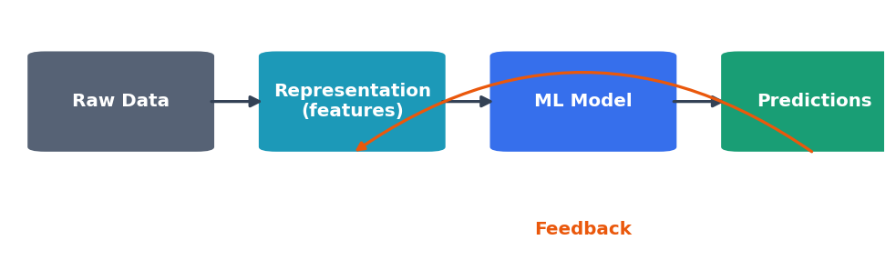

— makes "Representation" a first-class citizen. That box *is* Lecture 2 (turning messy reality into features) and, for images, Lecture 8 (letting convolution learn the representation). "ML Model" is Lectures 3–6. "Feedback" is the loss-and-optimise loop (L3 onward). So Lecture 1's single diagram is a map of the entire syllabus.

#### 🧪 Worked Examples

Decompose three systems into E/T/P:

| System | **T** (task) | **P** (performance) | **E** (experience) |
|---|---|---|---|
| Chess learner | playing chess | ratio of games won / total | playing games against itself |
| Self-driving car | driving from sensor data | avg. distance before a human-judged error | observing a human drive, recording inputs |
| Spam filter | classify email spam/not | classification accuracy (or precision/recall) | a corpus of labelled emails |

*Step-by-step on the spam filter:* the **thing being done** is labelling emails → that's T. The **score** we'd track is how often the labels are right → P. The **fuel** is the labelled corpus → E. As the corpus grows, accuracy should climb — that climb is what "learning" means here.

#### ❓ Counter Questions

- **Is a lookup table that memorises every training answer "learning"?** No — it recalls seen items but its performance on *new* instances of T doesn't improve. Learning requires generalization (L2), not storage.
- **Does "without being explicitly programmed" mean no code is written?** No — we still program the *learning algorithm*. What's not hand-written is the *solution* (the learned parameters/rules).
- **Can a system "improve on P" yet get worse in reality?** Yes — if P is a poor proxy for the true goal (e.g. optimising clicks ≠ optimising user wellbeing). This is *metric gaming*, and it's why L7's "choose the right metric" matters.

---

## 1.2 Paradigms of Machine Learning

#### 📐 Formal Definition

- **Supervised:** input is **labelled pairs** $(x_i,y_i)$; learn a mapping $f:x\to y$. Splits into **classification** (discrete $y$) and **regression** (continuous $y$).
- **Unsupervised:** input is **unlabelled** $(x_i)$; find hidden structure (clustering, dimensionality reduction).
- **Reinforcement:** an agent takes actions and receives **reward/punishment**; maximise cumulative reward.

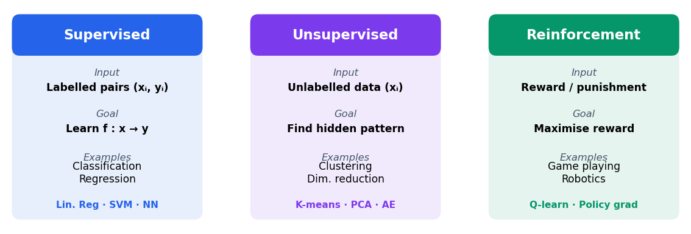

#### 🗣️ Layman Explanation

Supervised = learning with an answer key. Unsupervised = a pile of stuff and the question "what groups are in here?" with no key. Reinforcement = learning a game where you only ever see the score, never the perfect move.

#### 🧠 Conceptual Deep Dive

**The real dividing line is the *supervision signal* — what tells the model it's right.** Labels (supervised), the data's own geometry (unsupervised), or a delayed scalar reward (reinforcement). This isn't bureaucratic taxonomy; the signal type dictates the entire machinery: supervised learning can use a clean per-example loss (the whole of L3–L6), unsupervised learning must invent its own objective (e.g. cluster compactness), and reinforcement learning must solve *credit assignment* across time (which action, ten moves ago, earned this reward?).

**Why the course lives almost entirely in the supervised world.** Supervised learning has the cleanest mathematics — a labelled $(x,y)$ gives an unambiguous target, hence an unambiguous loss, hence gradient descent. That's why CSE 4621 spends its time here. Your slides also flag **self-supervised** learning (L2): labels *manufactured from the data itself* (hide a word, predict it) — the trick behind modern language models, and a clever way to get "supervised" signal without human labels.

**Classification vs regression is NOT an algorithm difference.** This is the subtlest point in the lecture. The *same* linear core $\theta^\top x$ becomes regression (with MSE) or, after a sigmoid squashes it into a probability, classification (with cross-entropy). The difference is the **output type and the loss**, not the model family. Internalise this now and "logistic *regression* is a *classification* method" (L5) will feel obvious rather than contradictory.

**What if we didn't separate these paradigms?** You'd repeatedly pick the wrong tool — e.g. forcing a clustering problem into a classifier you have no labels for. Naming the paradigm first is a diagnostic step: *do I have labels? are they discrete or continuous? is there a reward signal?* answers which half of the field to reach for.

**Trade-offs.** Supervised needs expensive labels but is powerful and well-understood. Unsupervised needs no labels but its objectives are fuzzier and evaluation is harder. Reinforcement is the most general (learns behaviour) but the most sample-hungry and unstable.

#### 🧪 Worked Examples

- **Classification:** "Is this cat obese? (yes/no)" — the running example of L5.
- **Regression:** "Predict a Dhaka house's price from its size" — the running example of L3.
- **Clustering (unsupervised):** group customers by purchasing behaviour with *no* predefined categories (K-means).
- **Dimensionality reduction (unsupervised):** compress 100 features into 2 for a scatter plot (PCA).
- **RL:** a bot learning chess by self-play; a robot learning to walk from fall/no-fall feedback.

#### ❓ Counter Questions

- **Is logistic regression supervised or unsupervised?** Supervised — it uses labelled $(x,y)$ with $y\in\{0,1\}$.
- **Clustering and classification both output groups — what's the difference?** Classification predicts *predefined* labels learned from labelled data; clustering *discovers* groups from unlabelled data. Labels present vs absent is the entire distinction.
- **Why not just label everything and always use supervised learning?** Labels are costly, slow, sometimes impossible (no ground truth), and sometimes the *goal itself* is discovery (you don't know the groups in advance).

---

## 1.3 Mathematical Foundations & Ethics

The three pillars (taught in full in the [primer](#mathematical-foundations--the-primer-that-makes-this-book-self-contained)):

- **Linear algebra** — matrices encode transformations ($Ax=b$); the **dot product** is the weighted sum at the heart of every model.
- **Calculus** — the **chain rule** and **gradients** are the literal engine of gradient descent and backpropagation.
- **Probability** — Bayes, expectation, variance, and **MLE** justify *why* our loss functions are what they are.

#### 🧠 Conceptual Deep Dive — the ethics slide is examinable

ML is not value-neutral, and your Lecture 1 lists four concrete harms:
- **Bias & fairness** — a model trained on biased data *perpetuates and amplifies* that bias (facial recognition that fails on darker skin; hiring tools that learn historical discrimination). The cause traces straight back to the "E must be representative" assumption in §1.1: skewed experience → skewed model.
- **Privacy** — large models *memorise* training data; *inference attacks* can recover sensitive records. (Memorisation is also the overfitting villain of L4 — the same phenomenon wearing an ethics hat.)
- **Interpretability** — "black-box" decisions in medicine or law raise accountability questions; this motivates simpler, inspectable models (and is a point in favour of L1-sparse models, L4).
- **Environmental cost** — a GPT-4-class training run ≈ 500 tonnes CO₂e; daily inference at scale consumes enormous water/energy.

> [!info] **Why this matters**
> These aren't moral garnish — they're a direct consequence of the technical choices in the rest of the book. Biased E → biased model (L2 data hygiene). Memorisation → privacy leaks *and* overfitting (L4). Complexity → opacity (L4 interpretability). Expect a short-answer item asking you to *name and explain* two such concerns and link them to a cause.

---

## 🎯 High-Yield Concepts (Lecture 1)

1. **Mitchell's E/T/P definition** — verbatim, plus decomposing a scenario.
2. **The three paradigms** (S/U/R) and their supervision signals.
3. **Classification vs regression** = output type + loss, *not* algorithm.
4. The **ML pipeline** (data → representation → model → prediction → feedback).
5. **Two ethical concerns**, named and explained with a cause.

## ⚠️ Common Misconceptions

- *"Higher training accuracy is always better."* False — that's overfitting (L4); the goal is generalization.
- *"The test set can be used to tune the model."* False — that leaks information (L2).
- *"Classification and regression need different algorithms."* False — often the same core, different loss.
- *"Unsupervised learning has no objective."* False — it optimises a *self-defined* objective (e.g. cluster tightness), just not a labelled one.
- *"'Without explicit programming' means no code."* False — the learning algorithm is still coded.

## 🎓 Professor Trap Questions

1. *"A spam filter improves as it sees more labelled emails." Identify E, T, P.* — **Trap:** an option labels "labelled emails" as the **task**. It's the **experience**; the task is classifying, the performance is accuracy. *(True statement, wrong slot.)*
2. *"Which is regression: predicting tomorrow's temperature, or predicting whether it will rain?"* — Temperature (continuous) is regression; rain (yes/no) is classification. The trap rewards reading *output type*, not topic.
3. *"Is a chess engine that plays itself supervised, because it generates its own data?"* — No: there are no labelled $(x,y)$ pairs; it learns from a **reward** (win/lose) → reinforcement. Self-generated ≠ supervised.

## 📝 Practice Problems (inspired by Alpaydın Ch. 1 & Goodfellow Ch. 1)

1. **(Conceptual)** Explain, with an example, why "learning" requires improvement on *unseen* instances rather than recall of training data. *(Generalization; a memoriser fails on new inputs.)*
2. **(Short answer)** For a movie-recommendation system, propose a plausible T, P, and E. *(T: predict a user's rating/next watch; P: rating error or click-through; E: past user–movie interactions.)*
3. **(Analytical)** A bank's loan-approval model is 95% accurate overall but rejects qualified applicants from one neighbourhood far more often. Which two ethical concerns are in play, and what is the likely technical cause? *(Bias/fairness + interpretability; biased/unrepresentative training data.)*
4. **("What if?")** What if you chose "number of emails processed" as the performance measure for a spam filter? *(It's not a measure of correctness; the system could "improve" by doing nothing useful — a metric-gaming failure.)*
5. **(Mixed)** Classify and justify: (a) compressing faces to 128 numbers, (b) AlphaGo, (c) predicting house prices, (d) detecting fraud (yes/no). *(a unsupervised dim-reduction; b RL; c supervised regression; d supervised classification.)*

## ⚡ Quick Revision Summary

> [!abstract]
> **ML = improving at a task T (measured by P) using experience E** (Mitchell). It exists because we can't hand-code rules for fuzzy, high-dimensional problems. **Three paradigms:** supervised (labelled, learn $f:x\to y$ → classification/regression), unsupervised (unlabelled, find structure), reinforcement (reward-driven). **Classification vs regression = output type + loss, not algorithm.** The pipeline is *data → representation → model → prediction → feedback*. **Ethics** (bias, privacy, interpretability, environment) follow directly from technical choices. The maths toolbox — dot products, chain rule, MLE — is in the primer.

---
# Lecture 2 — Probability, Statistics and Datasets

> **Slide source:** Lecture 2 (Ishmam Tashdeed). **Cited chapters:** Goodfellow Ch. 3 · Bishop Ch. 2.
> **Where it sits:** Two halves — the *engineering* of data (splits, leakage, generalization) and the *probability* (distributions, Bayes, MLE) that justifies every loss to come. This lecture is the hinge: L1 told us *what* learning is; L2 supplies the tools that make it *trustworthy* and *principled*. Depends on the probability [primer](#c-probability--statistics-the-justification-of-losses); feeds directly into L3 (MSE = Gaussian MLE) and L5 (BCE = Bernoulli MLE).

---

## 2.1 Datasets, Features, Labels

#### 📐 Formal Definition

A **dataset** is a structured collection of observations used to train, validate, test, or analyse models. A **sample** is one data point (a row); a **feature** is an input variable (a column); a **label** is the ground-truth output. By label availability: **supervised** (has labels), **unsupervised** (none), **self-supervised** (labels made from the data itself).

#### 🗣️ Layman Explanation

A spreadsheet. Each row is one example; most columns are clues (features); one special column is the answer to predict (the label).

#### 🧠 Conceptual Deep Dive

**The deep claim on the slide: "ML begins by converting messy reality into a representation a model can process."** A model only ever sees numbers. So the first, often hardest, job is **representation** — turning a photo, a sentence, or a sound into a vector. Different data types demand different encodings:
- **Tabular:** already numeric (hours studied, GPA).
- **Images:** a tensor of pixel intensities in $[0,255]$ (L8 builds on this).
- **Text:** words/sentences → numbers *while preserving meaning* (embeddings place "king" near "queen").
- **Audio:** waveforms/spectrograms (frequency, amplitude).

**Why representation caps performance.** The model can only exploit signal that *survives* the encoding. If your features don't carry the distinction you want, no algorithm recovers it — "garbage in, garbage out" is literal. This is why the slide urges **exploratory data analysis (EDA)** on every new dataset, and why much of practical ML is feature engineering, not model selection.

**What if representation didn't matter?** Then any model could solve any task given raw bytes — which is false. The entire reason CNNs (L8) exist is that the *naïve* representation of images (flatten the pixels) destroys spatial structure; convolution is a *better representation* baked into the architecture. So "representation" is not a preprocessing footnote — it's a thread running to the end of the course.

**Connection.** Supervised/unsupervised/self-supervised here mirror the paradigms of L1; the label column's presence is what made something "supervised."

#### 🧪 Worked Example (the slide's toy table)

| Hours Studied | Attendance | Current GPA | Final Grade |
|---|---|---|---|
| 5 | 90% | 3.4 | A |
| 2 | 60% | 3.0 | C |

First three columns = **features**; *Final Grade* = **label**; each row = **sample**. Delete the label column and the *same table* becomes an **unsupervised** dataset — the data didn't change, only what we ask of it.

#### ❓ Counter Questions

- **Could two different representations of the same data give very different results?** Yes — e.g. raw pixels vs edge-features for images, or word-counts vs embeddings for text. Representation is a modelling decision, not a fixed property of the data.
- **Is more features always better?** No — irrelevant features add noise and invite overfitting (the *curse of dimensionality*, L4).

---

## 2.2 Dataset Splitting, Leakage & Generalization

#### 📐 Formal Definition

Partition data into **training** (~70%, learn parameters), **validation** (~15%, tune choices/hyperparameters), and **test** (~15%, final unbiased evaluation). **Generalization** = performance on new, unseen data. **Data leakage** = information from the test set accidentally entering training. **Cross-validation** rotates through multiple splits and averages.

#### 🗣️ Layman Explanation

Exam prep: training set = practice problems; validation set = a mock test for choosing your study strategy; test set = the real exam, which you must not peek at. The slide nails it: *"If you keep checking the answer while preparing for a test, your performance no longer reflects your actual ability."*

#### 🧠 Conceptual Deep Dive

**Why three sets, not two — the subtle one.** The naive split is train/test. But the moment you use the test set to *choose* anything — a hyperparameter, a model, a threshold — you have *fit to the test set*, and your reported score becomes optimistic. The validation set exists to **absorb all that tuning** so the test set stays a true unseen sample. One number's worth of honesty is the entire justification for the third split.

**Why generalization is the whole point.** A model that memorises training answers has *zero* value — we already have those answers. We deploy models on data we've never seen. Hence the central tension of ML: a model flexible enough to fit the training data, but constrained enough not to fit its *noise*. That tension is named the **bias–variance trade-off** (L4), and every regularization method (L4, L6) is a tool to manage it. So this slide quietly states the problem that half the course exists to solve.

**Leakage — three exact mechanisms (memorise):**
1. **Scaling before splitting** — computing mean/std on the *whole* dataset lets test statistics seep into training.
2. **Duplicate samples** across train and test — the model "sees" test rows during training.
3. **Future information predicting the past** (temporal leakage) — using tomorrow's data to "predict" today.

**Why leakage is so insidious.** It doesn't crash anything; it *inflates* your validation/test score, so you ship a model that looks great and fails in production. The failure is silent until it's expensive.

**What if there were no held-out data at all?** You'd have no way to detect overfitting; training error always looks good. The held-out set is your *only* honest mirror.

> [!warning] **Exam trap — a real Quiz 1 question lives here**
> *Why normalize features before GD with L2 regularization?* L2 penalises large weights **equally**; if features have wildly different scales, a small-scale feature's weight must balloon to matter, and L2 then over-punishes it — unfair feature suppression. **Standardise first** so the penalty is fair. (This links L2 normalization → L4 regularization; you'll meet it again there.)

#### 🧪 Worked Example — leakage in action

You standardise using the **entire** dataset's mean/variance, *then* split. Training has now "seen" the test distribution through those statistics → optimistic test score → nasty production surprise. **Fix:** split first; compute scaling on **training only**; apply that *same* transform to validation/test.

#### ❓ Counter Questions

- **Why not train on everything and report training accuracy?** It measures memorisation, not generalization — almost always optimistic.
- **Is cross-validation a substitute for a test set?** It's a better *estimate during development*, but a final untouched test set (or genuinely new data) remains the gold standard.
- **70/15/15 — is that sacred?** No. With millions of examples, 98/1/1 can suffice; with tiny data, cross-validation matters more. The ratio reflects *how much data you can spare for honest evaluation*.

---

## 2.3 Random Variables & Distributions

#### 📐 Formal Definition

A **random variable** is an uncertain quantity (discrete or continuous). **Bernoulli($p$):** $X\in\{0,1\}$, $P(X{=}1)=p$, mean $p$, variance $p(1-p)$. **Gaussian $\mathcal{N}(\mu,\sigma^2)$:** $f(x)=\frac{1}{\sqrt{2\pi\sigma^2}}\exp\!\big(-\frac{(x-\mu)^2}{2\sigma^2}\big)$.

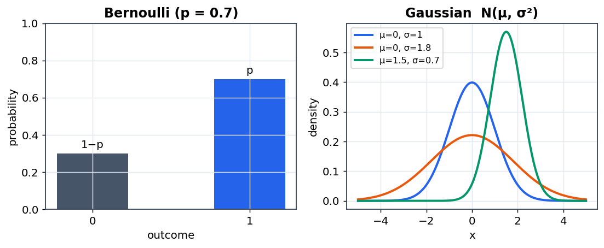

#### 🗣️ Layman Explanation

A random variable is "a number we're unsure about." Bernoulli is a (possibly biased) coin. Gaussian is the bell curve — clustered around an average with symmetric spread.

#### 🧠 Conceptual Deep Dive

**These two distributions are not trivia — they are the probabilistic skeletons of two models.** This is the lecture's quiet master-stroke:
- A **binary label** is a Bernoulli outcome → its MLE gives logistic regression's **cross-entropy** (L5).
- A **continuous target with additive noise** is Gaussian → its MLE gives linear regression's **MSE** (L3).

So when L3 and L5 "choose a loss," they're really choosing one of these distributions. The distribution comes first; the loss is its shadow.

**Why the Gaussian is everywhere.** The **Central Limit Theorem**: add up many small, independent random effects and the total tends to a bell curve — regardless of the individual effects' shapes. Measurement noise is exactly such a sum, so modelling noise as Gaussian is principled, not lazy.

**Why Bernoulli's variance is $p(1-p)$.** It's maximal at $p=0.5$ (maximum uncertainty — a fair coin) and zero at $p=0$ or $1$ (a certain outcome has no spread). That single fact reappears as $\sigma'(z)=\sigma(1-\sigma)\le0.25$ in the sigmoid (L5) and the vanishing-gradient bound (L6).

**What if we ignored the underlying distribution?** We'd pick losses by gut feeling and lose the ability to explain *why* a loss is right — exactly the "principled reasoning" the faculty rewards. Worse, mismatched loss-and-distribution (e.g. MSE on binary labels) gives non-convex, ill-behaved optimisation (L5).

#### 🧪 Worked Example

Spam label $Y\sim\text{Bernoulli}(p)$. House-price noise $\varepsilon=\text{price}-(\text{linear trend})\sim\mathcal{N}(0,\sigma^2)$. If $p=0.3$, the variance of one spam indicator is $0.3\times0.7=0.21$.

#### ❓ Counter Questions

- **Which distribution underlies MSE? Which underlies BCE?** Gaussian; Bernoulli.
- **Why model noise as Gaussian rather than, say, uniform?** The CLT makes sums-of-small-effects Gaussian, and the Gaussian's MLE yields the convenient squared-error loss.

---

## 2.4 Bayes' Theorem

#### 📐 Formal Definition

$$P(H\mid D)=\frac{P(D\mid H)\,P(H)}{P(D)},\qquad P(D)=\sum_H P(D\mid H)P(H).$$
**Prior** $P(H)$ — belief before data; **likelihood** $P(D\mid H)$ — probability of the data given the hypothesis; **posterior** $P(H\mid D)$ — updated belief after data.

#### 🗣️ Layman Explanation

Bayes is the mathematics of *changing your mind with evidence*: start with a hunch (prior), see data (likelihood), end with a sharper belief (posterior).

#### 🧠 Conceptual Deep Dive

**Where it comes from (one line of algebra).** From the definition of conditional probability, $P(H\cap D)=P(D\mid H)P(H)=P(H\mid D)P(D)$. Divide by $P(D)$ and Bayes falls out. So Bayes isn't a new axiom — it's *conditional probability read backwards*, letting us invert "data given hypothesis" into "hypothesis given data," which is what we actually want.

**The counter-intuitive lesson — base rates dominate.** A very accurate test can still yield a *low* posterior if the condition is **rare**, because the huge healthy population manufactures many false positives. Humans systematically ignore this (**base-rate neglect**), confusing $P(D\mid T)$ with $P(T\mid D)$ — the **prosecutor's fallacy**.

**The connection that will pay off in L7.** The posterior $P(\text{disease}\mid\text{positive})$ is *literally* **precision** $=\frac{TP}{TP+FP}$. So Bayes here and precision there are the *same computation*. The reason "accuracy is misleading on imbalanced data" (L7) is the same reason an accurate test gives a low posterior for a rare disease — base rates. Two lectures, one truth.

**What if we dropped the prior?** We'd commit the prosecutor's fallacy by default, reading test accuracy as disease probability. The prior is precisely what stops that error.

#### 🧪 Worked Example — the real Quiz 1 (SET-A) "Hantavirus" problem, every step

A disease affects **1%**; a test is **95% accurate**. A person tests positive — do they have it?

Define $D$ = has disease, $T$ = tests positive. Given: $P(D)=0.01$, $P(D')=0.99$, $P(T\mid D)=0.95$, $P(T\mid D')=0.05$.

*Step 1 — total probability of a positive test:*
$$P(T)=P(T\mid D)P(D)+P(T\mid D')P(D')=0.95(0.01)+0.05(0.99)=0.0095+0.0495=0.059.$$
*Step 2 — Bayes:*
$$P(D\mid T)=\frac{0.95\times0.01}{0.059}=\frac{0.0095}{0.059}\approx\boxed{0.161}.$$
Only **~16%** — the 99% healthy generate so many false positives they swamp the true positives.

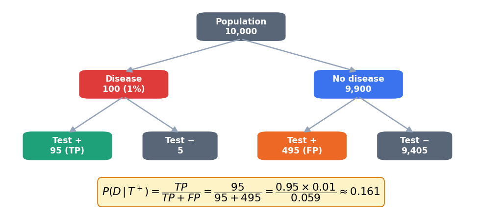

#### ❓ Counter Questions

- **The test is 95% accurate, so why isn't the answer 95%?** Because "95%" is $P(T\mid D)$, not $P(D\mid T)$. Reversing a conditional without the prior is the prosecutor's fallacy.
- **What raises the posterior?** A higher prior (commoner disease) or a lower false-positive rate.
- **Two positive tests in a row?** Use the first posterior as the new prior and update again — Bayes chains naturally.

---

## 2.5 Maximum Likelihood Estimation (MLE)

#### 📐 Formal Definition

**MLE** chooses parameters that make the observed data most probable: maximise the likelihood $\prod_i P(x_i\mid\theta)$, equivalently minimise the **negative log-likelihood** $-\sum_i\log P(x_i\mid\theta)$.

#### 🗣️ Layman Explanation

You flip a coin 10 times, get 7 heads. Which coin most plausibly did that? A $p=0.7$ coin makes "7 heads" more likely than a fair one. MLE picks the parameter that best explains what you actually saw.

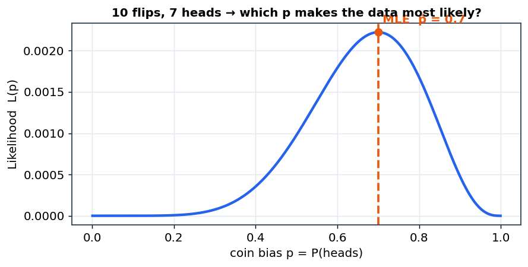

#### 🧠 Conceptual Deep Dive — *the unifying idea of the entire course*

Your slide says it outright: **"Many ML models are MLE in disguise."**
- Linear regression + Gaussian noise → minimise **MSE**.
- Logistic regression → maximise **Bernoulli** likelihood (= minimise BCE).
- Softmax classifier → maximise **categorical** likelihood.
- Neural-net classification → minimise **cross-entropy**.

So *every* loss in this book is a negative log-likelihood. "Minimise loss" = "maximise the probability of the data." This single sentence dissolves the mystery of where loss functions come from.

**Why the log?** Likelihoods are products of many probabilities — numerically tiny (underflow) and awkward to differentiate (product rule explodes). $\log$ turns products into **sums** (easy gradients, no underflow) and, being monotonic, *doesn't move the maximum*. So we optimise the log-likelihood and get the same answer, more safely.

**Why the negative?** Probabilities are $\le 1$, so log-probabilities are $\le 0$. Maximising a negative quantity is awkward; negating turns it into a *positive loss to minimise*, matching gradient **descent**. This is the exact origin of the "load-bearing minus sign" in cross-entropy (L5.2) — when you meet it there, remember it was born here.

**What if we didn't have MLE?** Loss functions would be arbitrary recipes with no justification, and you'd have no principled way to answer "why squared error?" or "why cross-entropy?" — the very questions that separate an A from a C on a conceptual exam.

**Connection to regularization (L4).** Add a *prior* on the parameters and MLE becomes **MAP** (maximum a posteriori) estimation — and a Gaussian prior on weights is *exactly* L2 regularization, an L1/Laplace prior is L1. So regularization is Bayes meeting MLE. (You don't need the derivation, but knowing the link is gold for "connect two concepts" questions.)

#### 🧪 Worked Example — MLE of a coin, fully derived

Data: 7 heads, 3 tails. Likelihood $L(p)=p^7(1-p)^3$. Maximise the log:
$$\ell(p)=7\log p+3\log(1-p),\qquad \ell'(p)=\frac{7}{p}-\frac{3}{1-p}=0.$$
$$\Rightarrow 7(1-p)=3p\Rightarrow 7=10p\Rightarrow p=0.7.$$
The MLE equals the observed frequency $k/n$ — clean and intuitive.

#### ❓ Counter Questions

- **Is MLE the same as minimising error?** Sometimes it *coincides* (Gaussian → MSE), but conceptually it maximises data probability; the "error" reading is a consequence, not the definition.
- **Does MLE need a prior like Bayes?** No — MLE uses only the likelihood. Add a prior and you get MAP (which is regularization in disguise).
- **Can MLE overfit?** Absolutely — with enough parameters it fits noise; that's *why* we add priors/regularization (L4).

---

## 🎯 High-Yield Concepts (Lecture 2)

1. **70/15/15 splits**, the *touch-test-once* rule, and why three sets.
2. **Three leakage mechanisms** and their fixes.
3. **Generalization** as the goal; memorisation as the failure.
4. **Bernoulli ↔ binary labels; Gaussian ↔ continuous noise.**
5. **Bayes** (posterior ∝ likelihood × prior) and the Hantavirus computation (≈0.161).
6. **MLE** as the source of *every* loss; the role of the log and the minus sign.

## ⚠️ Common Misconceptions

- *"Standardise the whole dataset, then split."* Leakage — fit scaling on **training only**.
- *"95% accurate test ⇒ 95% chance of disease."* Confuses $P(T\mid D)$ with $P(D\mid T)$; ignores the prior.
- *"MSE and cross-entropy are arbitrary choices."* Both are MLE under Gaussian / Bernoulli models.
- *"More data always beats a better model."* Data fixes *variance*, not *bias* (L4).
- *"Validation and test sets do the same job."* Validation is for tuning; test is the final, untouched judge.

## 🎓 Professor Trap Questions

1. *"A test is 99% accurate for a disease affecting 0.1% of people. A positive test means ~99% chance of disease — true or false?"* — **False.** Base rate crushes the posterior; precision ≈ tiny. Tests *exactly* the Bayes/base-rate insight.
2. *"Which leaks: (a) deduplicating rows before splitting, (b) computing the mean on all data before splitting?"* — **(b)** leaks (test statistics enter training); (a) is good practice. The trap pairs a *good* step with a *bad* one.
3. *"MSE comes from which probabilistic assumption?"* — Gaussian noise + MLE. Distractors ("it's just intuitive error") are true-sounding but miss the principled answer.

## 📝 Practice Problems (inspired by Bishop Ch. 2 & Goodfellow Ch. 3)

1. **(Mathematical)** Disease prevalence 2%, sensitivity 90%, false-positive rate 10%. Compute $P(D\mid T^+)$. *(P(T)=0.9·0.02+0.1·0.98=0.116; posterior=0.018/0.116≈0.155.)*
2. **(Mathematical)** Derive the MLE of $p$ for $k$ heads in $n$ flips. *(p̂ = k/n; set $\frac{k}{p}-\frac{n-k}{1-p}=0$.)*
3. **(Conceptual)** Explain why $\log$ is used in MLE and why it doesn't change the optimum. *(Turns products to sums / avoids underflow; monotonic ⇒ same argmax.)*
4. **(Short answer)** State the variance of Bernoulli($p$) and where it is largest. *(p(1−p); largest at p=0.5.)*
5. **("What if?")** What if you computed feature scaling *after* splitting but used the *test* set's statistics? *(Still leakage — any test-derived statistic contaminates evaluation.)*
6. **(Analytical/mixed)** A model reports 92% validation accuracy but 71% in production. Give two distinct causes rooted in this lecture. *(Data leakage inflating validation; train/production distribution mismatch — broken i.i.d. assumption.)*

## ⚡ Quick Revision Summary

> [!abstract]
> **Data hygiene:** 70/15/15; validation tunes, test judges *once*; leakage (scale-before-split, duplicates, future→past) silently inflates scores. **Generalization** is the goal. **Distributions:** Bernoulli ($p$, var $p(1-p)$) ↔ binary labels; Gaussian ($\mu,\sigma^2$, via CLT) ↔ continuous noise. **Bayes:** posterior ∝ likelihood × prior; rare conditions → low posterior even for accurate tests (Hantavirus ≈ 0.161); posterior = precision (preview of L7). **MLE** is the engine of every loss: maximise data probability ⇔ minimise negative log-likelihood; log for tractability, minus for descent; MSE↔Gaussian, BCE↔Bernoulli; add a prior → MAP = regularization (preview of L4).

---
# Lecture 3.1 — Linear Regression

> **Slide source:** Lecture 3 (Ishmam Tashdeed). **Cited chapters:** Goodfellow Ch. 5.1 · Bishop Ch. 3.1, 3.3.
> **Where it sits:** The **prototype** of all supervised learning and the spine's first concrete instance (model → loss → optimise). Master this and logistic regression (L5) and neural networks (L6) are variations on one theme. Depends on the [calculus](#b-calculus-the-training-of-models) and [linear-algebra](#a-linear-algebra-the-form-of-models) primer; its safety is *proved* in L3.2 (convexity); its overfitting is *cured* in L4.

---

## 3.1.1 The Hypothesis Function

#### 📐 Formal Definition

**Regression** predicts a continuous, real-valued output. The **hypothesis** is a weighted sum of features:
$$h_\theta(x)=\theta_0+\theta_1x_1+\dots+\theta_nx_n=\theta^\top x,\qquad(x_0=1).$$
Notation: $m$ = #examples, $n$ = #features, $x^{(i)}$ = the $i$-th example, $x_j^{(i)}$ = its $j$-th feature, $\theta$ = parameters (weights).

#### 🗣️ Layman Explanation

You assume the answer is a straight-line mix of the inputs. For a house: $\text{price}\approx\theta_0+\theta_1\cdot\text{size}$. The $\theta$'s are dials; learning is turning them until the line fits the dots.

#### 🧠 Conceptual Deep Dive

**Why *linear* — and what "linear" really means.** Linear regression is the simplest non-trivial hypothesis: it assumes each feature contributes *additively* and *proportionally*. The word "linear" refers to being **linear in the parameters $\theta$**, *not* in the inputs. You can feed in $x^2$ or $\sqrt{x}$ as features and still call it linear regression (this is polynomial regression, L4), because the model is still $\theta^\top(\text{features})$. This distinction is worth a mark and underpins L5's "nonlinear boundaries from a linear model."

**The bias trick ($x_0=1$) — why it's elegant.** A line needs an intercept $\theta_0$ (where it crosses the axis). Rather than carry it as a special case, we invent a fake feature $x_0=1$ for every example; then $\theta_0\cdot1$ is just another term and the whole model collapses into one clean dot product $\theta^\top x$. This is *purely notational convenience*, but it's why every formula later is so tidy — and it returns identically in logistic regression and neural-network biases.

**What problem does the hypothesis solve, and what if it didn't exist?** It turns the vague goal "predict price from features" into a *parameterised family of functions*. Without committing to a hypothesis class, "learning" has nothing to adjust — there are no dials to turn. The hypothesis is the search space; learning is the search.

**Assumption.** A linear hypothesis assumes the true relationship is (approximately) linear. If it's badly curved, a line *underfits* no matter how you train it (L4) — which is exactly the motivation for polynomial features and, eventually, neural networks.

#### 🧪 Worked Example (the Dhaka house slide)

| Size (sq.ft) $x$ | Price (1000s USD) $y$ |
|---|---|
| 1506 | 1030 |
| 1640 | 2300 |
| 852 | 581 |

Two candidate hypotheses: $(\theta_0{=}1010,\theta_1{=}1.1)$ vs $(\theta_0{=}483,\theta_1{=}2.3)$. "Which is better?" is answerable *only* once we have a number measuring fit — which is why the cost function is the very next idea.

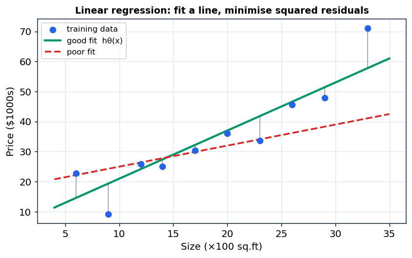

#### ❓ Counter Questions

- **Is $h_\theta(x)=\theta_0+\theta_1x+\theta_2x^2$ linear regression?** Yes — linear in $\theta$, even though curved in $x$.
- **Why not just connect the dots exactly?** A function passing through every noisy point fits the noise → overfitting (L4). We want the *trend*, not the noise.

---

## 3.1.2 The Cost Function — Mean Squared Error

#### 📐 Formal Definition

Residual for example $i$: $h_\theta(x^{(i)})-y^{(i)}$. The **MSE** cost:
$$J(\theta)=\frac{1}{2m}\sum_{i=1}^m\big(h_\theta(x^{(i)})-y^{(i)}\big)^2.$$
The $\tfrac12$ is a convention that cancels the 2 from differentiation. Goal: minimise $J(\theta)$.

#### 🗣️ Layman Explanation

For each dot, measure how far the line misses it (residual), square it (so over- and under-shoots both count, and big misses hurt more), average. Lower MSE = better fit.

#### 🧠 Conceptual Deep Dive

**Why square the error — three reasons, in order of depth.**
1. **Sign-agnostic.** Squaring makes $+5$ and $-5$ equally bad; otherwise positive and negative misses would cancel and a terrible line could score "zero average error."
2. **Smooth & convex.** $u^2$ is differentiable everywhere (good for gradient descent) and bowl-shaped, so the cost has *one* minimum (proved in L3.2). Absolute value $|u|$ is also sign-agnostic but has a kink at 0 — harder to optimise.
3. **The deep reason — it's the MLE under Gaussian noise (L2).** If $y=\theta^\top x+\varepsilon$ with $\varepsilon\sim\mathcal{N}(0,\sigma^2)$, then maximising the data's likelihood is *exactly* minimising squared error. So MSE isn't an arbitrary "distance" — it's the *principled* loss when noise is bell-shaped. This is the full-marks answer to "why MSE?".

**Why the $\tfrac{1}{2m}$, term by term.** The $\frac1m$ **averages** so the cost doesn't grow just because you have more data (it's a *mean* squared error, comparable across dataset sizes). The $\tfrac12$ is a *gradient-cleaning* trick: differentiating $u^2$ gives $2u$, and the $\tfrac12$ cancels that 2, leaving a tidy gradient with no stray constant. Neither changes *where* the minimum is (scaling a function doesn't move its argmin) — they only make the maths pretty.

**What if we used a different loss?** Absolute error (MAE) is more robust to outliers but non-smooth; squared error is smooth but outlier-sensitive (one huge miss dominates, because it's squared). The *choice of loss encodes what you consider "bad"* — a theme that becomes central in L7 (metrics) and L5 (cross-entropy).

**Geometry.** As $\theta$ varies, $J(\theta_0,\theta_1)$ is a **convex bowl**; viewed from above it's nested ellipses (a **contour plot**). Gradient descent walks downhill on this surface.

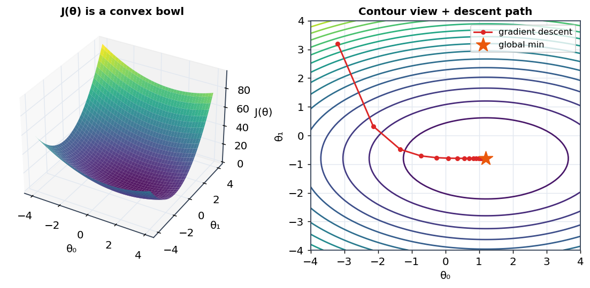

#### 🧪 Worked Example — the real Quiz 1 (SET-SAMPLE) Q4, every step

Data $\{(1,1),(2,2),(3,3)\}$, model $\theta_0+\theta_1x$, with $\theta_0=0,\theta_1=0.5$. Compute $J(\theta)$.

*Predictions:* $h(1)=0.5,\ h(2)=1.0,\ h(3)=1.5$.
*Residuals:* $0.5{-}1={-}0.5$, $1{-}2={-}1$, $1.5{-}3={-}1.5$.
*Squared:* $0.25,\ 1,\ 2.25$. Sum $=3.5$.
$$J(\theta)=\frac{1}{2\times3}(3.5)=\frac{3.5}{6}\approx\boxed{0.583}.$$

#### ❓ Counter Questions

- **Why not minimise the *sum* instead of the *mean*?** The minimiser is identical (a constant factor doesn't move it), but the mean is comparable across dataset sizes and keeps gradients scale-stable.
- **Is MSE always the right loss?** No — for classification it's non-convex on a sigmoid and not the Bernoulli MLE (L5). MSE is right when targets are continuous with roughly Gaussian noise.
- **What does $J=0$ mean?** The line passes exactly through every point — perfect fit on *training* data, which on noisy real data is a red flag for overfitting.

---

## 3.1.3 Gradient Descent

#### 📐 Formal Definition

From random $\theta$, repeatedly step opposite the gradient:
$$\theta_j\leftarrow\theta_j-\alpha\frac{\partial J}{\partial\theta_j},\qquad \frac{\partial J}{\partial\theta_j}=\frac{1}{m}\sum_{i=1}^m\big(h_\theta(x^{(i)})-y^{(i)}\big)x_j^{(i)},$$
$\alpha>0$ = learning rate. **Update all $\theta_j$ simultaneously.**

#### 🗣️ Layman Explanation

Blindfolded on a hillside (the cost surface), feel the slope under your feet (the gradient) and step downhill. Repeat. Step size = learning rate.

#### 🧠 Conceptual Deep Dive

**Why the negative gradient?** The gradient points toward steepest *increase* (primer §B). To *reduce* loss we go the opposite way — hence the minus sign in the update. That's the whole idea; everything else is bookkeeping.

**Why this gradient has the shape it does — derive it once and own it forever.** Differentiate one squared residual $\tfrac12(h_\theta(x)-y)^2$ by the chain rule: outer derivative $(h_\theta(x)-y)$, inner derivative $\frac{\partial}{\partial\theta_j}(\theta^\top x-y)=x_j$. Product: $(h_\theta(x)-y)\,x_j$. Average over examples → the formula above. The result reads **"(prediction − truth) × input."** Burn this in: *the identical structure reappears for logistic regression (L5.2) and the output layer of neural networks (L6.1)* — only how $h_\theta$ is computed changes.

**Why "simultaneous" update matters.** You must compute *all* partials from the **current** $\theta$, then update them together. If you update $\theta_0$ first and use the new $\theta_0$ while computing $\theta_1$'s gradient, you're descending a different (wrong) surface — a classic silent bug and a favourite exam point.

**What problem does GD solve that algebra doesn't?** For many models there is *no closed-form* minimum (logistic regression, neural nets — the loss is transcendental). GD only needs to compute a gradient, which we can always do. It also scales to millions of parameters where matrix inversion (the normal equation) is hopeless. GD is the universal optimiser; the normal equation is a lucky special case.

**The learning rate — the one knob that breaks everything.**

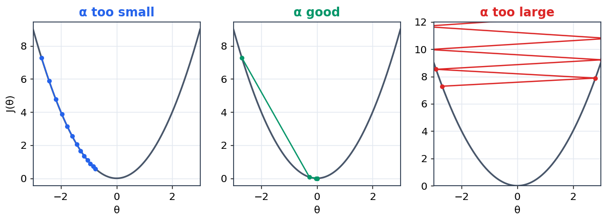

Too small → painfully slow (tiny steps). Too large → you overshoot the valley and **bounce out**, possibly **diverging** to infinity. There's no universal best $\alpha$; it's a hyperparameter (tuned on the validation set, L2). And critically: convergence is *guaranteed only for convex losses* (L3.2) — for non-convex ones (neural nets) you may settle in a local minimum.

#### 🧪 Worked Example — the real Quiz 1 (SET-B) Q1, every step

Data $\{(1,1.75),(2,3.22),(3,1.67)\}$, model $\theta_0+\theta_1x$, start $\theta_0{=}0,\theta_1{=}0$, $\alpha{=}1$. One step.

At $\theta=0$ all predictions are 0, so each residual $=0-y=-y$.
$$\frac{\partial J}{\partial\theta_0}=\frac13(-1.75-3.22-1.67)=\frac{-6.64}{3}=-2.213.$$
$$\frac{\partial J}{\partial\theta_1}=\frac13\big[(-1.75)(1)+(-3.22)(2)+(-1.67)(3)\big]=\frac13(-1.75-6.44-5.01)=\frac{-13.2}{3}=-4.4.$$
*Update (simultaneously):* $\theta_0=0-1(-2.213)=\boxed{2.213}$, $\theta_1=0-1(-4.4)=\boxed{4.4}$.

> [!warning] **Exam trap**
> The $\theta_1$ gradient multiplies each residual by its **own** $x^{(i)}$ ($\times1,\times2,\times3$); the $\theta_0$ gradient uses $x_0=1$ for all. Swapping these is the #1 arithmetic slip. And remember: **simultaneous** update from the old $\theta$.

#### ❓ Counter Questions

- **Why not solve for the minimum directly?** You can (normal equation, next), but it's $O(n^3)$ and fails on singular $X^\top X$; GD scales and generalises to non-linear models.
- **Is convergence guaranteed?** Only for convex, well-behaved losses with a suitable $\alpha$. Non-convex → possible local minima.
- **What if $\alpha$ shrinks over time?** That's *learning-rate scheduling* (L6) — big steps early, fine steps late.

---

## 3.1.4 The Normal Equation (closed-form OLS)

#### 📐 Formal Definition

Setting $\nabla_\theta J=0$ and solving:
$$\theta=(X^\top X)^{-1}X^\top y,$$
where $X\in\mathbb{R}^{m\times(n+1)}$ is the design matrix (one row per example).

#### 🗣️ Layman Explanation

Instead of walking downhill step by step, use algebra to jump straight to the bottom in one shot.

#### 🧠 Conceptual Deep Dive

**Why it exists — convexity makes "set the gradient to zero" *sufficient*.** For a general function, $\nabla J=0$ only finds a *candidate* (could be a max or saddle). For a convex function (which MSE is, L3.2), a zero gradient is *guaranteed* to be the global minimum. So convexity is what licenses the closed form.

**The geometric meaning — projection.** The prediction $\hat y=X\theta$ lives in the column space of $X$ (all reachable linear combinations of features). The best $\theta$ makes $\hat y$ the **orthogonal projection** of $y$ onto that space — the closest reachable point. The residual $y-X\theta$ is then perpendicular to every feature, which is *exactly* what $X^\top(y-X\theta)=0$ says. So the normal equation is "make the error orthogonal to the features," written in matrix form.

**Trade-offs vs gradient descent:**

| | Normal Equation | Gradient Descent |
|---|---|---|
| Iterations | none — one solve | many steps |
| Learning rate | not needed | must tune |
| Cost | $O(n^3)$ (invert $X^\top X$) | $O(knm)$, scales in $n$ |
| Fails when | $X^\top X$ singular (collinear features, $n>m$) | rarely; just slow |
| Best for | small $n$, exact answer | large $n$, non-linear models |

**What if $X^\top X$ is singular?** The inverse doesn't exist (redundant features, or more features than examples). Two fixes: drop redundant features, or add $\lambda I$ — **ridge regression** (L4), whose closed form $(X^\top X+\lambda I)^{-1}X^\top y$ is *always* invertible. So regularization secretly cures a linear-algebra disease too.

#### 🧪 Worked Example (shape sanity-check)

10 examples, 1 feature → $X$ is $10\times2$ (with the bias column). $X^\top X$ is $2\times2$ (cheap to invert). $X^\top y$ is $2\times1$. So $\theta=(X^\top X)^{-1}X^\top y$ is $2\times1$ — exactly $(\theta_0,\theta_1)$. The shape rule from the primer confirms the formula is well-formed.

#### ❓ Counter Questions

- **When would you *never* use the normal equation?** When $n$ is large (say $>10^4$) — inverting a huge matrix is infeasible — or when the model is non-linear (no closed form). Use GD.
- **Does it need feature scaling?** No (it's exact, scale-invariant) — unlike GD, which converges faster when features are scaled.

---

## 3.1.5 Variants & Feature Normalization

#### 📐 Formal Definition

- **Batch GD** — all $m$ examples per step: stable, slow for large $m$.
- **Stochastic GD (SGD)** — one example per step: fast, noisy.
- **Mini-batch GD** — a batch of $b$ examples (batch size is a hyperparameter): the practical default.

**Feature normalization:** **Min–max** → $[0,1]$; **Z-score** → mean 0, variance 1.

#### 🗣️ Layman Explanation

Batch = average everyone's opinion before each step (smooth, slow). Stochastic = act on one random opinion at a time (jittery, quick). Mini-batch = poll a small group — best of both.

#### 🧠 Conceptual Deep Dive

**Why normalize — the geometry of the cost bowl.** If "size" ranges 500–3000 and "bedrooms" ranges 1–5, the cost contours become long, thin valleys. Gradient descent then **zig-zags** across the steep narrow direction and crawls along the shallow long one. Rescaling features makes the contours nearly circular, so descent heads almost straight for the minimum → far fewer steps. (This same "make the scales comparable" instinct returns as *batch normalization inside networks*, L6.)

**Why SGD's noise is a feature, not just a bug.** Batch GD computes the exact average gradient — smooth but slow, and on a non-convex surface it slides straight into the *nearest* minimum, even a bad shallow one. SGD estimates the gradient from one (or a few) examples, so each step is **noisy**. That randomness can *kick* the parameters out of a shallow local minimum into a better region — a property batch GD lacks.

> [!info] **Real Quiz 1 (SET-A/B) Q2 lives here**
> *For a non-convex loss with shallow local minima, batch or stochastic GD?* **SGD** — its noisy gradient estimates introduce random perturbations that can dislodge the solution from a shallow basin and let it explore better regions. Smooth batch GD would sit stuck. (This matters enormously for neural networks, L6.)

**Min–max vs Z-score.** Min–max squashes to $[0,1]$ (good when you need bounded inputs, e.g. image pixels); Z-score centres at 0 with unit variance (good for gradient methods and for fair L2 penalties, L4). Both make features comparable; the choice depends on the downstream method.

#### 🧪 Worked Example — one Z-score

A feature with values $\{2,4,6\}$ has mean $4$ and (population) std $\sqrt{\frac{(2-4)^2+(4-4)^2+(6-4)^2}{3}}=\sqrt{8/3}\approx1.63$. The value $6$ becomes $\frac{6-4}{1.63}\approx1.23$ — "1.23 standard deviations above average," now on the same scale as every other standardised feature.

#### ❓ Counter Questions

- **Does normalization change the *best achievable* fit?** No — it changes the *optimisation path* (faster) and, with L2, *fairness of the penalty* (L4). The optimum predictions are the same.
- **Batch vs SGD for a convex loss?** Either converges; batch is smoother, SGD is faster per step and scales better.
- **Where must you fit the scaler?** On **training data only**, then apply to val/test — else you leak (L2).

---

## 🎯 High-Yield Concepts (Lecture 3.1)

1. Hypothesis $\theta^\top x$ and the **bias trick** $x_0=1$.
2. **MSE** $=\frac{1}{2m}\sum(h-y)^2$, why square, why $\tfrac{1}{2m}$, and its **Gaussian-MLE** origin.
3. **GD update** with the **(pred−truth)×input** gradient and **simultaneous** updates.
4. **Learning-rate** behaviour (slow / good / diverge).
5. **Normal equation**, its **projection** meaning, and its trade-offs.
6. **Normalize** for faster convergence; **SGD noise escapes shallow minima**.

## ⚠️ Common Misconceptions

- *"The $\tfrac12$ is optional."* It's chosen so the gradient has no stray 2; harmless but deliberate.
- *"Update $\theta_0$, then use it for $\theta_1$."* Wrong — updates must be **simultaneous** from the old $\theta$.
- *"Bigger learning rate = faster learning."* Too big → overshoot/diverge.
- *"Normalization changes the answer."* It changes the *path*, not the optimum.
- *"The normal equation always works."* It fails when $X^\top X$ is singular (collinearity, $n>m$).

## 🎓 Professor Trap Questions

1. *"You run GD and the loss explodes to infinity. Most likely cause?"* — **Learning rate too large** (divergence) — not "bad data," not "too few features."
2. *"For 1,000,000 features, use the normal equation or GD?"* — **GD**; inverting a million-by-million matrix is infeasible. The trap is that the normal equation is "exact," tempting you to prefer it.
3. *"After normalization, the model's predictions changed a lot. Is that expected?"* — The *optimum* shouldn't change; if predictions changed drastically, you likely normalized incorrectly (e.g. fit the scaler on test data, or forgot to apply it consistently).

## 📝 Practice Problems (inspired by Bishop Ch. 3.1, 3.3 & Goodfellow Ch. 5.1)

1. **(Mathematical)** For $\{(1,2),(2,2)\}$, $\theta_0{=}\theta_1{=}0$, $\alpha{=}0.5$, do one GD step. *(∂θ₀=−2, ∂θ₁=−3 → θ₀=1, θ₁=1.5.)*
2. **(Mathematical)** Compute $J$ for $\{(0,1),(1,3)\}$ with $\theta_0{=}1,\theta_1{=}2$. *(Predictions 1,3 → residuals 0,0 → J=0.)*
3. **(Conceptual)** Explain in two sentences why MSE is the "right" loss under Gaussian noise. *(MLE of a Gaussian-noise model reduces exactly to minimising squared error.)*
4. **(Analytical)** Your features are house *size* (hundreds–thousands) and *bedrooms* (1–5). Why does unnormalized GD zig-zag, and what fixes it? *(Elongated contours from scale mismatch; Z-score/min–max rounds them.)*
5. **("What if?")** What if you removed the $\frac1m$ from MSE? *(The minimiser is unchanged, but the loss scale grows with dataset size and a fixed $\alpha$ effectively becomes larger — convergence behaviour changes.)*
6. **(Mixed)** Derive the OLS normal equation by setting $\nabla_\theta\frac{1}{2m}\|X\theta-y\|^2=0$. *(∇ = $\frac1m X^\top(X\theta-y)=0$ ⇒ $X^\top X\theta=X^\top y$ ⇒ $\theta=(X^\top X)^{-1}X^\top y$.)*

## ⚡ Quick Revision Summary

> [!abstract]
> **Model:** $h_\theta(x)=\theta^\top x$, $x_0=1$ (bias trick). **Loss:** MSE $=\frac{1}{2m}\sum(h-y)^2$ — square for sign-agnostic + smooth + *Gaussian MLE*; $\tfrac{1}{2m}$ averages and cleans the gradient. **Optimise:** GD $\theta_j\leftarrow\theta_j-\frac{\alpha}{m}\sum(h-y)x_j$, gradient = **(pred−truth)×input**, update **simultaneously**; $\alpha$ too big diverges, convergence guaranteed only if convex (L3.2). **Closed form:** $\theta=(X^\top X)^{-1}X^\top y$ = orthogonal projection of $y$ onto feature space; $O(n^3)$, fails if singular (ridge fixes it, L4). **Normalize** (min–max / Z-score) for round contours and fast convergence; **SGD noise escapes shallow minima**. Memorise: $J\approx0.583$; one GD step → $2.213, 4.4$.

---
# Lecture 3.2 — Convexity

> **Slide source:** *Convexity* note (Ishmam Tashdeed). **Two levels:** a from-scratch foundation, then the advanced edges (Hessian proofs, why MSE+sigmoid is non-convex).
> **Where it sits:** This is the *guarantee* behind L3.1. Gradient descent and the normal equation are only trustworthy because MSE is convex. The same argument decides why classification uses cross-entropy not MSE (L5) and why neural networks (L6, non-convex) lose these guarantees. Depends on the [PSD/Hessian](#a-linear-algebra-the-form-of-models) primer ideas.

Your slides frame it perfectly: imagine hiking to the lowest point. If the terrain is a smooth bowl, downhill always leads to the same bottom, no matter where you start. *That guarantee is the whole reason we care.*

---

## 3.2.1 Convex Sets

#### 📐 Formal Definition

A set $C$ is **convex** if for any $x,y\in C$ and any $t\in[0,1]$: $\;tx+(1-t)y\in C.$

#### 🗣️ Layman Explanation

Pick any two points inside the shape, draw a straight line between them. If the whole line stays inside, the shape is convex. A filled disc is convex; a crescent or star is not.

#### 🧠 Conceptual Deep Dive

**Why start with *sets* before *functions*?** Because a function's convexity is *defined over* a convex domain, and the key object — the **epigraph** (everything on or above the graph) — is itself a *set*. A function is convex precisely when its epigraph is a convex set. So convex sets are the foundation the function definition stands on. The expression $tx+(1-t)y$ for $t\in[0,1]$ is a **convex combination** — it traces the straight segment from $y$ (at $t{=}0$) to $x$ (at $t{=}1$); "stays inside for all $t$" is the no-holes, no-dents condition.

**Where this shows up in ML.** The *feasible region* of a constrained problem (e.g. the L2 ball or L1 diamond in regularization, L4) is a convex set, and optimising a convex function over a convex set is the "easy" regime of optimisation. Non-convex sets (or functions) are where things get hard.

#### 🧪 Worked Example

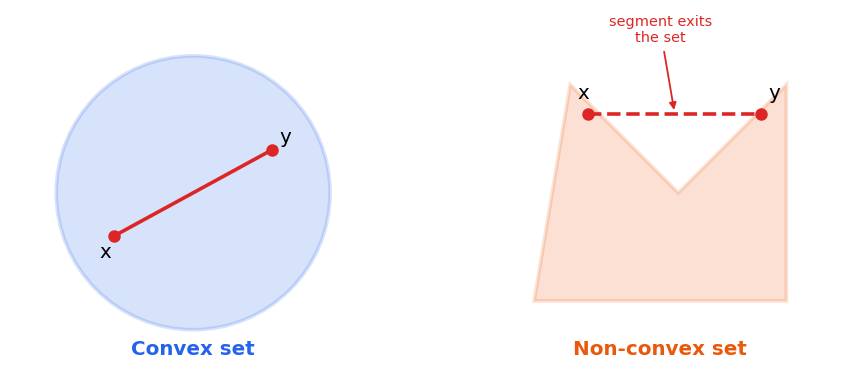

Filled circle: any chord stays inside → convex. Star polygon: a chord between two outer points cuts through the empty notches → non-convex.

#### ❓ Counter Questions

- **Is the union of two convex sets convex?** Not generally — two separate discs are each convex, but a segment between them leaves the union. (Intersections, however, *stay* convex.)
- **Is a single point a convex set? A line?** Yes to both — they trivially contain all their internal segments.

---

## 3.2.2 Convex Functions

#### 📐 Formal Definition

$f:\mathbb{R}^n\to\mathbb{R}$ on a convex domain is **convex** if for all $x,y$ and $t\in[0,1]$:
$$f\big(tx+(1-t)y\big)\le tf(x)+(1-t)f(y).$$
The **chord** joining any two graph points never dips **below** the curve.

#### 🗣️ Layman Explanation

A convex function is bowl-shaped (∪). Connect two points on its graph with a ruler; the ruler stays on or above the curve everywhere between them.

#### 🧠 Conceptual Deep Dive

**Read the inequality.** The left side, $f(tx+(1-t)y)$, is the function's *actual* value at a point between $x$ and $y$. The right side, $tf(x)+(1-t)f(y)$, is the *straight-line interpolation* (the chord) between the two endpoint heights. "Function $\le$ chord" means the curve sags **below** the straight line — the hallmark of a bowl. Flip the inequality and you get **concave** (a dome, ∩).

**Why ML obsesses over this one property.** Convexity is the bridge between "we can take a gradient" and "the gradient actually leads somewhere good." A convex loss has **no false valleys** — so gradient descent, which only ever sees *local* slope, is guaranteed to reach the *global* best (proved in §3.2.5). Without convexity, local information can mislead you into a suboptimal trap. Convexity is what turns optimisation from hope into guarantee.

**What if a loss isn't convex?** Then training becomes initialization-dependent and luck-dependent: different starting weights → different (possibly worse) solutions. This is the daily reality of neural networks (L6), and it's why they need tricks — momentum, good initialization, SGD noise — that convex problems simply don't.

#### 🧪 Worked Example

$f(x)=x^2$ is convex (the parabola lies below every chord). $f(x)=-x^2$ (∩) is **not** convex. $f(x)=|x|$ is convex (V-shape — chord stays above) but not smooth at 0.

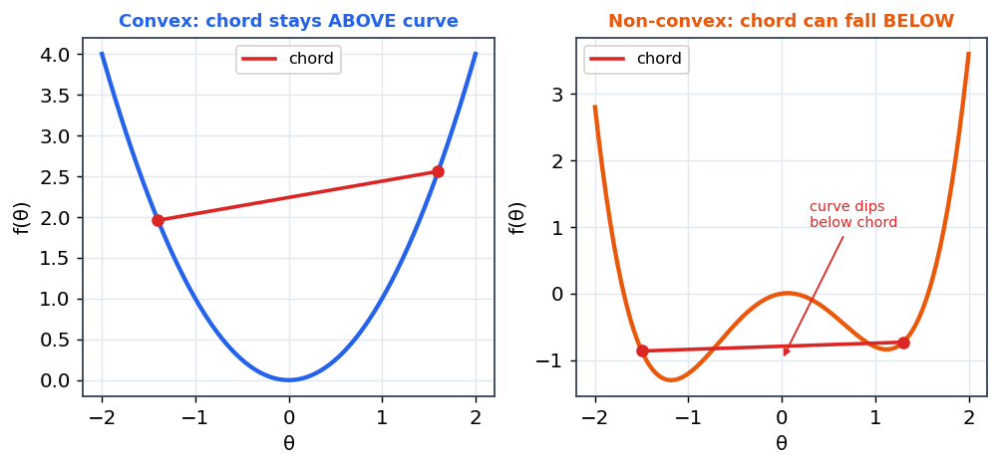

#### ❓ Counter Questions

- **Is a straight line convex?** Yes — the chord lies *on* the curve ($\le$ holds with equality). Linear functions are convex *and* concave.
- **Is the sum of convex functions convex?** Yes — a crucial fact: MSE + an L2 penalty (both convex) is convex (L4), so regularization preserves the guarantee.

---

## 3.2.3 How to Check Convexity

#### 📐 Formal Definition (the equivalence theorem)

For twice-differentiable $f$ on a convex open domain, these are **equivalent**:
- **(a)** $f$ is convex.
- **(b) First-order:** $f(y)\ge f(x)+\nabla f(x)^\top(y-x)$ — the function lies above all its tangents.
- **(c) Second-order:** the Hessian is PSD everywhere, $\nabla^2 f\succeq0$. In 1-D: $f''(x)\ge0$.

#### 🗣️ Layman Explanation

Three ways to verify a bowl: (a) the chord test (definition), (b) the curve never falls below a tangent ruler laid against it, or (c) its curvature is never negative. The curvature test is usually easiest.

#### 🧠 Conceptual Deep Dive

**Why have three equivalent tests?** Each is useful in different situations. The **definition** (a) is universal but cumbersome. The **first-order** condition (b) underlies optimisation theory (it's why a zero gradient is a global min for convex $f$). The **second-order** condition (c) is the *practical computational test* — just check the sign of curvature. They're equivalent because they all capture the same geometric fact: "bends upward."

**Intuition for the second-order test.** $f''$ measures whether the slope is *increasing* (curving up, ∪) or *decreasing* (curving down, ∩). If the slope only ever increases ($f''\ge0$ everywhere), the function is a bowl. In many dimensions, "curvature $\ge0$ in every direction" becomes "the Hessian is **PSD**" — i.e. $v^\top\nabla^2f\,v\ge0$ for all directions $v$ (primer §A).

**An advanced subtlety (worth a counter-question).** Strict convexity does *not* require $f''>0$ everywhere. $f(x)=x^4$ is strictly convex yet $f''(0)=0$. PSD-with-isolated-zeros still gives convexity; strict positive-definiteness is *sufficient but not necessary* for strict convexity.

#### 🧪 Worked Example

Is $f(x)=x^2$ convex? $f'(x)=2x$, $f''(x)=2\ge0$ everywhere → convex. ✓
Is $f(x)=x^3$ convex? $f''(x)=6x$, which is negative for $x<0$ → **not** convex (it's convex only on $x\ge0$).

#### ❓ Counter Questions

- **Does $f''(x_0)=0$ at one point break convexity?** No — convexity needs $f''\ge0$ *everywhere*; isolated zeros are fine (e.g. $x^4$).
- **Why prefer the Hessian test in ML?** Because cost functions are given as formulas; differentiating twice and checking PSD is mechanical and rigorous.

---

## 3.2.4 Convexity of MSE (the full proof)

#### 📐 The claim

For $\hat y=\theta^\top x$ and $J(\theta)=\frac{1}{2m}\sum(\theta^\top x^{(i)}-y^{(i)})^2$, $J$ is **convex** in $\theta$.

#### 🧠 Conceptual Deep Dive + proof (exactly as your note derives it)

**Step 1 — gradient:**
$$\nabla_\theta J(\theta)=\frac1m\sum_{i=1}^m\big(\theta^\top x^{(i)}-y^{(i)}\big)x^{(i)}.$$
**Step 2 — Hessian** (differentiate again; the residual's derivative w.r.t. $\theta$ is $x^{(i)\top}$):
$$\nabla^2_\theta J(\theta)=\frac1m\sum_{i=1}^m x^{(i)}\big(x^{(i)}\big)^\top.$$
**Step 3 — check PSD.** For any vector $v$:
$$v^\top\!\Big(\frac1m\sum_i x^{(i)}x^{(i)\top}\Big)v=\frac1m\sum_i v^\top x^{(i)}\,x^{(i)\top}v=\frac1m\sum_i\big(v^\top x^{(i)}\big)^2\ge0.$$
A sum of squares is non-negative ⇒ Hessian PSD everywhere ⇒ **$J$ is convex.** ∎

> [!info] **Why this matters — and the bonus observation**
> The Hessian $\frac1m\sum x^{(i)}x^{(i)\top}$ **does not depend on $\theta$**. A constant Hessian means $J$ isn't merely convex — it's **quadratic** (a perfect paraboloid), the friendliest convex shape. *This* is the deep reason linear regression has both a clean closed-form solution (one curvature everywhere → one solve) and flawless gradient descent.

#### 🧪 Worked Example (1-D intuition)

With one feature and the bias dropped, $J(\theta_1)=\frac{1}{2m}\sum(\theta_1 x^{(i)}-y^{(i)})^2$. Then $J''(\theta_1)=\frac1m\sum (x^{(i)})^2\ge0$ — a sum of squares, manifestly non-negative. The multi-dimensional proof is just this fact wearing matrix clothes.

#### ❓ Counter Questions

- **Why is it important the Hessian is θ-independent?** It means the curvature is the *same everywhere*, so there's a single global bowl — no flat-then-steep regions, no surprises. This is special to quadratic losses.
- **Does adding L2 keep it convex?** Yes — L2 adds $\lambda I$ to the Hessian (still PSD, in fact positive-definite), so ridge is *even more* strongly convex (L4).

---

## 3.2.5 Why Convexity Is Powerful — local = global

#### 📐 Theorem (with proof)

**If $f$ is convex, every local minimum is a global minimum.**

*Proof (contradiction).* Suppose $\theta^*$ is a local min but not global, so some $u$ has $f(u)<f(\theta^*)$. On the segment $z=(1-t)\theta^*+tu$, $t\in(0,1)$, convexity gives
$$f(z)\le(1-t)f(\theta^*)+tf(u)<(1-t)f(\theta^*)+tf(\theta^*)=f(\theta^*).$$
So $f(z)<f(\theta^*)$ for $z$ arbitrarily close to $\theta^*$ (take $t$ small) — contradicting that $\theta^*$ is a *local* minimum. Hence no such $u$ exists. ∎

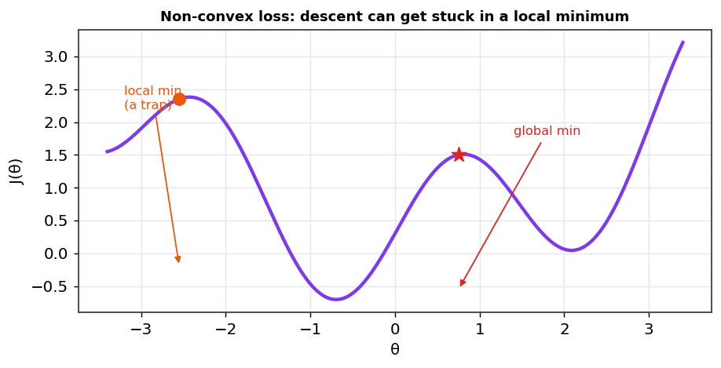

#### 🧠 Conceptual Deep Dive

**What the proof really says.** If there were a better point $u$ somewhere far away, convexity forces the function to *slope downward continuously* from $\theta^*$ toward $u$ — so $\theta^*$ couldn't be a bottom even locally. Convexity removes the possibility of "a dip here, a deeper dip over there with a hill between." There are no hills; the whole surface tilts toward one global bottom.

**Why this is the keystone of the course.** It means: for convex losses (linear regression, logistic regression), gradient descent's *local* hill-walking is *globally* optimal — you cannot get stuck, and the answer doesn't depend on where you start. This is the precise sense in which L3.1's optimiser is *guaranteed* to work, and it's the property neural networks (L6) sacrifice.

**Answer to the real Quiz 1 (SET-SAMPLE) Q3.** *Why is convexity desirable for a cost function?* Because a convex cost **guarantees any local minimum is the global minimum**, so gradient descent converges to the best solution **regardless of initialization**. Non-convex costs (neural nets) can trap descent at local minima or saddle points, giving a suboptimal, start-dependent model.

#### 🧪 Worked Example (why initialization is irrelevant)

On the convex MSE bowl, start GD at $\theta=(-3,3)$ or $\theta=(5,-5)$ — both roll to the *same* unique minimum (the contour figure in L3.1 shows one such path). On a non-convex surface, those two starts could end in *different* valleys.

#### ❓ Counter Questions

- **Neural nets are non-convex — is GD useless there?** No, but its guarantees weaken: it may find a local minimum/saddle, and the result depends on init and randomness. Momentum, good init, and SGD noise help navigate (L6).
- **Does convex = easy to optimise?** Convex is *necessary* for the global guarantee but you still need a sensible learning rate; a convex problem with a bad $\alpha$ can still diverge.

---

## 3.2.6 Advanced Edge — MSE+sigmoid is **non-convex**, BCE is convex

This is the conceptual bridge to L5 and a favourite deep-reasoning item.

#### 🧠 Conceptual Deep Dive

For logistic regression we predict $\hat y=\sigma(\theta^\top x)$ — a **nonlinear** sigmoid. Wrapping it in MSE, $J=\frac{1}{2m}\sum(\sigma(\theta^\top x)-y)^2$, squares the error *after* a nonlinear transform. As the L5 slide states: *"the curvature of the loss changes sign in different regions"* — the Hessian is **not** PSD everywhere ⇒ **non-convex**, with multiple local minima and flat regions where the gradient nearly vanishes (so GD barely moves).

**Why does the sigmoid ruin convexity?** A composition of a convex function with a *nonlinear* inner function need not be convex. The sigmoid's S-shape (convex on one side of 0, concave on the other) injects concavity into the squared loss in places, breaking the PSD-everywhere condition.

**How cross-entropy rescues it.** BCE's $\log$ is engineered to **invert** the sigmoid's exponential, leaving a clean convex bowl. The convexity note confirms BCE+sigmoid has a PSD Hessian. So choosing cross-entropy over MSE for classification is *not* cosmetic — it **restores the global-optimum guarantee** of §3.2.5.

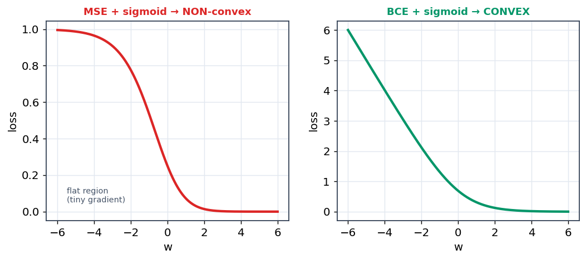

#### 🧪 Worked Example (single point, intuition)

Take one example $x=1,y=1$. The MSE-over-sigmoid loss $(\sigma(w)-1)^2$ is *flat* for very negative $w$ (gradient ≈ 0, so GD stalls) and not bowl-shaped overall. The BCE loss $-\log\sigma(w)$ decreases monotonically and convexly toward $w\to\infty$ — a clean descent. (The figure plots both.)

#### ❓ Counter Questions

- **Why does perfect linear separability break logistic convexity guarantees?** The loss can approach 0 only by sending $\|\theta\|\to\infty$; the minimum sits "at infinity," so weights diverge. Regularization (L4) restores a finite optimum.
- **Is every nonlinearity inside a loss bad?** Not "bad," but it can destroy convexity. The art is pairing a nonlinearity with a loss that *cancels* its troublesome curvature — exactly what sigmoid+log achieves.

---

## 🎯 High-Yield Concepts (Lecture 3.2)

1. **Convex set** (chord stays inside) and **convex function** (chord stays above).
2. The **three equivalent tests** (definition / first-order tangent / Hessian PSD).
3. **MSE is convex** — and *quadratic* (θ-independent Hessian); know the 3-step proof.
4. **Convex ⇒ every local min is global** — know the contradiction proof.
5. **MSE+sigmoid is non-convex; BCE+sigmoid is convex** — the reason classification uses cross-entropy.

## ⚠️ Common Misconceptions

- *"$f''=0$ anywhere means not convex."* False — isolated zeros are fine ($x^4$).
- *"Convex means easy / fast."* Convex guarantees a *global* optimum exists and is reachable, but you still need a good $\alpha$.
- *"MSE works fine for logistic regression."* It's non-convex on a sigmoid — use BCE.
- *"Non-convex means GD fails."* It means GD has no *global* guarantee, not that it's useless.
- *"Concave is the same as non-convex."* Concave is a specific ∩-shape; non-convex is anything that isn't convex.

## 🎓 Professor Trap Questions

1. *"Is $f(x)=|x|$ convex?"* — **Yes** (chord stays above), even though it's not differentiable at 0. The trap baits you into equating convex with smooth.
2. *"MSE is convex, so logistic regression with MSE is convex too — true?"* — **False.** Convexity of MSE was for a *linear* model; with a sigmoid inside, it's non-convex. Tests whether you understand *why* MSE was convex.
3. *"A function has a local minimum that's not global — could it be convex?"* — **No** — that directly contradicts the local=global theorem; the function must be non-convex.

## 📝 Practice Problems (inspired by the Convexity note & Boyd-style convex analysis)

1. **(Mathematical)** Show $f(x)=e^x$ is convex. *($f''=e^x>0$ everywhere.)*
2. **(Mathematical)** Prove the MSE Hessian is PSD. *(Reproduce the 3-step sum-of-squares argument.)*
3. **(Conceptual)** Explain why a θ-independent Hessian implies a quadratic, single-bowl loss. *(Constant curvature everywhere ⇒ paraboloid ⇒ one global min.)*
4. **(Analytical)** Why does cross-entropy "undo" the sigmoid to restore convexity, while squared error doesn't? *(The log inverts the sigmoid's exponential, cancelling the concavity the square would otherwise inherit.)*
5. **("What if?")** What if your classification loss were non-convex with many shallow minima — what optimiser choice helps, and why (link to L3.1)? *(SGD; its gradient noise can escape shallow minima.)*
6. **(Mixed)** Is the sum of a convex MSE and a convex L2 penalty convex? Justify and state the consequence for ridge regression. *(Yes — sum of convex functions is convex; ridge keeps the global-optimum guarantee, and is strongly convex.)*

## ⚡ Quick Revision Summary

> [!abstract]
> **Convex set:** every chord stays inside. **Convex function:** chord stays above the curve (∪). **Three tests:** definition / above-all-tangents / Hessian PSD ($f''\ge0$). **MSE is convex** because $\nabla^2J=\frac1m\sum x x^\top\succeq0$ — and θ-independent, so *quadratic* (one perfect bowl). **Convex ⇒ every local min is global** ⇒ GD reaches the global optimum regardless of start (Quiz 1 Q3). **MSE+sigmoid is non-convex** (sigmoid injects concavity); **BCE+sigmoid is convex** (log cancels it) — the reason classification uses cross-entropy. Neural nets are non-convex, which is why they need momentum/good-init/SGD-noise (L6).

---
# Lecture 4 — Linear Regression and Regularization

> **Slide source:** Lecture 4 (Ishmam Tashdeed). **Cited chapters:** Goodfellow Ch. 7 · Bishop Ch. 3.1.4 · Alpaydın Ch. 4.7.
> **Where it sits:** L3 built a model that *fits*. This lecture confronts the universal danger — fitting *too well* and failing on new data — and supplies the cure. It operationalises L2's "generalization," reuses L3.2's "sum of convex functions is convex," and its tools (dropout, weight decay) return in L6.

---

## 4.1 Multivariate & Polynomial Regression

#### 📐 Formal Definition

**Multivariate** linear regression: $h_\theta(x)=\theta_0+\theta_1x_1+\dots+\theta_nx_n=\theta^\top x$, with GD updating every feature. **Polynomial** regression keeps the model linear-in-$\theta$ but adds nonlinear features ($x^2,x^3,\dots$) to fit curves.

#### 🗣️ Layman Explanation

House price depends on more than size — bedrooms, floors, age. Multivariate regression adds a dial per factor. Polynomial regression bends the line into a curve by feeding the model powers of the inputs.

#### 🧠 Conceptual Deep Dive

**Why polynomial regression is "still linear regression."** This trips students up. The model $\theta_0+\theta_1x+\theta_2x^2$ is *nonlinear in $x$* but *linear in $\theta$* — and learning only ever adjusts $\theta$. So we can reuse the entire linear-regression machinery (MSE, GD, normal equation) by treating $x^2$ as just another feature column. The nonlinearity lives in **feature engineering**, not the model. This exact idea powers nonlinear decision boundaries in logistic regression (L5) and is the conceptual seed of what hidden layers do automatically in neural networks (L6).

**The crucial question the slide poses: "why not keep adding parameters?"** Each new polynomial term lets the curve wiggle more, driving training error toward zero. It feels like progress — but you're now fitting the *noise*, not the signal. This is the doorway to overfitting, the entire subject of this lecture. The tension is fundamental: **more flexibility fits the training data better but generalizes worse past a point.**

**What if we only ever used straight lines?** We'd *underfit* any curved relationship — no amount of training fixes a hypothesis too simple to represent the truth. So we need flexibility; the art is controlling it.

#### 🧪 Worked Example

Fitting house price from $\{x_1=\text{size},x_2=\text{bedrooms},x_3=\text{floors},x_4=\text{age}\}$: $h_\theta(x)=\theta_0+\theta_1x_1+\theta_2x_2+\theta_3x_3+\theta_4x_4$. The GD update for *each* $\theta_j$ is the familiar $\theta_j\leftarrow\theta_j-\frac{\alpha}{m}\sum_i(h_\theta(x^{(i)})-y^{(i)})x_j^{(i)}$ — identical form, just more of them.

#### ❓ Counter Questions

- **Is polynomial regression still "linear regression"?** Yes — linear in the parameters; the nonlinearity is in the engineered features.
- **Can adding features ever *hurt*?** Yes — irrelevant or excessive features raise variance (overfitting) and trigger the curse of dimensionality (§4.2).

---

## 4.2 Overfitting, Underfitting & the Bias–Variance Trade-off

#### 📐 Formal Definition

With too many parameters, the hypothesis can fit training data almost perfectly ($J(\theta)\approx0$) yet **fail to generalize**. Three regimes:
- **Underfit** — too simple → **high bias** (and, by standard convention, **low variance**).
- **Good fit** — low bias, low variance.
- **Overfit** — memorises noise → **low bias, high variance**.

> [!danger] **Course discrepancy — read carefully**
> Your **Lecture 4 slide labels underfitting "High Bias, High Variance."** This contradicts the universal convention (Alpaydın, Bishop, ISL, Goodfellow): **underfitting = high bias, *low* variance.** The logic — a too-simple model (a flat line) is *insensitive* to the training sample; retrain it on a different sample and it barely moves → **low** variance. High variance is the *overfitting* symptom.
> **In the exam:** if a question explicitly cites the slide, answer per the slide; otherwise give the standard form (**high bias, low variance** for underfit) and note the slide's wording. A principled grader rewards the correct convention — and this is exactly the adjacent-fact confusion the faculty probes.

#### 🗣️ Layman Explanation

**Underfitting** = a student who barely studied and gives the same shallow answer to everything (consistently wrong — high bias, low variance). **Overfitting** = a student who memorised the practice exam verbatim but panics on any rephrasing (great on seen problems, erratic on new ones — high variance).

#### 🧠 Conceptual Deep Dive

**Decomposing error — where bias and variance come from.** Imagine training your model on many different datasets drawn from the same source. For a fixed test point, your predictions scatter around the truth. **Bias** is how far the *average* prediction sits from the truth (systematic error from over-simplified assumptions). **Variance** is how much predictions *scatter* around that average (sensitivity to which particular dataset you got). Total expected error $=\text{bias}^2+\text{variance}+\text{irreducible noise}$ — the noise being the part no model can remove.

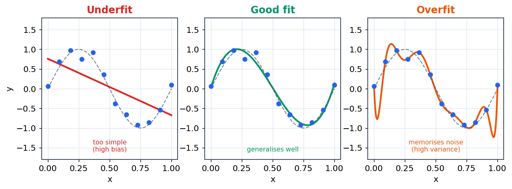

**Why they trade off.** A simple model (flat line) makes the *same* confident-but-wrong prediction no matter the dataset → high bias, low variance. A flexible model (degree-11 polynomial) contorts to whatever dataset it sees → low bias, high variance. You cannot minimise both at once with a single complexity dial; you seek the **balance** that minimises *total test error*.

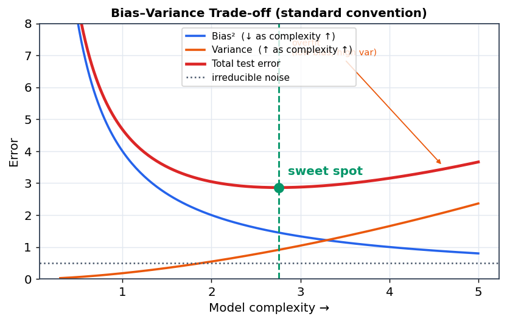

**Why "fits training perfectly" is a warning, not a triumph.** $J\approx0$ on training means the model captured the noise too — and noise doesn't repeat on new data, so test error climbs. This is the single most important instinct in applied ML: *training error near zero with rising validation error = overfitting* (a debugging cue that returns in L6).

**The curse of dimensionality (Bellman) — why "too many features" is dangerous.** As feature count grows, the space's volume explodes **exponentially**, so a fixed dataset becomes vanishingly **sparse**. Consequences your slide names: (1) to keep the same data "density," you'd need *exponentially* more data; (2) distance measures (Euclidean) lose meaning — nearest and farthest points become almost equidistant, crippling distance-based methods. This is *why* high-dimensional models overfit so readily and *why* we need to either reduce features or regularize.

**What if regularization didn't exist?** We'd be forced to manually prune features or collect impossibly large datasets to control overfitting. Regularization lets us keep all features yet tame their influence — a far more flexible cure (§4.3).

#### 🧪 Worked Example

Fit polynomials of degree 1, 3, 11 to 12 noisy points from a sine wave (figure above). Degree 1 underfits (misses the curve — high bias). Degree 3 tracks the trend (balanced). Degree 11 wiggles through every point *including noise* (low training error, high variance) — and predicts wildly between points.

#### ❓ Counter Questions

- **Can a model be high-bias AND high-variance?** A *badly built* model can be both, but the canonical underfit case is high-bias/low-variance (the slide's "high/high" is the flagged discrepancy).
- **Does more data fix overfitting?** It reduces *variance* (more data pins the model down) but cannot fix *bias* — an underpowered model stays wrong no matter the data volume.
- **Does more data fix underfitting?** No — you need a *more expressive* model (more features/complexity), not more data.

---

## 4.3 Regularization — the General Idea

#### 📐 Formal Definition

Add a penalty $\Omega(\theta)$ on the weights: $J_{\text{reg}}(\theta)=J(\theta)+\lambda\,\Omega(\theta)$, $\lambda\ge0$. $\lambda=0$ → no regularization (overfit risk); $\lambda\to\infty$ → all $\theta\approx0$ (underfit); optimal $\lambda^*$ → best generalization.

#### 🗣️ Layman Explanation

Regularization is a tax on complexity. Big weights make a wiggly, over-sensitive function; the penalty charges the model for large weights, nudging it toward simpler, smoother hypotheses that generalize better.

#### 🧠 Conceptual Deep Dive

**Why penalising *weights* controls *complexity*.** Your slide's chain: small weights → the hypothesis is less sensitive to input changes → a simpler, smoother function → less overfitting. Large weights → tiny input changes cause big output swings → a wiggly high-variance function. So weight *magnitude* is a proxy for *complexity*, and shrinking weights shrinks complexity — moving you leftward on the bias–variance curve (trading variance for a little bias).

**The deeper origin — regularization is a prior (link to L2's MLE).** Recall MLE picks weights that best fit the data. Add a *prior belief* that weights should be small (most real effects are modest), and MLE becomes MAP estimation. A **Gaussian** prior on weights yields **L2**; a **Laplace** prior yields **L1**. So regularization isn't an ad-hoc patch — it's the Bayesian statement "I expect small weights" made mathematical. (You won't be asked to derive this, but stating the connection is a top-band answer.)

**The $\lambda$ dial — a bias–variance knob.** $\lambda$ directly trades variance for bias: crank it up and weights shrink (simpler, higher bias, lower variance); turn it down and the model is free to overfit. The optimal $\lambda^*$ is found on the *validation* set (L2) — never the test set.

**Two cures for overfitting (slide).** (1) **Reduce features** (manual or automatic selection). (2) **Regularization** (keep all features, shrink their influence). Regularization wins when *every feature carries some signal* — you don't want to discard any, just dampen them.

#### 🧪 Worked Example (λ at its extremes)

Fit a degree-10 polynomial with ridge. At $\lambda=0$: the curve wiggles through every point (overfit). At $\lambda=10^6$: every $\theta_j\approx0$, so $h_\theta(x)\approx\theta_0$ — a flat line (underfit). Somewhere between sits $\lambda^*$ giving a smooth curve that tracks the trend — chosen by lowest validation error.

#### ❓ Counter Questions

- **Does regularization always improve accuracy?** No — too large a $\lambda$ underfits. It improves *generalization* only at the right strength.
- **Why penalise large weights specifically?** Because large weights are what let a function react violently to small input changes — the signature of high variance.

---

## 4.4 L2 / Ridge Regularization

#### 📐 Formal Definition

$\Omega_{L2}(\theta)=\tfrac12\|\theta\|_2^2=\tfrac12\sum_{j\ge1}\theta_j^2$, so $J_{L2}=J(\theta)+\frac\lambda2\sum_{j\ge1}\theta_j^2$. Gradient gains $\lambda\theta_j$ (for $j\ge1$; **bias $\theta_0$ unpenalised**). Update:
$$\theta_j\leftarrow(1-\alpha\lambda)\,\theta_j-\frac{\alpha}{m}\sum_i\big(h_\theta(x^{(i)})-y^{(i)}\big)x_j^{(i)}.$$
Closed form: $\theta=(X^\top X+\lambda I)^{-1}X^\top y$.

#### 🗣️ Layman Explanation

Ridge gently deflates every weight on each step before the usual gradient update — like air slowly leaking from balloons. Weights get small but rarely hit exactly zero.

#### 🧠 Conceptual Deep Dive

**Why it's called "weight decay" — read the update.** The factor $(1-\alpha\lambda)$ in front of $\theta_j$ means each step first **multiplies the weight by something slightly less than 1** (decaying it toward zero), *then* applies the gradient. So every iteration the weight "leaks" a fixed *fraction*. The pull toward zero is $2\lambda\theta_j$ — **proportional to the weight**, so it *weakens as $\theta_j\to0$* and never quite reaches zero. That's why L2 gives **dense** solutions (all weights small, none exactly zero).

**The geometry — circular constraint.** Equivalently, ridge minimises the loss subject to keeping $\sum\theta_j^2$ small — a **circular/spherical** constraint region. The expanding loss contours typically first touch this smooth boundary at a point where *no* coordinate is exactly zero.

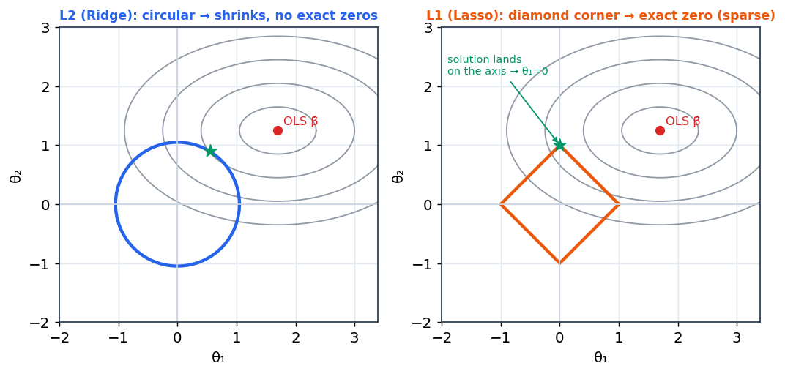

**The hidden bonus — numerical rescue.** $(X^\top X+\lambda I)$ is **always invertible** even when $X^\top X$ is singular (collinear features, $n>m$), because adding $\lambda I$ lifts all eigenvalues above zero. So ridge simultaneously fights overfitting *and* fixes the normal-equation breakdown from L3.1. One idea, two payoffs.

**Why the bias is excluded.** $\theta_0$ only *shifts* predictions up/down; it doesn't control sensitivity to inputs, so penalising it would just handicap the model's ability to centre its outputs without reducing overfitting (more in §4.5's quiz item).

#### 🧪 Worked Example (weight decay in one step)

Suppose $\theta_j=4$, $\alpha=0.1$, $\lambda=0.5$, and the data-gradient term is 2. The decay factor is $(1-\alpha\lambda)=(1-0.05)=0.95$. Update: $\theta_j\leftarrow 0.95(4)-0.1(2)=3.8-0.2=3.6$. The weight first decayed $4\to3.8$, then the gradient nudged it to $3.6$.

> [!warning] **Exam trap (real Quiz 1 SET-A Q3)**
> *Why normalize features before GD with L2?* L2 penalises large weights **equally**. A tiny-scale feature needs a large weight to matter, which L2 then over-punishes → that feature is unfairly suppressed. **Standardise first** so the penalty is fair. The slide: *"Ridge penalises large θ equally, so features on different scales get unfair treatment. It is critical to standardise the features before ridge."*

#### ❓ Counter Questions

- **Why doesn't L2 produce exact zeros?** Its pull $2\lambda\theta_j$ vanishes as $\theta_j\to0$, so the weight asymptotes to (but never reaches) zero.
- **How does ridge fix a singular normal equation?** $+\lambda I$ makes $X^\top X+\lambda I$ positive-definite, hence invertible.

---

## 4.5 L1 / Lasso Regularization

#### 📐 Formal Definition

$\Omega_{L1}(\theta)=\|\theta\|_1=\sum_{j\ge1}|\theta_j|$, so $J_{L1}=J(\theta)+\lambda\sum_{j\ge1}|\theta_j|$. Since $|\theta_j|$ isn't differentiable at 0, use the **subgradient** $\operatorname{sign}(\theta_j)\in\{+1,-1,0\}$; gradient gains $\lambda\operatorname{sign}(\theta_j)$.

#### 🗣️ Layman Explanation

L1 gives every weight a *constant* shove toward zero of fixed size $\lambda$, no matter how big the weight is. Small weights get shoved all the way to **exactly zero** and drop out — the model selects its own features.

#### 🧠 Conceptual Deep Dive

**The decisive contrast — constant vs vanishing pull.** L2's pull $2\lambda\theta_j$ *shrinks* with the weight, so it eases off near zero and never arrives. L1's pull is $\lambda\operatorname{sign}(\theta_j)=\pm\lambda$ — a **constant** force regardless of weight size. A constant force *can* push a weight all the way to zero and *pin* it there (the data-gradient must exceed $\lambda$ to move it off zero). Result: **L1 → sparse** (many exact zeros → automatic **feature selection**); **L2 → dense** (all small, none zero).

**The geometry — diamond corners.** L1's constraint region $\sum|\theta_j|\le t$ is a **diamond** with sharp **corners on the axes**. Expanding loss contours are most likely to first touch a *corner*, where one coordinate is exactly zero (figure in §4.4). L2's smooth circle has no such corners, so it rarely zeroes a coordinate. The shape of the penalty *is* the reason for sparsity.

**Why sparsity is valuable.** A model using 5 of 1000 features is **interpretable** (you know what drives predictions), **cheaper**, and often **generalizes better** (fewer parameters → lower variance). L1 does feature selection and fitting *in one optimisation*.

**What if you have correlated features?** L1 tends to arbitrarily pick one of a correlated group and zero the rest, which can be unstable. **Elastic Net** (next) mixes L1+L2 to get sparsity *and* stability.

#### 🧪 Worked Example (why a small weight dies under L1)

A weight $\theta_j=0.1$ whose data-gradient is only $0.05$, with $\lambda=0.2$. The L1 term pushes by $\lambda=0.2$ toward zero, which *overwhelms* the data-gradient of $0.05$ → the weight is driven to (and held at) 0. Under L2 with the same $\lambda$, the pull would be $2\lambda\theta_j=2(0.2)(0.1)=0.04$ — *weaker* than the data-gradient, so the weight survives, merely shrunk. Same setup, opposite outcome — that's sparsity vs density in action.

> [!tip] **Memory trick**
> **L1 = Lasso = Lean** (sparse, feature selection, diamond, constant pull). **L2 = Ridge = Reduce-all** (dense, weight decay, circle, proportional pull). "Lasso lassoes weights to zero."

#### ❓ Counter Questions

- **Why does L1 produce zeros but L2 doesn't?** Constant vs vanishing pull near zero, and the diamond's axis-corners vs the circle's smooth edge.
- **Is the bias term regularised?** No — see the trap below.

> [!warning] **Exam trap (real Quiz 2 SET-B Q2)**
> *Why exclude the bias from regularization?* The bias only **shifts** the decision boundary / prediction level; feature weights control *sensitivity to inputs* (the thing that overfits). Penalising the bias wouldn't curb overfitting and would just impair the model's ability to centre its outputs — so it's left unpenalised.

---

## 4.6 Other Regularizers (slide)

**Elastic Net** ($\alpha L1+(1-\alpha)L2$ — sparsity *and* stability with correlated features), **Dropout** (randomly drop neurons — a neural-net regularizer, L6), **Early Stopping** (halt training when validation loss starts rising — using L2's "validation as referee" idea). All share one goal: **limit effective complexity** to improve generalization.

---

## 🎯 High-Yield Concepts (Lecture 4)

1. **Overfit/underfit** and the **bias–variance trade-off** (mind the slide's "high/high" discrepancy).
2. **Curse of dimensionality** (Bellman; exponential sparsity).
3. **General regularization** $J+\lambda\Omega$ and the role of $\lambda$.
4. **L2/ridge**: weight decay $(1-\alpha\lambda)$, circle, dense, $(X^\top X+\lambda I)^{-1}$.
5. **L1/lasso**: $\pm\lambda$ subgradient, diamond, **sparse → feature selection**.
6. **Standardise before ridge**; **don't regularize the bias**.

## ⚠️ Common Misconceptions

- *"Underfitting is high bias *and* high variance."* Standard convention: high bias, **low** variance (your slide says high/high — flag it).
- *"Regularization always raises accuracy."* Too-large $\lambda$ underfits.
- *"L2 can zero out features."* No — that's L1; L2 only shrinks.
- *"More data fixes bias."* It fixes variance, not bias.
- *"Regularize the bias too, for consistency."* No — it only shifts predictions and doesn't cause overfitting.

## 🎓 Professor Trap Questions

1. *"You want automatic feature selection from 1000 features. L1 or L2?"* — **L1** (sparsity). L2 keeps all features (dense). The trap rewards knowing *why* the geometries differ.
2. *"A flat-line model performs poorly on both train and test. High variance — true?"* — **False:** that's high **bias**, low variance (underfit). (Directly probes the slide discrepancy.)
3. *"Ridge gave a great fit without standardizing. Any concern?"* — Yes — the penalty was applied unequally across scales, so feature importances are distorted; standardize and refit.

## 📝 Practice Problems (inspired by Goodfellow Ch. 7, Bishop Ch. 3.1.4, Alpaydın Ch. 4.7)

1. **(Mathematical)** Write the ridge weight-decay update and compute one step for $\theta_j=2$, $\alpha=0.1$, $\lambda=1$, data-gradient $=3$. *(Factor $0.9$; $0.9(2)-0.1(3)=1.8-0.3=1.5$.)*
2. **(Conceptual)** Explain geometrically why L1 produces sparsity but L2 does not. *(Diamond corners on axes vs smooth circle.)*
3. **(Short answer)** State the closed-form ridge solution and one extra problem it solves besides overfitting. *( $(X^\top X+\lambda I)^{-1}X^\top y$; fixes singular $X^\top X$.)*
4. **(Analytical)** A model has near-zero training error but poor test error. Name the regime, the bias–variance labels, and two fixes. *(Overfit; low bias/high variance; regularize (L1/L2), get more data, reduce features/complexity.)*
5. **("What if?")** What if $\lambda\to\infty$? What if $\lambda=0$? *(All weights →0, underfit; no penalty, overfit.)*
6. **(Mixed)** You have 50 features, 30 strongly correlated. Which regularizer balances sparsity and stability, and why? *(Elastic Net — L1 for sparsity, L2 to handle correlated groups gracefully.)*

## ⚡ Quick Revision Summary

> [!abstract]
> **Overfit = low bias/high variance** (memorises noise); **underfit = high bias/low variance** (too simple) — *your slide says "high/high," flag it.* Error = bias²+variance+noise; **curse of dimensionality** (Bellman) makes high-D data sparse. **Regularization** $J+\lambda\Omega$ taxes weight magnitude (a complexity proxy; a *prior* on weights, link to MLE). **L2/ridge** = weight decay $(1-\alpha\lambda)$, circular, **dense**, $(X^\top X+\lambda I)^{-1}$ also cures singular $X^\top X$. **L1/lasso** = constant $\pm\lambda$ pull, diamond, **sparse → feature selection**. **Standardise before ridge**; **never regularize the bias**. $\lambda$ is a bias–variance dial tuned on validation.

---
# Lecture 5.1 — Logistic Regression

> **Slide source:** Lecture 5 (Ishmam Tashdeed). **Cited chapters:** Bishop Ch. 4.3.2, 4.3.4.
> **Where it sits:** The pivot from regression to classification — and the bridge to neural networks. Take L3's linear core $\theta^\top x$, squash it into a probability, and you have a single neuron (L6). It reuses L3.2's convexity argument to justify cross-entropy over MSE, and its gradient (L5.2) is structurally identical to L3.1's.

---

## 5.1.1 Why Not Linear Regression for Classification?

#### 📐 Formal Definition

**Classification** predicts discrete categorical classes. For binary $y\in\{0,1\}$, we want a **probability** $h_\theta(x)=P(y=1\mid x)\in[0,1]$.

#### 🗣️ Layman Explanation

You want a yes/no answer ("is this cat obese?"). A straight line can shoot to 5 or −3, nonsense as a probability. We need an output that always lands in $[0,1]$.

#### 🧠 Conceptual Deep Dive

**The four failures of linear regression for classification (slide), and why each is fatal:**
1. **Unbounded output.** $\theta^\top x$ ranges over all reals; a "probability" of 1.7 or −0.3 is meaningless.
2. **Not a probability.** Even within $[0,1]$, a raw line gives no calibrated sense of confidence.
3. **Outlier fragility.** One extreme point drags the fitted line, shifting the threshold and flipping many predictions — classification should be robust to a single far-away example, but least-squares is not.
4. **Wrong loss.** MSE on binary outcomes is both statistically wrong (binary labels are Bernoulli, not Gaussian — L2) and, on a sigmoid, **non-convex** (L3.2), wrecking optimisation.

**The reframing that fixes everything.** Instead of predicting the label directly, predict $P(y=1\mid x)$ — a probability. This single change cascades: it forces a squashing function (the sigmoid), which forces a matching loss (cross-entropy, the Bernoulli MLE), which happens to be convex. Each piece *necessitates* the next. Logistic regression is not a bag of tricks; it's a chain of forced moves once you decide to output a probability.

**What if we just thresholded linear regression at 0.5?** That's essentially the *perceptron*, and it works for cleanly separable data — but it gives no probability, is outlier-sensitive, and its hard threshold is non-differentiable (no smooth gradient to train). Logistic regression is the smooth, probabilistic, trainable upgrade.

#### 🧪 Worked Example

The obese-cat dataset: encode Obese? as $1$/$0$. A linear fit through these 0/1 points produces predictions like $1.4$ or $-0.2$ for extreme sizes — uninterpretable. We need a function that bends those extremes into $[0,1]$. Enter the sigmoid.

#### ❓ Counter Questions

- **Give two reasons linear regression fails for binary classification.** Unbounded/uninterpretable output; outlier-sensitive; MSE inappropriate (non-convex on a sigmoid, wrong likelihood).
- **Could we use linear regression if data are perfectly separable?** Even then it gives no probabilities and is unstable to outliers; thresholding (perceptron) is non-differentiable. Logistic regression is strictly better-behaved.

---

## 5.1.2 The Sigmoid Function

#### 📐 Formal Definition

$\sigma:\mathbb{R}\to(0,1)$, $\;\sigma(z)=\dfrac{1}{1+e^{-z}}$. Properties: range $(0,1)$; $\sigma(0)=0.5$; $\sigma(z)\to1$ as $z\to+\infty$, $\to0$ as $z\to-\infty$; derivative $\sigma'(z)=\sigma(z)(1-\sigma(z))$.

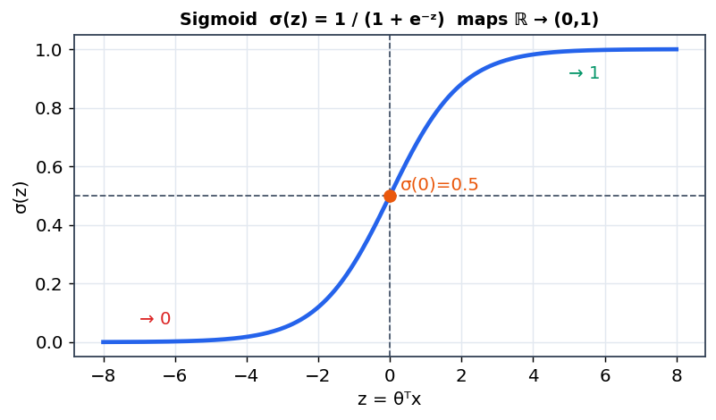

#### 🗣️ Layman Explanation

A smooth on/off switch. Very negative input → near 0 ("no"); very positive → near 1 ("yes"); zero → 0.5 ("genuinely unsure"). The S-shape gives a soft, probabilistic transition instead of a hard step.

#### 🧠 Conceptual Deep Dive

**Why *this* function?** Three reasons converge on the sigmoid:
- It **maps $\mathbb{R}\to(0,1)$** smoothly — exactly the probability requirement.
- It's the **inverse of the logit** (log-odds): if you believe the *log-odds* of class 1 are linear in the features ($\log\frac{p}{1-p}=\theta^\top x$), then solving for $p$ gives *precisely* $\sigma(\theta^\top x)$. So the sigmoid isn't arbitrary — it's forced by the assumption "log-odds are linear."
- Its **derivative is clean**: $\sigma'=\sigma(1-\sigma)$, expressed entirely in the output. This costs nothing extra to compute and is the reason the cross-entropy gradient collapses so beautifully (L5.2).

**The $0.25$ that haunts deep learning.** $\sigma'$ peaks at $z=0$ where $\sigma=0.5$, giving $\sigma'_{\max}=0.5\times0.5=0.25$. This *maximum slope of only 0.25* is the seed of the **vanishing-gradient** problem (L6): multiply many factors $\le0.25$ through a deep network and the gradient evaporates. So a property introduced innocently here becomes a central obstacle three lectures later — a beautiful thread to cite.

**What if we used a step function instead?** A hard step (0 below 0, 1 above) gives no gradient anywhere (flat) and no probability — untrainable by gradient descent. The sigmoid is the *smooth, differentiable* relaxation of the step that makes learning possible.

#### 🧪 Worked Example

$\sigma(0)=0.5$. $\sigma(2)=\frac{1}{1+e^{-2}}=\frac{1}{1+0.135}\approx0.88$. $\sigma(-2)\approx0.12$. $\sigma'(0)=0.5(1-0.5)=0.25$ (the maximum). So a pre-activation of $+2$ means "88% confident class 1."

#### ❓ Counter Questions

- **What is $\sigma(0)$ and why does it matter?** $0.5$ — the natural decision threshold and the point of maximum uncertainty.
- **What's the maximum of $\sigma'$, and why care?** $0.25$ — it bounds how much gradient survives each sigmoid in backprop, causing vanishing gradients in deep nets (L6).

---

## 5.1.3 The Model & Decision Boundary

#### 📐 Formal Definition

$$\hat y=P(y=1\mid x;\theta)=\sigma(\theta^\top x).$$
Threshold: predict 1 if $\hat y\ge0.5$, else 0. Since $\sigma(z)\ge0.5\iff z\ge0$, the **decision boundary** is $\theta^\top x=0$.

#### 🗣️ Layman Explanation

Compute a weighted score $\theta^\top x$. Positive → lean "yes," negative → "no," and the dividing line (score exactly 0) is where the model flips its vote.

#### 🧠 Conceptual Deep Dive

**Why the boundary is $\theta^\top x=0$, not $\hat y=0.5$ in some complicated way.** The threshold is on the *probability* ($\hat y\ge0.5$), but because the sigmoid is monotonic and $\sigma(0)=0.5$, "$\hat y\ge0.5$" is *exactly equivalent* to "$z=\theta^\top x\ge0$." So the messy probability condition reduces to a clean **linear** condition on the score. This is why logistic regression has a *linear* decision boundary despite its nonlinear sigmoid — the nonlinearity affects *confidence*, not the *location* of the boundary.

**How to get curved boundaries.** Feed nonlinear features ($x_1^2,x_2^2,x_1x_2$). The boundary $\theta^\top(\text{features})=0$ is then nonlinear in the *original* space while the model stays linear in $\theta$ — the same "linear in parameters" trick from L4's polynomial regression. This is the manual version of what neural-network hidden layers do automatically (L6).

**The log-odds interpretation (deeper why).** Rearranging gives $\log\frac{P(y=1)}{P(y=0)}=\theta^\top x$: logistic regression assumes the **log-odds are linear in the features**. So a unit increase in $x_j$ multiplies the *odds* by $e^{\theta_j}$ — a concrete, interpretable meaning for each weight (unlike a black-box model). This interpretability is one reason logistic regression remains a workhorse.

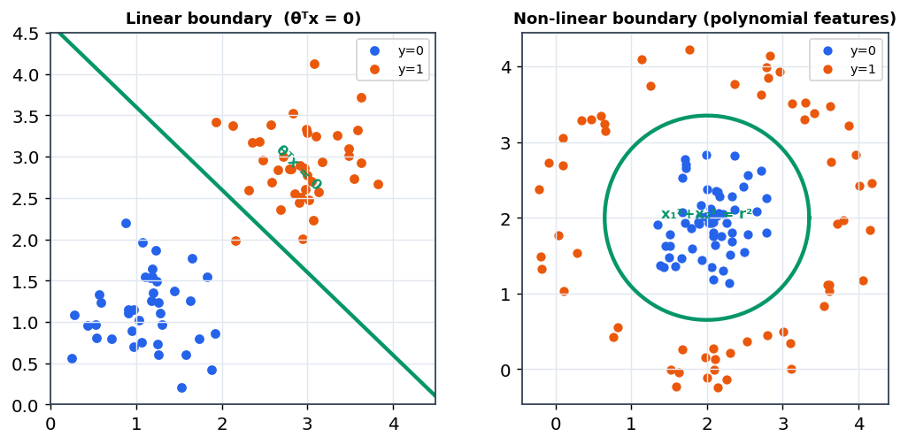

#### 🧪 Worked Example — a circular boundary

An inner cluster (class 0) surrounded by a ring (class 1) can't be split by any line. But adding the feature $x_1^2+x_2^2$ lets the boundary be $x_1^2+x_2^2=r^2$ — a **circle** (figure, right). The model is still linear in $\theta$; the *features* carry the curvature.

> [!warning] **Exam trap (real Quiz 2 Q1)**
> "Predict class 1 at threshold 0.5" ⟺ **$\theta^\top x\ge0$** (because $\sigma(z)\ge0.5\iff z\ge0$). The distractor "$\theta^\top x\ge0.5$" confuses the threshold on the *probability* with the *logit*. For a general threshold $\tau$: boundary is $\theta^\top x=\log\frac{\tau}{1-\tau}$ (the logit of $\tau$).

#### ❓ Counter Questions

- **How can a linear model give a nonlinear boundary?** Via nonlinear features; the model is linear in $\theta$, the features carry the nonlinearity (real Quiz 2 SET-A Q1).
- **What does moving the threshold to 0.7 do?** Shifts the boundary to $\theta^\top x=\log\frac{0.7}{0.3}>0$, trading recall for precision (L7).

---

## 5.1.4 The Cost Function (intuition) & Multiclass

#### 📐 Formal Definition

Per-example cost: $-\log\hat y$ if $y=1$, $-\log(1-\hat y)$ if $y=0$. Combined (since $y\in\{0,1\}$):
$$J(\theta)=-\frac1m\sum_i\big[y^{(i)}\log\hat y^{(i)}+(1-y^{(i)})\log(1-\hat y^{(i)})\big]$$
— **Binary Cross-Entropy** (full derivation in L5.2). **Multiclass** via **one-vs-all**.

#### 🗣️ Layman Explanation

The loss should **reward confident-correct** guesses and **harshly punish confident-wrong** ones. If the truth is 1 and you said 0.0, $-\log$ blows up to a huge penalty; if you said 1.0, the penalty is 0.

#### 🧠 Conceptual Deep Dive

**Why this shape of loss.** Your slide's design goal: a near-zero penalty for confident-correct, an exploding penalty for confident-wrong. The $-\log$ delivers exactly that — $-\log(\hat y)\to0$ as $\hat y\to1$ and $\to\infty$ as $\hat y\to0$. The *steepness* near the wrong extreme is the point: it makes the model *terrified* of being confidently wrong, which is precisely the behaviour we want from a probability estimator.

**Why MSE is rejected here (recap of L3.2).** Squaring a sigmoid's output is non-convex (multiple minima, flat regions) *and* not the Bernoulli MLE. Cross-entropy is both **convex** (global optimum reachable) and **principled** (it *is* the Bernoulli negative log-likelihood, L2). The full derivation and the magical gradient cancellation are the subject of L5.2.

**One-vs-all for $K$ classes.** Train one binary classifier per class ("class $i$ vs the rest"), each outputting $P(y=i\mid x)$; at prediction time, pick the highest. It's simple and reuses binary logistic regression $K$ times. The smoother alternative — **softmax** (L6) — couples the outputs so they sum to 1, giving better-calibrated probabilities for mutually exclusive classes.

#### 🧪 Worked Example (the two extremes)

If $y=1$ and $\hat y=0.99$: cost $=-\log(0.99)\approx0.01$ (tiny — confident and correct). If $y=1$ and $\hat y=0.01$: cost $=-\log(0.01)\approx4.6$ (huge — confident and wrong). The asymmetry in penalty is what teaches the model.

#### ❓ Counter Questions

- **Why not MSE for logistic regression?** Non-convex on a sigmoid (L3.2) *and* not the Bernoulli MLE → cross-entropy is convex and principled (real Quiz 2 Q2).
- **One-vs-all vs softmax?** One-vs-all trains $K$ independent binary models; softmax is one model with $K$ coupled outputs summing to 1 — better for mutually exclusive classes.

---

## 🎯 High-Yield Concepts (Lecture 5.1)

1. **Why linear regression fails** for classification (4 reasons).
2. **Sigmoid** $\sigma(z)=1/(1+e^{-z})$: $\sigma(0)=0.5$, $\sigma'=\sigma(1-\sigma)\le0.25$.
3. **Model** $\hat y=\sigma(\theta^\top x)=P(y=1\mid x)$ and **boundary $\theta^\top x=0$**.
4. **Threshold-0.5 ⟺ $\theta^\top x\ge0$**; nonlinear boundaries via polynomial features.
5. **BCE intuition** (reward confident-correct, punish confident-wrong); **one-vs-all** multiclass.

## ⚠️ Common Misconceptions

- *"Logistic regression is a regression method."* It's **classification** (outputs a probability).
- *"Threshold 0.5 means $\theta^\top x\ge0.5$."* No — it means $\theta^\top x\ge0$.
- *"The decision boundary is nonlinear because of the sigmoid."* The boundary is **linear** ($\theta^\top x=0$); the sigmoid only shapes confidence. Curved boundaries need nonlinear *features*.
- *"Use MSE, it's the default loss."* MSE is non-convex here; use cross-entropy.
- *"$\sigma'$ can be large."* Its maximum is only **0.25**.

## 🎓 Professor Trap Questions

1. *"At threshold 0.5, predict class 1 iff: (A) $\theta^\top x\ge0.5$ (B) $\theta^\top x\ge0$ (C) $\hat y\ge\theta^\top x$?"* — **(B).** (A) confuses probability threshold with logit. *(Real quiz.)*
2. *"Logistic regression can only draw straight boundaries — true?"* — **False:** with polynomial features it draws curves; it's linear *in parameters*, not in inputs.
3. *"Sigmoid output of 0.5 means the model is confident — true?"* — **False:** 0.5 is *maximum uncertainty* (the boundary), not confidence.

## 📝 Practice Problems (inspired by Bishop Ch. 4.3.2, 4.3.4)

1. **(Mathematical)** Compute $\sigma(1)$ and $\sigma'(1)$. *(σ(1)≈0.731; σ′=0.731·0.269≈0.197.)*
2. **(Conceptual)** Explain why the decision boundary is linear even though the model is nonlinear. *(Monotone sigmoid + $\sigma(0)=0.5$ reduce $\hat y\ge0.5$ to $\theta^\top x\ge0$.)*
3. **(Analytical)** You need a circular decision boundary. What features do you add, and is the model still "linear"? *(Add $x_1^2,x_2^2$; yes — linear in $\theta$.)*
4. **(Short answer)** State the log-odds interpretation and what $e^{\theta_j}$ means. *( $\log\frac{p}{1-p}=\theta^\top x$; a unit rise in $x_j$ multiplies the odds by $e^{\theta_j}$.)*
5. **("What if?")** What if you raised the threshold from 0.5 to 0.9? *(Boundary moves to $\theta^\top x=\log9$; fewer positives → higher precision, lower recall.)*
6. **(Mixed)** Why is cross-entropy preferred over MSE here — give a convexity reason and a probabilistic reason. *(Convex with sigmoid; it is the Bernoulli negative log-likelihood.)*

## ⚡ Quick Revision Summary

> [!abstract]
> Classification needs a **probability**, so linear regression (unbounded, outlier-fragile, wrong loss) is out. The **sigmoid** $\sigma(z)=1/(1+e^{-z})$ squashes $\mathbb{R}\to(0,1)$; it's the inverse logit, with $\sigma(0)=0.5$ and $\sigma'=\sigma(1-\sigma)\le0.25$ (seed of vanishing gradients, L6). Model: $\hat y=\sigma(\theta^\top x)=P(y=1\mid x)$; **boundary $\theta^\top x=0$** (linear; threshold-0.5 ⟺ $\theta^\top x\ge0$); curved boundaries via polynomial features; log-odds are linear. Loss is **BCE** (reward confident-correct, punish confident-wrong) — convex + Bernoulli-MLE, unlike MSE. Multiclass via **one-vs-all** (softmax is the coupled upgrade, L6).

---
# Lecture 5.2 — Logistic Regression and Gradient Descent

> **Slide source:** *Logistic Regression & Gradient Descent* note (Ishmam Tashdeed).
> **Where it sits:** The most derivation-heavy stop in the course. It *earns* the cross-entropy loss from L2's MLE, computes its gradient with the primer's chain rule, and reveals the same "(prediction − truth) × input" structure that reappears in neural-network backprop (L6). If L5.1 was the *what*, this is the *why it works mathematically*.

---

## 5.2.1 Binary Cross-Entropy from Maximum Likelihood

#### 📐 Formal Definition

A binary label $y\in\{0,1\}$ given $\hat y=\sigma(\theta^\top x)$ follows a **Bernoulli** distribution: $P(y\mid x;\theta)=\hat y^{\,y}(1-\hat y)^{1-y}$. Negating the log-likelihood over $m$ examples gives the **Binary Cross-Entropy (BCE)**:
$$J(\theta)=-\frac1m\sum_{i=1}^m\Big[y^{(i)}\log\hat y^{(i)}+(1-y^{(i)})\log\big(1-\hat y^{(i)}\big)\Big].$$

#### 🗣️ Layman Explanation

We want the parameters that make the labels we actually observed as **probable** as possible (MLE, L2). Write the probability of all the data, take its log (turns a giant product into a friendly sum), flip the sign (so "more likely" becomes "less loss"), and you've *derived* cross-entropy — it isn't pulled from a hat.

#### 🧠 Conceptual Deep Dive

**The Bernoulli switch trick — why one formula covers both cases.** The expression $\hat y^{\,y}(1-\hat y)^{1-y}$ uses the label as an *exponent switch*: when $y=1$ it becomes $\hat y^1(1-\hat y)^0=\hat y$; when $y=0$ it becomes $\hat y^0(1-\hat y)^1=1-\hat y$. So a single algebraic expression encodes "probability of the observed label." Taking $\log$ turns it into $y\log\hat y+(1-y)\log(1-\hat y)$, where one term always zeroes out — *this* is the machinery behind L5.1's "combine the two cases into one loss."

**Why this derivation matters more than the formula.** Memorising BCE is fragile; *deriving* it from "maximise the probability of the data" is robust and is the kind of principled reasoning the faculty rewards. It also unifies the course: MSE came from a Gaussian likelihood (L2/L3), BCE from a Bernoulli likelihood — *same recipe, different distribution.* Every loss in this book is a negative log-likelihood.

**What if the data weren't Bernoulli?** If you mistakenly applied BCE to continuous targets, or MSE to binary labels, you'd be doing MLE under the *wrong* probability model — yielding ill-behaved, non-convex, or poorly-calibrated training. The loss must match the data's distribution; that match is the whole point of the MLE viewpoint.

> [!warning] **Exam trap — the load-bearing minus sign**
> A probability lies in $(0,1)$, so $\log(\text{prob})$ is **negative**. The leading **minus** converts that negative log-likelihood into a positive **loss** to *minimise*. Drop the minus and you'd *maximise* the wrong thing and report a negative "loss" — the classic mechanical error. The minus is not decoration; it's what makes gradient **descent** correct. (It traces straight back to L2's "negate to turn maximisation into minimisation.")

#### 🧪 Worked Example — the real Quiz 2 Q7, fully

A model predicts $\hat y=0.2$ for an example whose true label is $y=1$. Only the $y=1$ term survives:
$$L=-\big[y\log\hat y+(1-y)\log(1-\hat y)\big]=-\log(0.2)=-\ln(0.2)=\ln 5\approx\boxed{1.609}.$$
(Sanity: a confident-correct $\hat y=0.99$ would cost $-\ln0.99\approx0.01$; a confident-wrong $\hat y=0.01$ would cost $-\ln0.01\approx4.6$. The wrong-and-confident case is punished ~460× harder.)

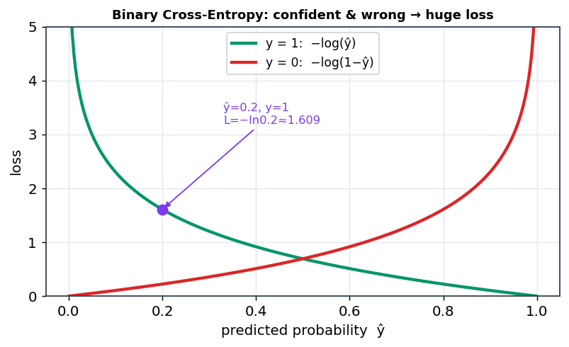

#### ❓ Counter Questions

- **Why log, not the raw likelihood?** Log turns the product of $m$ probabilities into a sum (no numerical underflow, simple gradients) and, being monotonic, preserves the optimum (L2).
- **Why is BCE always $\ge0$?** Each $\log$ of a probability is $\le0$; the leading minus flips it to $\ge0$, so a perfect model scores 0.

---

## 5.2.2 The Gradient via the Chain Rule

#### 📐 Formal Definition (the full derivation)

Let $z=\theta^\top x$, $\hat y=\sigma(z)$. For one example:

**Step 1 — loss w.r.t. $\hat y$:** $\;\dfrac{\partial L}{\partial\hat y}=-\Big(\dfrac{y}{\hat y}-\dfrac{1-y}{1-\hat y}\Big)=\dfrac{\hat y-y}{\hat y(1-\hat y)}.$

**Step 2 — $\hat y$ w.r.t. $z$ (sigmoid derivative):** $\;\dfrac{\partial\hat y}{\partial z}=\sigma'(z)=\hat y(1-\hat y).$

**Step 3 — $z$ w.r.t. $\theta_j$:** $\;\dfrac{\partial z}{\partial\theta_j}=x_j.$

**Step 4 — chain them:** $\;\dfrac{\partial L}{\partial\theta_j}=\dfrac{\hat y-y}{\hat y(1-\hat y)}\cdot \hat y(1-\hat y)\cdot x_j=(\hat y-y)\,x_j.$

#### 🗣️ Layman Explanation

To know how to nudge each weight, multiply three sensitivities: how the loss changes with the prediction, how the prediction changes with the score, and how the score changes with the weight. Two messy pieces — the $\hat y(1-\hat y)$ factors — **cancel exactly**, leaving the breathtakingly simple "(prediction − truth) × input."

#### 🧠 Conceptual Deep Dive

**The magic cancellation — and why it's not luck.** The $\hat y(1-\hat y)$ in the *denominator* of Step 1 is annihilated by the identical $\hat y(1-\hat y)$ from the sigmoid derivative in Step 2. Your note states it plainly: this is *"a direct consequence of using the sigmoid together with the log loss."* Pair the sigmoid with *any other* loss (e.g. MSE) and this gift vanishes — you'd be stuck with the $\hat y(1-\hat y)$ factor, which is near zero in the saturated regions, stalling learning exactly when the model is confidently wrong. So cross-entropy is engineered to *cancel the sigmoid's flatness*, keeping gradients healthy. This is the mathematical reason BCE is *the* loss for logistic regression — not just convexity (L3.2), but a clean, non-vanishing gradient.

**Why the result is so beautiful.** $(\hat y - y)x$ says: the weight update is proportional to the *error* times the *input that caused it*. Big error → big correction; an input that was large → that weight moves more. It's the most intuitive learning rule imaginable, and it falls out of rigorous calculus.

**The unifying punchline.** This is *structurally identical* to the linear-regression gradient (L3.1), where it was also "(prediction − truth) × input." One template powers linear regression, logistic regression, softmax, and the output layer of neural networks (L6, where it appears as $dZ^{[L]}=A^{[L]}-Y$). Learn it once; reuse it everywhere.

#### 🧪 Worked Example — full-dataset & vectorized form

Averaging over $m$ examples:
$$\frac{\partial J}{\partial\theta_j}=\frac1m\sum_{i=1}^m\big(\hat y^{(i)}-y^{(i)}\big)x_j^{(i)},\qquad \nabla_\theta J=\frac1m X^\top(\hat y-y),\qquad \theta\leftarrow\theta-\frac{\alpha}{m}X^\top(\hat y-y).$$

*Tiny numeric check:* one example $x=(1,2)$ (with bias feature 1), $\hat y=0.8$, $y=1$. Then $(\hat y-y)=-0.2$, and the gradient contribution is $(-0.2)(1,2)=(-0.2,-0.4)$. With $\alpha=1$: $\theta\leftarrow\theta-(-0.2,-0.4)=\theta+(0.2,0.4)$ — the weights move to *raise* $\hat y$ toward the true label 1. ✓ The sign works out automatically.

> [!info] **Why this matters — same shape as linear regression**
> Identical update form; the *only* difference is how $\hat y$ is computed ($\sigma(\theta^\top x)$ vs $\theta^\top x$). This is the spine of the whole course made literal: *(pred − truth) × input*.

**Dimensional reasoning (real Quiz 2 Q3).** Why $\frac1m X^\top(\hat y-y)$ and not $\frac1m X(\hat y-y)$? The error vector $(\hat y-y)\in\mathbb{R}^m$; to produce a gradient in $\mathbb{R}^d$ (one entry per feature) you need $X^\top\in\mathbb{R}^{d\times m}$ times an $m$-vector $\to$ a $d$-vector. Plain $X$ ($m\times d$) has the wrong shape (primer §A's shape rule decides it).

#### ❓ Counter Questions

- **What would happen if we used MSE + sigmoid here?** The $\hat y(1-\hat y)$ factor would *not* cancel; gradients would vanish in saturated regions and the loss would be non-convex (L3.2) — slow, unreliable training.
- **Why average ($\frac1m$)?** Keeps the gradient scale independent of dataset size, so a fixed $\alpha$ behaves consistently.

---

## 5.2.3 Regularized Logistic Regression

#### 📐 Formal Definition

**L2:** $\nabla_\theta J_{L2}=\frac1m X^\top(\hat y-y)+\lambda\theta\Rightarrow\theta\leftarrow(1-\alpha\lambda)\theta-\frac{\alpha}{m}X^\top(\hat y-y)$.
**L1:** $\nabla_\theta J_{L1}=\frac1m X^\top(\hat y-y)+\lambda\operatorname{sign}(\theta)$.

#### 🗣️ Layman Explanation

The same regularization story from L4, bolted onto logistic regression: L2 quietly deflates every weight (the $1-\alpha\lambda$ weight-decay factor), L1 shoves small weights to exactly zero for sparsity/feature selection.

#### 🧠 Conceptual Deep Dive — why regularization is *essential*, not optional, here

**The separability catastrophe.** If the classes are **perfectly linearly separable**, the BCE loss can be driven toward 0 only by pushing $\|\theta\|\to\infty$ (making the sigmoid infinitely steep so every prediction is exactly 0 or 1). The optimum literally sits "at infinity" — weights diverge, the model becomes absurdly overconfident, and training never settles. **Regularization rescues it** by adding a finite cost to large weights, so the optimum becomes finite and well-defined. This is a case where regularization isn't just for generalization — it's for the optimisation to *have an answer at all*.

**Convexity guarantee (tying L3.2 to here).** BCE + sigmoid is **convex** (PSD Hessian), so gradient descent is guaranteed to reach the **global** minimum given a sensible $\alpha$ — *provided* the data isn't perfectly separable (the divergence case above). Adding L2 makes it *strongly* convex, restoring a unique finite optimum even under separability. So the arc L3.2 (convexity) → L4 (regularization) → here closes into a single coherent story.

#### 🧪 Worked Example

$\theta_j=3$, $\alpha=0.1$, $\lambda=0.5$, data-gradient term $=1$. Decay factor $(1-\alpha\lambda)=0.95$. Update: $\theta_j\leftarrow0.95(3)-0.1(1)=2.85-0.1=2.75$ — decayed then nudged, identical mechanics to ridge in L4.

#### ❓ Counter Questions

- **Why is regularization especially important under linear separability?** Without it, weights diverge to infinity chasing zero loss; the penalty keeps the optimum finite.
- **Does L2 here change the gradient's "(pred−truth)×input" core?** No — it just *adds* a weight-decay term; the data-fit part is unchanged.

---

## 🎯 High-Yield Concepts (Lecture 5.2)

1. **BCE = Bernoulli negative log-likelihood**; derive it from the switch trick.
2. **The load-bearing minus sign** (positive loss to minimise).
3. **Chain-rule gradient** $\Rightarrow(\hat y-y)x$ via the $\hat y(1-\hat y)$ **cancellation**.
4. **Vectorized** $\frac1m X^\top(\hat y-y)$ — and the **transpose** shape argument.
5. **Same form as linear regression**; reappears as $A^{[L]}-Y$ in backprop (L6).
6. **Regularization is essential under separability**; BCE+sigmoid is convex.

## ⚠️ Common Misconceptions

- *"BCE can be negative."* No — the minus sign makes it $\ge0$; a perfect model scores 0. (Dropping the minus is the classic bug.)
- *"You must memorise the gradient."* You can *derive* it in three chain-rule steps; the cancellation is automatic.
- *"The vectorized gradient uses $X$, not $X^\top$."* It must be $X^\top$ for the shapes to work.
- *"Cross-entropy and the sigmoid are independent choices."* They're a matched pair — the log is built to cancel the sigmoid's derivative.
- *"Logistic regression never needs regularization."* It's essential when classes are separable (weights would diverge).

## 🎓 Professor Trap Questions

1. *"Compute BCE for $\hat y=0.2$, $y=1$."* — $-\ln0.2\approx 1.609$ (positive). A distractor offers $-1.609$ (forgot the minus) — the signature mechanical trap.
2. *"The logistic gradient is $(\hat y-y)x$ because the sigmoid derivative is small — true?"* — **False reasoning:** it's because the sigmoid derivative *cancels* the loss derivative's denominator, not because it's small. Tests genuine understanding of the cancellation.
3. *"For separable data, BCE training converges to a nice finite $\theta$ — true?"* — **False** (unregularized): weights diverge to infinity. Regularization is what gives a finite optimum.

## 📝 Practice Problems (inspired by Bishop Ch. 4.3.2, 4.3.4)

1. **(Mathematical)** Compute BCE for $\hat y=0.7$, $y=0$. *( $-\ln(1-0.7)=-\ln0.3\approx1.204$.)*
2. **(Mathematical)** Derive $\partial L/\partial\theta_j=(\hat y-y)x_j$ showing every chain-rule step and the cancellation.
3. **(Conceptual)** Explain why pairing the sigmoid with MSE gives vanishing gradients but with BCE does not. *(MSE leaves the $\hat y(1-\hat y)$ factor, which →0 in saturation; BCE cancels it.)*
4. **(Short answer)** Give the vectorized logistic gradient and justify its shape. *( $\frac1m X^\top(\hat y-y)$; $d\times m$ times $m$-vector → $d$-vector.)*
5. **("What if?")** What if you forgot the leading minus in BCE and ran gradient descent? *(You'd ascend the likelihood-negative — effectively maximise error; predictions worsen, "loss" reported negative.)*
6. **(Mixed)** Add L2 to logistic regression and write the update; explain why it both regularizes and tames separable-data divergence. *( $\theta\leftarrow(1-\alpha\lambda)\theta-\frac{\alpha}{m}X^\top(\hat y-y)$; the penalty makes the at-infinity optimum finite and strongly convex.)*

## ⚡ Quick Revision Summary

> [!abstract]
> **BCE** = negative log-likelihood of a Bernoulli label: $-\frac1m\sum[y\log\hat y+(1-y)\log(1-\hat y)]$ — the **minus sign is load-bearing** (positive loss to minimise). **Chain-rule gradient** = $(\hat y-y)x$ because the sigmoid's $\hat y(1-\hat y)$ **cancels** the loss derivative's denominator (sigmoid+log are a matched pair, keeping gradients alive). **Vectorized:** $\frac1m X^\top(\hat y-y)$ — note the **transpose** for shape. **Same form as linear regression**; resurfaces as $dZ^{[L]}=A^{[L]}-Y$ in backprop. **L2** decay $(1-\alpha\lambda)$, **L1** $\pm\lambda$; regularization is *essential* under separability (else weights diverge). BCE+sigmoid is **convex** ⇒ GD finds the global min. Memorise $-\ln0.2\approx1.609$.

---
# Lecture 6.1 — Neural Networks

> **Slide source:** Lecture 6 (Ishmam Tashdeed). **Cited chapters:** Goodfellow Ch. 6–8 · Bishop Ch. 5.1–5.4 · Alpaydın Ch. 11.
> **Where it sits:** The synthesis lecture. A neural network is **logistic regression, stacked and composed** — so almost everything (weighted sums, sigmoids, cross-entropy, the $(\hat y-y)$ gradient) returns here, now wired into layers. Depends on L5 (the neuron), L3.2 (now sacrificed — nets are non-convex), the [chain-rule primer](#b-calculus-the-training-of-models) (= backprop), and feeds L6.2 (UAT) and L8 (CNNs).

---

## 6.1.1 Perceptron → Multi-Layer Perceptron

#### 📐 Formal Definition

A **perceptron** (Rosenblatt, 1957): $\text{out}=\sigma(\sum_j w_jx_j+b)$ — classifies only **linearly separable** problems. An **MLP** stacks perceptrons into layers: for layer $l$, $z^{[l]}=W^{[l]}a^{[l-1]}+b^{[l]}$, $a^{[l]}=g(z^{[l]})$. **Depth** = #layers; **width** = units/layer.

#### 🗣️ Layman Explanation

One perceptron draws a single straight dividing line — useless for anything curvy (it can't even do XOR). Stack many in layers, each building on the last, and the network carves arbitrarily complex shapes.

#### 🧠 Conceptual Deep Dive

**The identity that demystifies everything: a single sigmoid neuron *is* logistic regression.** $\sigma(w^\top x+b)$ is exactly the L5 model. So a neural network is a *composition of logistic-regression-like units*, which is precisely why the cross-entropy loss and the $(\hat y-y)$ output gradient carry straight over — you already know the pieces; L6 just connects them.

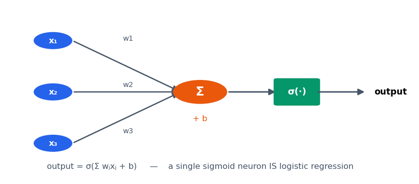

**Why stacking helps — the XOR lesson (history + intuition).** Minsky & Papert (1969) showed a single perceptron can't represent XOR (no straight line separates the classes), triggering an "AI winter." The fix — **hidden layers + nonlinear activations + backpropagation** (Rumelhart, Hinton, Williams, 1986) — is the entire reason deep learning exists. A hidden layer lets the network first *transform* the input into a new representation where the problem *becomes* linearly separable, then apply a linear classifier on top. Composition + nonlinearity = expressive power.

**What problem do hidden layers solve that feature engineering did (L4/L5)?** In L4/L5 *you* hand-crafted nonlinear features ($x^2$, $x_1x_2$) to bend boundaries. Hidden layers **learn those features automatically** from data. That's the leap: the network discovers its own representation (recall L2's "representation caps performance") instead of relying on your guesses.

**Depth vs width — two ways to add capacity.** Width = more neurons per layer (more features at one level of abstraction). Depth = more layers (more *levels* of abstraction, composing simple features into complex ones). Both increase capacity, but depth tends to be far more parameter-efficient (L6.2).

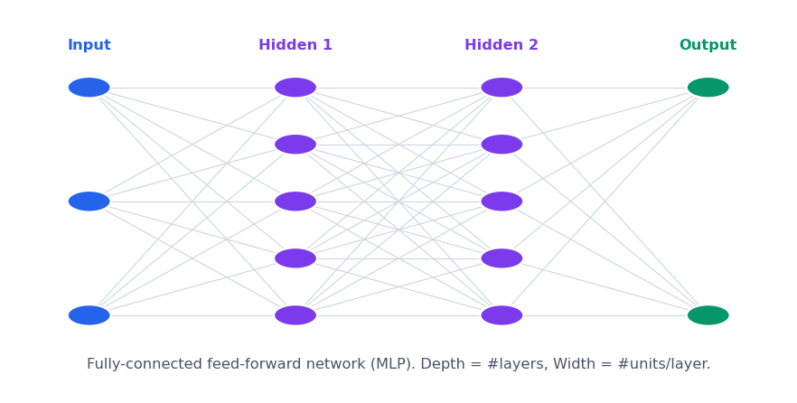

#### 🧪 Worked Example — XOR needs a hidden layer

XOR truth table: $(0,0)\to0,\ (0,1)\to1,\ (1,0)\to1,\ (1,1)\to0$. No single line separates the 1s from the 0s. But two hidden neurons — one detecting "OR", one detecting "AND" — let a third neuron compute "OR but not AND" = XOR. The hidden layer manufactured a separable representation.

#### ❓ Counter Questions

- **What can a single perceptron not do, and what fixes it?** Non-linearly-separable problems (XOR); hidden layers with nonlinear activations.
- **Is a 1-hidden-layer net with no activation more powerful than logistic regression?** No — without a nonlinearity it collapses to a linear model (§6.1.2). Power requires the nonlinearity.

---

## 6.1.2 Activation Functions

#### 📐 Formal Definition

A function applied to a neuron's weighted sum to introduce **non-linearity**. Desired: differentiable, fast, ideally zero-centred. Common: **Sigmoid** $\frac{1}{1+e^{-z}}$, **Tanh** $\tanh z$, **ReLU** $\max(0,z)$, **Leaky ReLU** $\max(\alpha z,z)$, **GELU**.

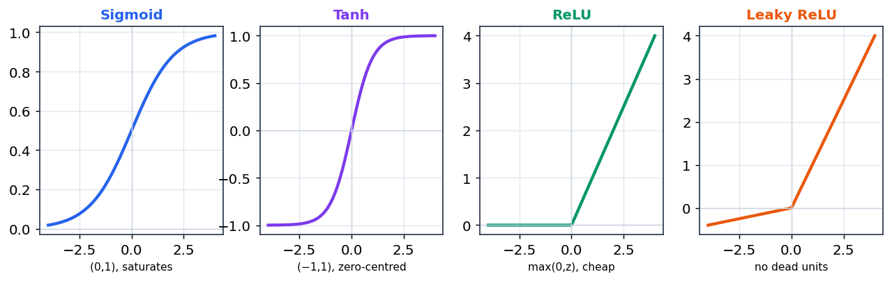

#### 🗣️ Layman Explanation

The activation is the "bend" in each neuron. Without a bend, stacking layers stays a single straight transformation. The bend is what lets the network represent curves and complex patterns.

#### 🧠 Conceptual Deep Dive — the single most-tested NN idea

> [!warning] **Exam trap (real Quiz 2 Q4)**
> If every layer is **affine** ($Wx+b$) with no nonlinearity, the whole network collapses to a single affine map: $W_2(W_1x+b_1)+b_2=(W_2W_1)x+(W_2b_1+b_2)$ — still linear. Extra layers add **zero** expressive power. The nonlinear activation between layers is what makes depth meaningful (and is the hinge of the UAT, L6.2).

**Why this collapse happens — and what it tells us.** Matrix multiplication is associative: a chain of linear maps is *one* linear map. So depth is worthless unless something *non*-linear sits between the multiplications. The activation is that something. This is not a minor caveat — it's the reason activations exist at all.

**The trade-offs that drove the sigmoid → ReLU shift (a mini-history):**
- **Sigmoid / tanh** *saturate*: for large $|z|$ the curve flattens, so $\sigma'\to0$ → **vanishing gradients** in deep nets (§6.1.5). Tanh is at least zero-centred (outputs in $(-1,1)$), which helps optimisation versus sigmoid's $(0,1)$.
- **ReLU** ($\max(0,z)$): gradient is exactly **1** for $z>0$ (no shrinkage → fixes most vanishing), and it's dirt-cheap to compute. Its flaw: "**dying ReLU**" — a neuron stuck at $z<0$ outputs 0 with 0 gradient forever.
- **Leaky ReLU / GELU**: keep a small slope for $z<0$ (Leaky) or a smooth probabilistic gate (GELU) to revive dying units. GELU is the modern default in Transformers.

**What if we had no activation choice and only sigmoids?** Deep networks would be nearly untrainable (vanishing gradients), which is historically *why* deep learning stalled until ReLU (and good initialization, §6.1.5) arrived around 2010–2012.

#### 🧪 Worked Example

For $z=-3$: sigmoid $\approx0.047$ (and $\sigma'\approx0.045$ — tiny, gradient nearly dead); ReLU $=0$ (and gradient 0 — this neuron is "off"); Leaky ReLU with $\alpha=0.01$ gives $-0.03$ (and gradient $0.01$ — still learns a little). The same input, very different gradient behaviour.

#### ❓ Counter Questions

- **What happens with only affine layers?** The whole network = one affine map; no added power.
- **One advantage of ReLU over sigmoid?** Non-saturating for $z>0$ (gradient 1) → mitigates vanishing gradients; also far cheaper.
- **Why is zero-centring nice?** Non-zero-centred activations (sigmoid) push gradients consistently one direction, zig-zagging optimisation; tanh/ReLU-family avoid this.

---

## 6.1.3 Forward Pass & Cost Function

#### 📐 Formal Definition

**Forward pass:** $a^{[l]}=g(W^{[l]}a^{[l-1]}+b^{[l]})$, input→hidden→output. Cost: cross-entropy (binary = one output neuron; **multiclass** = $K$ neurons with one-hot targets), optionally plus a weight-regularization term.

#### 🗣️ Layman Explanation

Push the input through the layers, one matrix-multiply-and-bend at a time, until numbers pop out the far end. Compare to the truth with cross-entropy → one loss.

#### 🧠 Conceptual Deep Dive

**Vectorization — why it's all matrices.** Stack all $m$ examples as columns of $A^{[0]}=X$; then each layer is *one* big matrix product $Z^{[l]}=W^{[l]}A^{[l-1]}+b^{[l]}$ processing the entire batch at once. This isn't just tidy notation — it's *why* GPUs (built for massive parallel matrix multiply) train networks fast. The forward pass is "bookkeeping," but bookkeeping shaped for hardware.

**Softmax for multiclass — the coupled upgrade of one-vs-all (L5).** For $K$ mutually-exclusive classes, the output layer uses **softmax**: $p_k=\frac{e^{z_k}}{\sum_j e^{z_j}}$, producing a probability *distribution* (non-negative, sums to 1). Paired with cross-entropy, it's the categorical-likelihood MLE — the multiclass sibling of BCE. Unlike one-vs-all's $K$ independent models, softmax couples the outputs so they compete, giving calibrated probabilities.

#### 🧪 Worked Example (shapes in a tiny net)

Input dim 3, hidden layer of 4, output 1. $W^{[1]}$ is $4\times3$, $b^{[1]}$ is $4\times1$ → $a^{[1]}$ is $4\times1$. $W^{[2]}$ is $1\times4$ → $a^{[2]}$ is $1\times1$ (the prediction). Parameter count: $(4{\times}3+4)+(1{\times}4+1)=16+5=21$. The shape rule (primer §A) makes every dimension predictable.

#### ❓ Counter Questions

- **Forward-pass recurrence?** $z^{[l]}=W^{[l]}a^{[l-1]}+b^{[l]}$, $a^{[l]}=g(z^{[l]})$.
- **Why softmax over one-vs-all?** Couples class scores into a normalised distribution → better-calibrated, single-model training for exclusive classes.

---

## 6.1.4 Backpropagation

#### 📐 Formal Definition

**Backpropagation** computes $\nabla_{W,b}J$ by applying the **chain rule** backwards from output to input, reusing stored forward activations. For a sigmoid (or softmax) output with cross-entropy, the output-layer error simplifies to $dZ^{[L]}=A^{[L]}-Y$.

#### 🗣️ Layman Explanation

The forward pass makes a prediction; backprop assigns *blame*. Starting from the output error, it walks backwards layer by layer, using the chain rule to compute how much each weight contributed to the mistake, so each weight knows which way to move.

#### 🧠 Conceptual Deep Dive

**Backprop is just the chain rule, organised.** A deep network is a deeply nested function $f(g(h(\dots)))$. The chain rule says: to differentiate a composition, multiply the derivatives of each stage. Backprop computes those stage-derivatives once (during the forward pass we cached the activations) and multiplies them from output to input — *reusing* shared sub-computations instead of recomputing them (the key efficiency, turning an exponential naive cost into linear). The name "backpropagation" is literally "propagate the error gradient backward."

> [!info] **Why $dZ^{[L]}=A^{[L]}-Y$ matters (real Quiz 2 Q10)**
> This is the *same* "(prediction − truth)" from logistic regression (L5.2) — because the sigmoid/softmax derivative and the cross-entropy derivative **cancel** (the matched-pair gift). So the output-layer gradient is trivial: no messy $\hat y(1-\hat y)$ survives. This is why the sigmoid+BCE (or softmax+cross-entropy) pairing is the standard output design — clean gradients, healthy learning.

**What if we had no backprop?** Computing gradients for millions of parameters by finite differences would be astronomically slow (one full forward pass per parameter). Backprop computes *all* gradients in essentially one forward + one backward pass. It's the algorithm that made training deep networks feasible.

#### 🧪 Worked Example (output error)

Output $A^{[L]}=0.7$, true $Y=1$ → $dZ^{[L]}=0.7-1=-0.3$. This negative error flows back, scaling each output-weight's gradient by the activation that fed it — pushing weights to *raise* the prediction toward 1. The sign and magnitude both fall out automatically.

#### ❓ Counter Questions

- **Why is $dZ^{[L]}$ so simple for sigmoid+BCE?** Their derivatives cancel (L5.2's cancellation, generalised).
- **What rule is backprop built on?** The chain rule — nothing more exotic.

---

## 6.1.5 Vanishing/Exploding Gradients & Weight Initialization

#### 📐 Formal Definition

Backprop multiplies many layer derivatives. With sigmoid, $\sigma'\le0.25$, so signals shrink like $0.25^{\text{depth}}$ — **vanishing gradients**. Derivatives $>1$ cause **exploding gradients**. **Weight initialization** (Xavier/Glorot for sigmoid/tanh; He for ReLU) sets starting weights so signals neither vanish nor explode.

#### 🗣️ Layman Explanation

Each layer the error passes through can *dim* it (×<1) or *amplify* it (×>1). Over many layers, dimming makes early layers learn nothing (vanishing); amplifying blows training up (exploding).

#### 🧠 Conceptual Deep Dive — the $0.25$ thread pays off

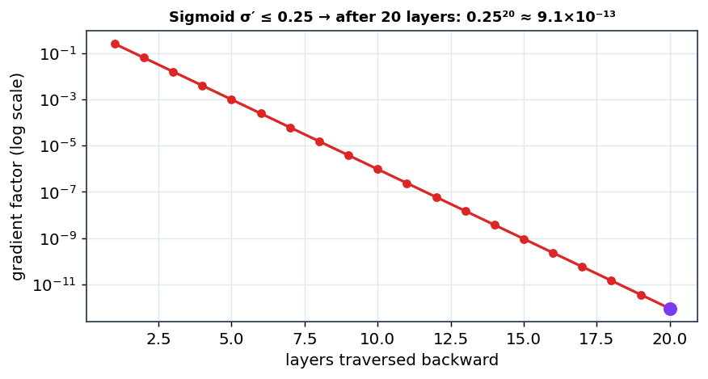

The sigmoid derivative peaks at **0.25** (from L5: $\sigma'=\sigma(1-\sigma)$, max at $\sigma=0.5$). In a 20-layer net, the best-case gradient is multiplied by $0.25$ twenty times: $0.25^{20}\approx9.094947\times10^{-13}$ — effectively zero. Early layers receive *no* learning signal and freeze. This single number is *why* deep sigmoid networks were historically untrainable, and it traces directly to a property we met innocently three lectures ago. **Mitigations (slide):** residual/skip connections (let gradients bypass layers), gradient clipping (cap explosions), proper initialization, and normalization layers (§6.1.7).

> [!warning] **Exam trap (real Quiz 2 Q5 / SET-B Q3)**
> $\sigma'$ is **at most 0.25** — not 0.5, not >1. The "0.5" distractor is the value of $\sigma$ itself at the peak, not its derivative. ($\sigma'_{\max}=\sigma(0)(1-\sigma(0))=0.5\times0.5=0.25$.)

**The zero-initialization symmetry problem (real Quiz 2 Q9) — a beautiful "why."** If all weights start at 0 (or any identical value), every neuron in a layer computes the **same output**, hence receives the **same gradient**, hence updates **identically** — forever. They can never differentiate into distinct feature detectors; the layer behaves like a single neuron no matter how wide. The fix is **random** initialization to *break symmetry*. Xavier/He then choose the *scale* of that randomness so the signal variance is preserved across layers (Xavier tuned for sigmoid/tanh, He for ReLU's halved-variance) — preventing both vanishing and exploding from the very first step.

**What if we ignored initialization?** Even with ReLU, badly-scaled initial weights make activations blow up or die immediately, and training stalls or diverges. Initialization is the unglamorous prerequisite that makes everything else work.

#### 🧪 Worked Example

A 10-layer sigmoid net, best case: gradient scaled by $0.25^{10}\approx9.5\times10^{-7}$ — a millionfold attenuation. Swap to ReLU (derivative 1 for active units): the per-layer factor is ~1, so the gradient survives. This is the concrete payoff of the activation choice in §6.1.2.

#### ❓ Counter Questions

- **Why do sigmoids cause vanishing gradients?** $\sigma'\le0.25$; repeated multiplication shrinks the signal exponentially with depth.
- **Why can't all weights be zero?** Symmetry — identical outputs/gradients → neurons never differentiate.
- **Which init for ReLU? For tanh?** He; Xavier.

---

## 6.1.6 Optimization: Momentum, Adam, LR Scheduling

#### 📐 Formal Definition

NN losses are **non-convex** (local minima, saddle points), and vanilla GD is slow in flat directions and oscillates in steep ones. **SGD with momentum:** $v_t=\beta v_{t-1}+\nabla J$, $\theta\leftarrow\theta-\alpha v_t$. Variants: **RMSProp, Adam, AdamW**. **LR scheduling** lowers $\alpha$ over training.

#### 🗣️ Layman Explanation

Plain GD is a forgetful hiker taking one cautious step at a time, zig-zagging down narrow valleys. **Momentum** gives inertia: the hiker remembers its recent direction and rolls smoothly, powering through flat stretches and damping side-to-side wobble — like a ball rolling downhill.

#### 🧠 Conceptual Deep Dive

**Why momentum works (real Quiz 2 SET-B Q4).** In a long narrow valley, successive gradients *agree* along the valley floor but *flip sign* across the steep walls. Momentum **accumulates velocity**: the agreeing components add up (acceleration along the floor), while the oscillating components cancel (damped wobble). Net effect — faster, smoother descent. It also helps coast across saddle points and small bumps where the raw gradient is near zero.

**Why non-convexity changes the game (link to L3.2).** Linear/logistic regression were convex → GD *guaranteed* the global optimum regardless of start. Neural nets are **non-convex**, so those guarantees vanish: different initializations land in different basins. In practice this is less catastrophic than it sounds (many local minima are nearly as good, and saddle points — not bad minima — are the main obstacle in high dimensions), but it's *why* nets need momentum, careful init, and the gentle noise of SGD to navigate.

**Adam in one line.** Adam = momentum (smoothed gradient) + per-parameter adaptive step sizes (RMSProp-style scaling by recent gradient magnitude). It's the robust default because it auto-tunes effective learning rates per weight.

**LR scheduling — why a constant $\alpha$ is suboptimal.** Early on you want *big* steps for fast progress; late, *small* steps to settle precisely into the minimum without bouncing. A constant $\alpha$ is a compromise that's good at neither; a schedule (step decay, cosine, warmup) gets both phases right.

> [!warning] **Exam trap (real Quiz 2 SET-A Q4)**
> An **excessively large learning rate** → **oscillation or divergence** (repeatedly overshooting low-loss regions), *not* "perfect generalization" and *not* "all parameters become zero."

#### 🧪 Worked Example (momentum smoothing)

Gradients over three steps in one coordinate: $+1, -1, +1$ (pure oscillation). Vanilla GD jitters in place. With momentum $\beta=0.9$: $v_1=1$, $v_2=0.9(1)-1=-0.1$, $v_3=0.9(-0.1)+1=0.91$ — the velocity is *smoothed*, and a consistently-signed direction would instead build up speed. The oscillation is damped; agreement accelerates.

#### ❓ Counter Questions

- **How does momentum speed up a narrow valley?** Accumulates velocity where gradients agree; cancels oscillation across the walls.
- **Why schedule the LR?** Big early (fast), small late (precise); constant is good at neither.
- **Effect of too-large $\alpha$?** Oscillation/divergence.

---

## 6.1.7 Regularization for Networks: Dropout & Batch Normalization

#### 📐 Formal Definition

**Dropout:** during training, keep each neuron with probability $p$ (drop the rest); a different sub-network trains each mini-batch. **Batch Normalization:** normalize a layer's pre-activations over the mini-batch to mean 0/variance 1, then rescale/shift with **learnable** $\gamma,\beta$. **Train vs inference:** training uses **mini-batch** statistics; inference uses stored **running** estimates.

#### 🗣️ Layman Explanation

**Dropout** randomly benches players each practice so the team can't lean on any single star — every neuron must contribute. **Batch norm** keeps each layer's inputs on a stable, well-behaved scale so training isn't derailed by shifting distributions.

#### 🧠 Conceptual Deep Dive

**Dropout combats *co-adaptation*.** If many neurons learn to rely on one fragile neuron's feature, the network is brittle and overfits. Randomly dropping neurons forces each to be *individually* useful and prevents fragile co-dependencies — effectively training an *ensemble* of exponentially many sub-networks that share weights and average at test time. (It's L4's "limit effective complexity" applied to neurons; L1/L2 weight penalties also apply.)

**Batch norm addresses *internal covariate shift*.** As earlier layers update, the distribution of inputs to *later* layers keeps shifting — so later layers chase a moving target. Normalizing each layer's pre-activations stabilises that distribution; the **learnable $\gamma,\beta$** then let the network *recover any distribution it actually needs* (it isn't forced to stay mean-0/var-1). The deeper modern view: batch norm **smooths the loss landscape**, allowing larger learning rates and faster, more stable training.

> [!warning] **Exam trap (real Quiz 2 SET-A Q3)**
> Batch norm behaves **differently** at train vs inference: **training → mini-batch statistics; inference → stored running estimates**, so predictions are deterministic and don't depend on whichever batch a sample lands in.

**The normalization family (slide):** **Batch** (across the mini-batch; CNNs), **Layer** (across a sample's features; Transformers), **Instance** (single channel; style transfer), **Group** (channel groups; low-GPU vision). Same idea, different axis of normalization.

#### 🧪 Worked Example (dropout at test time)

With keep-probability $p=0.8$, training randomly zeroes 20% of a layer's neurons each step. At inference, all neurons are kept but their outputs are scaled by $p=0.8$ (or, equivalently, "inverted dropout" scales during training) so the expected activation matches. This scaling is *why* train/inference behaviour differs — a common exam point shared with batch norm.

#### ❓ Counter Questions

- **How does dropout prevent overfitting?** Breaks co-adaptation; trains an implicit ensemble of sub-networks.
- **How does batch norm differ train vs inference?** Mini-batch stats vs running estimates.
- **What problem does batch norm target?** Internal covariate shift; it also smooths the loss surface.

---

## 🎯 High-Yield Concepts (Lecture 6.1)

1. **Single sigmoid neuron = logistic regression**; MLP = composed neurons; XOR needs a hidden layer.
2. **No nonlinearity ⇒ whole net is one affine map** (Q4).
3. **Backprop = chain rule**; $dZ^{[L]}=A^{[L]}-Y$ (sigmoid/softmax + cross-entropy cancel).
4. **$\sigma'\le0.25$** ⇒ vanishing gradients ($0.25^{20}\approx9.1\text{e-}13$); fixes (ReLU, He/Xavier, residual, clip, norm).
5. **Zero-init symmetry** ⇒ random init.
6. **Momentum** accumulates velocity; **too-large LR diverges**; **schedule** the LR.
7. **Dropout** breaks co-adaptation; **batch norm** fights covariate shift (train=batch, inference=running).

## ⚠️ Common Misconceptions

- *"More layers always help, even without activations."* No — without nonlinearity, depth collapses to one linear map.
- *"$\sigma'$ can be up to 0.5."* Its max is **0.25**.
- *"Initialize all weights to zero for a clean start."* Symmetry trap — neurons never differentiate.
- *"Batch norm acts the same in training and testing."* No — mini-batch vs running statistics.
- *"Bigger learning rate trains faster."* Too big → oscillation/divergence.
- *"Neural-net training finds the global optimum like linear regression."* No — non-convex; no global guarantee.

## 🎓 Professor Trap Questions

1. *"A 5-layer net uses only linear activations. How expressive is it?"* — Exactly as expressive as a **single linear layer** (one affine map). Tests the Q4 collapse.
2. *"Your 30-layer sigmoid net won't train; early layers don't update. Cause?"* — **Vanishing gradients** ($\sigma'\le0.25$ compounded). Fix: ReLU + He init + residuals. Distractors blame "learning rate too small" — true-sounding but not the root cause.
3. *"You set all weights to the same small random value 0.01. Symmetry broken?"* — **No** — identical values (even nonzero) keep neurons symmetric; you need *distinct* random values.
4. *"Batch-norm test predictions vary depending on the batch — bug or feature?"* — **Bug**: at inference, use *running* statistics so predictions are batch-independent.

## 📝 Practice Problems (inspired by Goodfellow Ch. 6–8, Bishop Ch. 5, Alpaydın Ch. 11)

1. **(Conceptual)** Prove that two affine layers with no activation equal one affine layer. *( $W_2(W_1x+b_1)+b_2=(W_2W_1)x+(W_2b_1+b_2)$.)*
2. **(Mathematical)** A sigmoid net has 15 layers. Best-case gradient attenuation factor? *( $0.25^{15}\approx9.3\times10^{-10}$.)*
3. **(Short answer)** State $dZ^{[L]}$ for softmax+cross-entropy and why it's simple. *( $A^{[L]}-Y$; derivatives cancel.)*
4. **(Analytical)** Training loss decreases but validation loss rises after epoch 10. Diagnose and give two fixes. *(Overfitting; add dropout/L2, early stopping, reduce capacity, more data.)*
5. **("What if?")** What if you removed batch norm's learnable $\gamma,\beta$? *(The layer would be forced to mean-0/var-1, unable to represent distributions that need a different scale/shift — reduced expressiveness.)*
6. **(Mixed)** Compare He vs Xavier initialization and say which suits ReLU and why. *(He scales variance for ReLU's zeroed-half; Xavier suits symmetric sigmoid/tanh; wrong choice → vanishing/exploding from step 1.)*

## ⚡ Quick Revision Summary

> [!abstract]
> A **single sigmoid neuron = logistic regression**; an **MLP composes** them, learning its own nonlinear features (XOR needs a hidden layer). **No nonlinearity ⇒ one affine map** (Q4). **Forward pass** = matmuls + activations (vectorized for GPUs); multiclass uses **softmax + cross-entropy**. **Backprop = chain rule**, with $dZ^{[L]}=A^{[L]}-Y$ (matched-pair cancellation). **$\sigma'\le0.25$** ⇒ **vanishing gradients** ($0.25^{20}\approx9.1\text{e-}13$); fix with ReLU/He-Xavier/residual/clip/norm. **Zero-init = symmetry trap** → random init. Nets are **non-convex** → **momentum** (accumulate velocity), **Adam**, **LR schedule**; **too-large LR diverges**. **Dropout** breaks co-adaptation; **batch norm** fights internal covariate shift (train = mini-batch stats, inference = running stats).

---
# Lecture 6.2 — Universal Approximation Theorem

> **Slide source:** *Universal Approximation Theorem* note (Ishmam Tashdeed). **Two levels:** an intuitive from-scratch build, then the advanced edges (what it does *not* promise; depth vs width).
> **Where it sits:** The philosophical capstone of the neural-network arc. It answers "*why can networks learn almost anything?*" — and, just as importantly, draws the precise line around what that promise excludes. It depends on L6.1's "nonlinearity gives power" and is the faculty's favourite **existence-vs-reality** trap.

---

## 6.2.1 The Theorem

#### 📐 Formal Definition

**Universal Approximation Theorem (Cybenko 1989; Hornik 1991).** Let $\sigma$ be any continuous, non-constant, bounded activation (e.g. sigmoid or tanh), and $g:[0,1]^n\to\mathbb{R}$ any continuous function. Then for any $\varepsilon>0$ there exist $N$ and parameters $\{c_k,w_k,b_k\}$ such that the one-hidden-layer network
$$f(x)=\sum_{k=1}^N c_k\,\sigma(w_k^\top x+b_k)\quad\text{satisfies}\quad\sup_{x\in[0,1]^n}|f(x)-g(x)|<\varepsilon.$$

#### 🗣️ Layman Explanation

A neural network with **even one hidden layer**, given **enough neurons**, can mimic **any reasonable (continuous) function** to **any accuracy you demand**. Name an error budget, however tiny — there exists a network that stays within it everywhere on the input region.

#### 🧠 Conceptual Deep Dive

**Why it's true — building bumps.** Each neuron with a sigmoid-like activation contributes a smooth **step/bump**. By combining many bumps at different positions, widths, and heights, you can sculpt any shape — like approximating a smooth curve with many thin rectangles (the same intuition as a Riemann sum). As $N$ grows, the bumps get finer and the approximation error shrinks toward zero.

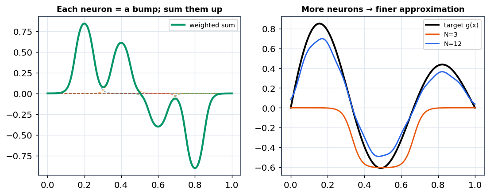

**Why the nonlinearity is the indispensable ingredient.** From L6.1: without a nonlinear activation, the whole network is one affine map — capable of representing only straight lines/planes. The bumps that make universal approximation possible *exist only because* $\sigma$ is nonlinear. So the UAT is the formal pay-off of L6.1's "activations give power." Remove the nonlinearity and the theorem collapses to "a linear model can approximate any *linear* function" — useless.

**What problem does the UAT solve?** It silences the question "are neural networks fundamentally limited in what they can represent?" The answer is *no* — representation is not the bottleneck. This *legitimises* the entire enterprise of using networks as general function approximators. But — crucially — it then **relocates** the hard problem from *representation* to *learning* (§6.2.2).

#### 🧪 Worked Example

Approximate $g(x)=\sin(3\pi x)e^{-x}$ on $[0,1]$. With $N=3$ neurons the network captures only the gross shape; with $N=12$ it tracks the wiggles closely (figure, right). Want closer still? Add neurons — the theorem promises it's always possible.

#### ❓ Counter Questions

- **What single ingredient makes the theorem work, and what fails without it?** A nonlinear activation; without it, stacking neurons yields only a linear model.
- **Does "one hidden layer suffices" mean depth is pointless?** No — "suffices" can demand *exponentially many* neurons; depth is far more efficient (§6.2.3).

---

## 6.2.2 What the Theorem Does **NOT** Say (the advanced edge)

#### 📐 Formal Definition

The UAT is an **existence** result about *representational capacity*. It guarantees the right parameters **exist**; it is silent about everything else.

#### 🧠 Conceptual Deep Dive — the four caveats (the signature exam material)

1. **It doesn't tell you how to *find* the parameters.** It says a good network *exists*, not that gradient descent will *reach* it. Training is a separate, **non-convex** problem (L6.1) with no guarantee of finding the ideal weights.
2. **It doesn't bound the *number* of neurons.** $N$ could be astronomically large for a complicated $g$; the theorem gives no usable estimate.
3. **It says nothing about *generalization*.** Approximating the *training* function well says nothing about unseen data. Capacity ≠ generalization (this is L2/L4's entire concern).
4. **It's about one hidden layer only.** In practice, depth is dramatically more efficient (§6.2.3).

> [!warning] **Exam trap (real Quiz 2 Q6 and SET-A Q2) — the signature UAT question**
> The faculty repeatedly tests **existence vs usefulness**. Distractors: "a single *neuron* can represent any function" (false — needs many), "gradient descent *always* finds the optimal network" (false — training is separate and non-convex), "deep nets *always* need more parameters" (false — usually fewer). Correct reading: *capacity to represent ≠ ability to learn from finite data.* As SET-A Q2 puts it: a network may have the **capacity**, but **training may not find the parameters, and fitting the data doesn't ensure good performance on unseen examples.**

**The deepest takeaway.** The UAT cleanly separates the three questions of machine learning that students conflate:
- **Representation** — *can* a network express this function? → UAT says **yes**.
- **Optimization** — *will training find* those weights? → UAT is **silent** (L6.1: non-convex, no guarantee).
- **Generalization** — *will it work on new data*? → UAT is **silent** (L2/L4: that's what splits and regularization manage).

Almost every other lecture exists to address the second and third questions *precisely because* the UAT only answers the first. Seeing this turns the syllabus into one coherent argument.

**What if students forgot these caveats?** They'd conclude "a big enough network always solves any task," then be baffled when their over-parameterised net overfits or fails to train. The caveats are the antidote to over-claiming — and the exam tests exactly that discipline.

#### 🧪 Worked Example (existence ≠ reachable)

A network *exists* that classifies a hard dataset perfectly (UAT guarantees the *weights* are out there). Yet starting SGD from random init, you might land in a poor local basin, or fit the training set and fail on test data. The perfect weights existing did *not* make them findable or generalizable — the gap the rest of ML fills.

#### ❓ Counter Questions

- **List three things the UAT does not guarantee.** Trainability, neuron count, generalization (also depth-efficiency).
- **Why doesn't fitting the training data ensure good test performance?** Capacity to fit ≠ generalization; an over-flexible net can memorise noise (L4).
- **Does the UAT promise SGD converges?** No — optimisation is a separate, non-convex problem.

---

## 6.2.3 Why Depth Helps (advanced note)

#### 📐 Formal Definition

The UAT guarantees **width** (many neurons in one layer) is *enough*, but **depth** often achieves the same accuracy with **exponentially fewer** total neurons.

#### 🗣️ Layman Explanation

Building a complex shape from one thick slab (wide, shallow) is wasteful; stacking many thin, precisely-cut sheets (deep) reaches the same shape with far less material. Depth lets the network **reuse and compose** intermediate features.

#### 🧠 Conceptual Deep Dive

Deep networks build **hierarchical/compositional** representations: early layers detect simple parts (edges), later layers combine them into complex concepts (shapes → objects). Many real-world functions are *themselves* compositional, so depth **matches their structure** and represents them compactly — whereas a shallow network must enumerate every combination explicitly, exploding its width. This is the theoretical justification for "deep" learning over "wide" learning, and it foreshadows CNNs (L8), whose stacked layers literally build edges → textures → parts → objects.

> [!tip] **Memory trick**
> **UAT = "can," not "will."** Width gives *possibility*; depth gives *efficiency*; training + data + regularization give *reality*.

#### 🧪 Worked Example

Some functions (e.g. parity over $n$ bits) provably need *exponentially* many neurons in a shallow net but only *polynomially* many in a deep one. The intuition: depth reuses partial computations (compute "XOR of a pair" once, combine upward), while width must recompute every combination from scratch.

#### ❓ Counter Questions

- **If one hidden layer suffices, why go deep?** "Suffices" may mean exponentially many neurons; depth gets the same accuracy far more cheaply by composing features.
- **Does depth guarantee better generalization?** Not automatically — but compositional efficiency *often* helps, and it matches the structure of natural data (images, language).

---

## 🎯 High-Yield Concepts (Lecture 6.2)

1. **UAT statement** (one hidden layer + enough neurons + nonlinear activation + compact domain + any $\varepsilon$).
2. **Mechanism:** sum of bumps; more neurons → finer fit.
3. **The four "does NOT" caveats** — trainability, neuron count, generalization, depth.
4. **Existence ≠ learnability ≠ generalization** (the three-question separation).
5. **Depth is exponentially more efficient than width.**

## ⚠️ Common Misconceptions

- *"A single neuron can approximate any function."* No — you need *many* neurons (a whole hidden layer).
- *"The UAT means training will find the perfect network."* No — optimisation is separate and non-convex.
- *"Universal approximation guarantees good test accuracy."* No — that's generalization, which the UAT ignores.
- *"Deep networks always need more parameters than shallow ones."* Usually *fewer* for the same accuracy.
- *"The UAT works with any activation."* It needs a *nonlinear* (non-constant, bounded/continuous) activation.

## 🎓 Professor Trap Questions

1. *"True or false: by the UAT, a neural network can perfectly learn any continuous function from data."* — **False** — it can *represent* it (existence); *learning* it from finite data is not guaranteed.
2. *"Which is the strongest correct statement of the UAT: (A) one neuron suffices, (B) one hidden layer with enough neurons and a nonlinear activation suffices, (C) gradient descent always finds it?"* — **(B).** (Real Quiz 2 Q6.)
3. *"You have universal approximation, so why does your model overfit?"* — Because capacity to *represent* includes capacity to *memorise noise*; the UAT says nothing about generalization (L4).

## 📝 Practice Problems (inspired by the UAT note & Goodfellow Ch. 6)

1. **(Conceptual)** Explain, using the bump picture, why more neurons reduce approximation error. *(Finer/more numerous bumps fill gaps, shrinking $\varepsilon$.)*
2. **(Short answer)** Name the three distinct questions of ML the UAT separates and which one it answers. *(Representation [yes], optimisation [silent], generalization [silent].)*
3. **(Analytical)** Your one-hidden-layer net theoretically can fit a task but trains poorly. Give two UAT-consistent reasons. *(Non-convex optimisation may miss the weights; required $N$ may be impractically large.)*
4. **("What if?")** What if the activation were linear? Restate what the UAT would (not) give. *(Only linear functions representable — no universal approximation.)*
5. **(Mixed)** Contrast representational capacity (UAT) with the bias–variance picture (L4): how can a "universal" model still fail? *(High capacity can overfit → high variance; representation ≠ generalization.)*

## ⚡ Quick Revision Summary

> [!abstract]
> **UAT (Cybenko/Hornik):** one hidden layer + enough neurons + a **nonlinear** activation approximates any continuous function on a compact domain to any $\varepsilon$. **Mechanism:** weighted sum of **bumps**; more neurons → finer fit; the nonlinearity is indispensable (L6.1). **The trap — it's an *existence* result:** it does **not** promise trainability (non-convex optimisation), a neuron count, or generalization. It cleanly separates ML's three questions — *representation* (yes), *optimization* (silent), *generalization* (silent) — which is why the rest of the course exists. **Depth** is usually exponentially more efficient than width.

---
# Lecture 7 — Evaluation Metrics

> **Slide source:** Lecture 7 (Ishmam Tashdeed). **Cited chapters:** Goodfellow Ch. 5.3, 5.5 · Bishop Ch. 4.1 · Alpaydın Ch. 19.
> **Where it sits:** Training is half the job; **measuring honestly** is the other half. This lecture closes the loop opened in L2 (generalization) and reveals that **precision is literally the Bayes posterior** from L2 — two lectures, one truth. Its thesis: *the metric you optimise shapes what your model learns,* so choosing the wrong one quietly ruins everything.

---

## 7.0 The Horror Story (why this lecture exists)

> [!danger] **The cautionary tale (slide)**
> A cancer-screening model labels **every** patient "healthy." Trained where only **1%** have cancer, it scores **99% accuracy** — and catches **zero** cancer patients. A useless model with a near-perfect headline number. This is why accuracy alone is dangerous on imbalanced data, and why the rest of this lecture exists.

**Why this matters conceptually.** Accuracy treats all errors as equal and rewards the majority class. When classes are imbalanced, "predict the majority" is a high-accuracy, zero-value strategy. The fix is to use metrics that *ask the specific question your problem cares about* — which is the organising principle below.

---

## 7.1 Regression Metrics

#### 📐 Formal Definition

**MAE** $=\frac1m\sum|y_i-\hat y_i|$; **MSE** $=\frac1m\sum(y_i-\hat y_i)^2$; **RMSE** $=\sqrt{\text{MSE}}$; **R²** $=1-\frac{\text{SS}_{res}}{\text{SS}_{tot}}$; **Adjusted R²** (R² penalised for #features); **MAPE** (mean absolute *percentage* error).

#### 🗣️ Layman Explanation

MAE = "on average, how many units off am I?" (forgiving of outliers). MSE/RMSE = same, but big misses hurt much more (squared). R² = "what fraction of the variation in the target does my model explain?" — 1 perfect, 0 no better than guessing the mean.

#### 🧠 Conceptual Deep Dive

**MAE vs RMSE — the choice encodes what you consider "bad."** RMSE squares errors, so a single huge miss dominates the score; MAE treats all errors linearly. Choose **MAE** when large errors are likely outliers you don't want to chase; choose **RMSE** when large errors are *genuinely* worse (e.g. a 100-unit miss is more than twice as bad as a 50-unit miss). RMSE is also in the target's *units* (unlike MSE), making it interpretable. Note the link to L3: minimising MSE is the *training* objective; here MSE/RMSE is an *evaluation* metric — same quantity, two roles.

**Why Adjusted R² exists — a subtle but examinable point.** Plain R² **never decreases** when you add a feature, even a useless random one (more flexibility can only fit the training data at least as well). So R² would always favour the bigger model — useless for model comparison. **Adjusted R²** subtracts a penalty for the number of features, so it *can fall* if a feature doesn't earn its keep. It's the evaluation-side cousin of regularization (L4): both punish needless complexity.

**MAPE's trap.** It reports error as a percentage (intuitive: "12% off") but **divides by the true value**, so it *breaks (division by zero)* when any true value is 0, and explodes for near-zero targets. Know when *not* to use it.

#### 🧪 Worked Example

True $y=[100,200]$, predicted $\hat y=[110,180]$. Errors $=[10,-20]$. MAE $=\frac{10+20}{2}=15$; MSE $=\frac{100+400}{2}=250$; RMSE $=\sqrt{250}\approx15.8$; MAPE $=\frac12\left(\frac{10}{100}+\frac{20}{200}\right)=\frac12(0.10+0.10)=10\%$. Notice RMSE $>$ MAE — the squared term inflated the $-20$ miss.

#### ❓ Counter Questions

- **When prefer MAE over RMSE?** When outliers shouldn't dominate — you want robustness.
- **Why use Adjusted R² over R²?** R² always rises with more features; adjusted penalises useless ones.
- **When does MAPE break?** When a true value is 0 (division by zero).

---

## 7.2 Confusion Matrix: TP, FP, FN, TN

#### 📐 Formal Definition

**TP** (predicted +, actually +), **FP / Type I** (predicted +, actually −), **FN / Type II** (predicted −, actually +), **TN** (predicted −, actually −). Derived: **Accuracy** $=\frac{TP+TN}{\text{total}}$, **Precision** $=\frac{TP}{TP+FP}$, **Recall (Sensitivity, TPR)** $=\frac{TP}{TP+FN}$, **Specificity (TNR)** $=\frac{TN}{TN+FP}$, **F1** $=\frac{2PR}{P+R}$.

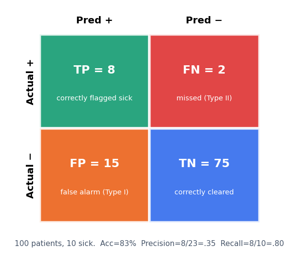

#### 🗣️ Layman Explanation

Four outcomes of a yes/no test: right and said yes (TP), right and said no (TN), cried wolf (FP — false alarm), missed the wolf (FN — miss). **Precision** = "when I shout positive, how often am I right?" **Recall** = "of all real positives, how many did I catch?"

#### 🧠 Conceptual Deep Dive

**Precision and recall ask *different questions* — and that's the whole point.** Precision is about the *trustworthiness of your positive predictions* (denominator $TP+FP$ = everything you *flagged*). Recall is about *coverage of the real positives* (denominator $TP+FN$ = everything that *truly is* positive). A model can be high-precision/low-recall (flags few but is usually right) or low-precision/high-recall (flags everything, catches all positives but with many false alarms). One number can't capture both — which is exactly why accuracy, a single blunt average, misleads.

**The precision–recall trade-off via the threshold.** Lower the decision threshold → you flag more positives → **recall ↑, precision ↓** (more catches, more false alarms). Raise it → the reverse. There's no free lunch; you slide along the trade-off by moving the threshold, and *which way you slide* depends on the **cost of each error**:
- **Cancer screening / fraud / pedestrian detection:** a **miss (FN)** is catastrophic → optimise **recall** (catch every positive, tolerate false alarms).
- **Spam filtering / ad targeting:** a **false alarm (FP)** is costly (a real email lost) → optimise **precision**.

**F1 — when you need one number.** F1 is the *harmonic* mean of precision and recall (not arithmetic — the harmonic mean punishes imbalance, so you can't score well by acing one and tanking the other). Use it when both errors matter and classes are imbalanced.

> [!info] **The connection that ties L7 back to L2 — precision *is* the Bayes posterior**
> Precision $=\frac{TP}{TP+FP}=P(\text{actually positive}\mid\text{predicted positive})$ — *exactly* the Bayes posterior $P(D\mid T^+)$ from L2. The Hantavirus answer (≈0.161) was a precision computation. And "accuracy misleads on imbalanced data" is the *same* truth as "an accurate test gives a low posterior for a rare disease" — both are **base rates** dominating. Two lectures, one idea.

> [!warning] **Exam trap — the faculty's favourite swaps**
> (1) **Precision vs recall:** a distractor gives the *recall* formula for a precision question (both true facts about adjacent concepts). Anchor: **P**recision has F**P** in the denominator; **R**ecall has F**N**. (2) **Type I vs II:** FP = Type I (false alarm), FN = Type II (miss). (3) Precision = the Bayes posterior.

#### 🧪 Worked Example — the slide's exact 100-patient case, every number

100 patients, 10 actually sick. Model: **TP=8** (sick, flagged), **FN=2** (sick, missed), **FP=15** (healthy, wrongly flagged), **TN=75** (healthy, cleared).
- **Accuracy** $=\frac{8+75}{100}=83\%$.
- **Precision** $=\frac{8}{8+15}=\frac{8}{23}\approx0.35$ — only 35% of those flagged are truly sick.
- **Recall** $=\frac{8}{8+2}=\frac{8}{10}=0.80$ — caught 80% of the sick.
- **Specificity** $=\frac{75}{75+15}=\frac{75}{90}\approx0.83$. **F1** $=\frac{2(0.35)(0.80)}{0.35+0.80}=\frac{0.56}{1.15}\approx0.49$.

The lesson lives in the gap: accuracy (83%) *looks fine* while precision (0.35) reveals the model false-alarms constantly. Different metrics, different stories — report the one your problem cares about.

#### ❓ Counter Questions

- **Define TP/FP/FN/TN and which are Type I/II.** FP = Type I; FN = Type II.
- **For a cancer test, optimise precision or recall? Why?** Recall — a miss (FN) is far costlier than a false alarm.
- **Why is F1 a *harmonic* mean?** It penalises a large gap between P and R, so you can't game it by maximising one alone.

---

## 7.3 ROC Curve & AUC

#### 📐 Formal Definition

**ROC** plots **TPR (recall)** on the y-axis vs **FPR** $=\frac{FP}{FP+TN}$ on the x-axis, across all thresholds. **AUC** = area under the curve = probability the model ranks a random **positive** above a random **negative**. AUC 0.5 = random; 1.0 = perfect.

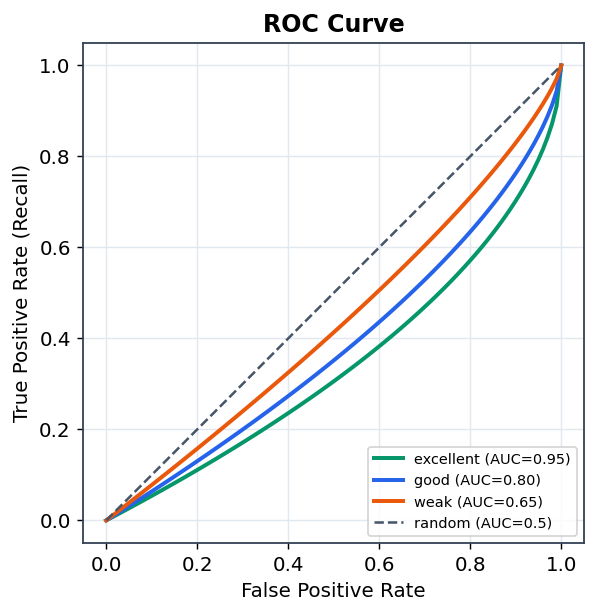

#### 🗣️ Layman Explanation

Instead of judging at one threshold, ROC sweeps *every* threshold and plots the trade-off between catching positives (TPR) and false alarms (FPR). AUC squeezes the whole curve into one number: the chance the model scores a true positive above a true negative.

#### 🧠 Conceptual Deep Dive

**Why a *curve* and not a point?** A single threshold gives one (precision, recall) pair — but the "right" threshold depends on your error costs, which may change after deployment. ROC evaluates the model's **ranking ability** independent of any threshold: a good model assigns higher scores to positives than negatives *across the board*. The diagonal is random guessing; bowing toward the **top-left** (high TPR at low FPR) is better.

**Why AUC's "probability" interpretation is so clean.** AUC = P(a random positive scores higher than a random negative). This is *threshold-free* and *scale-free* — it measures pure discrimination. AUC 0.9 means: pick any positive and any negative, and 90% of the time the model ranks the positive higher. That's why it's a favourite single-number summary, especially for imbalanced data where accuracy lies.

**ROC vs Precision–Recall curves (a useful nuance).** On *severely* imbalanced data, ROC can look optimistic (FPR has the huge TN count in its denominator, so it stays low even with many false positives). A Precision–Recall curve is often more informative there. Knowing this distinction is a top-band point.

> [!warning] **Exam trap**
> The x-axis is **FPR** $=\frac{FP}{FP+TN}$, *not* raw FP and *not* precision. TPR is just another name for **recall/sensitivity**. Mixing FPR with precision is the classic error.

#### 🧪 Worked Example

From the 100-patient case: TPR $=$ recall $=0.80$; FPR $=\frac{FP}{FP+TN}=\frac{15}{15+75}=\frac{15}{90}\approx0.167$. So this threshold corresponds to the ROC point $(0.167,\,0.80)$ — well above the diagonal (good). Sweeping the threshold traces the rest of the curve.

#### ❓ Counter Questions

- **What do the ROC axes represent?** y: TPR/recall; x: FPR.
- **Interpret AUC = 0.5 and 0.9.** Random; ranks a random positive above a random negative 90% of the time.
- **When might ROC mislead?** Under heavy imbalance — prefer a precision–recall curve.

---

## 7.4 Handling Class Imbalance

#### 📐 Formal Definition

When one class dominates, accuracy is misleading. **Balanced accuracy** = average recall across classes. Remedies (slide): **oversample** the minority (**SMOTE**, RandomOverSampler), **undersample** the majority, or use **class weights** in the loss.

#### 🗣️ Layman Explanation

If 95% of cases are "no," a lazy "always-no" model scores 95% while learning nothing. Balanced accuracy averages how well you do on *each* class, exposing the laziness. To fix the imbalance: manufacture more minority examples, drop some majority ones, or tell the loss to care more about the rare class.

#### 🧠 Conceptual Deep Dive

This closes the loop with the opening horror story: the all-"healthy" cancer model has 99% accuracy but **0% recall** and terrible balanced accuracy. **Why each remedy works:**
- **SMOTE** synthesises new minority points by interpolating between real ones (not just copying) — giving the model more varied positive examples without trivial duplicates.
- **Undersampling** discards majority examples to rebalance — simple but throws away data.
- **Class weights** multiply the loss for minority mistakes, so a missed positive *hurts more* — rebalancing without touching the data. This directly invokes the lecture's thesis: *the metric/loss you optimise shapes what the model learns.* Reweight the loss and you change the model's priorities.

**What if we ignored imbalance?** The model optimises overall accuracy by ignoring the rare class — exactly the failure that makes the metric you *optimise during training* (not just report) decisive.

#### 🧪 Worked Example

Dataset: 950 negatives, 50 positives. An "always-negative" model: accuracy $=95\%$, recall $=0\%$, balanced accuracy $=\frac{0\%+100\%}{2}=50\%$ (= random). Balanced accuracy instantly exposes the model that accuracy flatters.

#### ❓ Counter Questions

- **Why is accuracy misleading under imbalance, and what's better?** A trivial majority-class model scores high; use balanced accuracy / F1 / recall.
- **Two ways to handle imbalance?** SMOTE/oversample, undersample, or class weights.
- **Does oversampling risk overfitting?** Naïve duplication can; SMOTE's interpolation mitigates it by adding variety.

---

## 🎯 High-Yield Concepts (Lecture 7)

1. **Accuracy lies on imbalanced data** (the 99% cancer model).
2. **Confusion matrix**: FP = Type I, FN = Type II; **Precision** vs **Recall** formulas.
3. **Precision = Bayes posterior** (link to L2); the precision–recall threshold trade-off.
4. **ROC** = TPR vs **FPR**; **AUC** = P(random + ranked above random −).
5. **Regression metrics:** MAE (robust) vs RMSE (outlier-sensitive); R²/Adjusted R²; MAPE breaks at 0.
6. **Imbalance fixes:** SMOTE / undersample / class weights; balanced accuracy.
7. The **100-patient numbers**: Acc 83%, P 0.35, R 0.80.

## ⚠️ Common Misconceptions

- *"High accuracy means a good model."* Not under imbalance — check recall/F1/balanced accuracy.
- *"Precision and recall are interchangeable."* Different denominators (FP vs FN), different questions.
- *"FPR equals FP."* FPR $=\frac{FP}{FP+TN}$, a rate.
- *"AUC measures accuracy at threshold 0.5."* It's threshold-free; it measures ranking.
- *"R² can decrease when you add a feature."* Plain R² can't; Adjusted R² can.
- *"MAPE always works."* It fails when a true value is 0.

## 🎓 Professor Trap Questions

1. *"A model is 95% accurate on data that's 95% negative. Is it good?"* — Likely **no** — it may just predict the majority (recall ≈ 0). Tests the imbalance trap.
2. *"Precision is $\frac{TP}{TP+FN}$ — true?"* — **False:** that's *recall*; precision has **FP** in the denominator. The swap is the signature distractor.
3. *"For a model with AUC 0.85 but poor accuracy at threshold 0.5, is the model bad?"* — Not necessarily — it *ranks* well (AUC 0.85); you may just need a better threshold. Separates ranking from thresholded accuracy.
4. *"Optimise precision for cancer detection — sensible?"* — **No** — you'd minimise false alarms at the cost of missing cancers (FN); optimise **recall** instead.

## 📝 Practice Problems (inspired by Alpaydın Ch. 19, Bishop Ch. 4.1, Goodfellow Ch. 5.3)

1. **(Mathematical)** From TP=40, FP=10, FN=20, TN=130: compute accuracy, precision, recall, F1. *(Acc=170/200=0.85; P=40/50=0.80; R=40/60≈0.667; F1=2·0.8·0.667/(1.467)≈0.727.)*
2. **(Mathematical)** Compute FPR for the above. *(FP/(FP+TN)=10/140≈0.071.)*
3. **(Conceptual)** Explain why precision equals a Bayes posterior. *(Both are $P(\text{positive}\mid\text{predicted/test positive})$.)*
4. **(Analytical)** A fraud detector flags 2% of transactions; analysts can only investigate 50/day. Which metric should you optimise and why? *(Precision — limited capacity means flagged cases must be trustworthy.)*
5. **("What if?")** What if you lower the classification threshold from 0.5 to 0.3? *(Recall ↑, precision ↓; more positives flagged, more false alarms.)*
6. **(Mixed)** Your data is 99% negative. Compare accuracy, F1, and AUC as headline metrics. *(Accuracy misleads; F1/recall/balanced-accuracy and AUC reveal true minority-class performance.)*

## ⚡ Quick Revision Summary

> [!abstract]
> **Accuracy lies on imbalanced data** (99% cancer model). **Confusion matrix:** FP = Type I, FN = Type II. **Precision** $=\frac{TP}{TP+FP}$ (= Bayes posterior, link to L2), **Recall** $=\frac{TP}{TP+FN}$; slide the threshold to trade them — optimise **recall** when misses kill, **precision** when false alarms cost. **F1** = harmonic mean. **ROC** = TPR vs **FPR** across thresholds; **AUC** = P(random + ranked above random −), threshold-free. **Regression:** MAE (robust) vs RMSE (outlier-sensitive, target units); R²/Adjusted R² (variance explained, penalise extra features); MAPE breaks at 0. **Imbalance:** SMOTE / undersample / class weights; balanced accuracy. Know the 100-patient numbers cold (Acc 83%, P 0.35, R 0.80).

---
# Lecture 8 — Convolutional Neural Networks

> **Slide source:** Lecture 8 (Ishmam Tashdeed). **Cited chapters:** Goodfellow Ch. 9 · Alpaydın Ch. 12.
> **Where it sits:** The final lecture specialises neural networks (L6) for **images** by baking in two assumptions about how images work. Everything from L6 still applies (forward pass, backprop, activations, regularization); CNNs just replace dense layers with a structure-aware operation. It's the payoff of L2's "representation caps performance" and L6.2's "depth composes features."

---

## 8.1 Images as Data & Why MLPs Struggle

#### 📐 Formal Definition

An **image** is a tensor of pixel intensities in $[0,255]$. Grayscale: $H\times W$. Colour: $H\times W\times3$ (RGB channels). An MLP flattens this into a vector and connects every pixel to every neuron.

#### 🗣️ Layman Explanation

A picture is a grid of brightness numbers (three grids for colour). Flatten it for a normal neural net and you throw away the fact that nearby pixels belong together — and you drown in weights.

#### 🧠 Conceptual Deep Dive — the three fatal problems (slide)

For a $32\times32\times3$ CIFAR-10 image, the input vector has **3,072** dimensions; a first hidden layer of 512 units needs $3072\times512\approx\mathbf{1.5\,million}$ weights — for one tiny image, one layer. Three failures:
1. **Parameter explosion** — millions of weights → severe overfitting risk (L4's curse of dimensionality, made concrete), and infeasible memory/compute for real images.
2. **No spatial structure exploited** — flattening makes a pixel and its neighbour as "unrelated" as two opposite corners; the MLP can't know they're adjacent. But adjacency is *everything* in an image (edges, textures are local).
3. **No translation invariance** — a cat in the top-left and the same cat in the bottom-right are, to a flattened MLP, completely different inputs, so it must *relearn* the cat at every position. Hopelessly inefficient.

**The unifying insight — inductive bias.** An MLP assumes *nothing* about its input's structure (maximally general, hence data-hungry and weight-heavy). Images have *strong* structure, so we should *build that structure into the architecture*. That's an **inductive bias**: a built-in assumption that, when it matches the data, slashes the parameters and data needed. CNNs encode exactly the two biases images obey — **locality** and **translation invariance** (§8.2). This is L6.2's lesson (match structure to data) applied to vision.

**What if we just used bigger MLPs?** You'd need astronomically more data and compute to overcome the three problems, and still wouldn't get translation invariance for free. CNNs solve all three *by design*, which is why vision uses them.

#### 🧪 Worked Example

A modest $224\times224\times3$ image (ImageNet size) flattens to **150,528** inputs; one 1000-unit hidden layer → **~150 million** weights in a *single* layer. A CNN processes the same image with kernels of a few thousand shared weights total. The contrast is the whole motivation.

#### ❓ Counter Questions

- **Why are MLPs poorly suited to images?** Parameter explosion; ignores spatial locality; no translation invariance.
- **Is flattening ever fine?** For small, unstructured tabular data, yes — there's no spatial structure to lose. For images, no.

---

## 8.2 Convolution & Inductive Biases

#### 📐 Formal Definition

A **filter/kernel** is a small weight matrix. **Convolution** (in deep learning, technically cross-correlation) slides the filter across the image, computing a **dot product** at each position → a **feature map**. Two biases: **locality** (features are local) and **translation invariance** (a feature is the same wherever it appears).

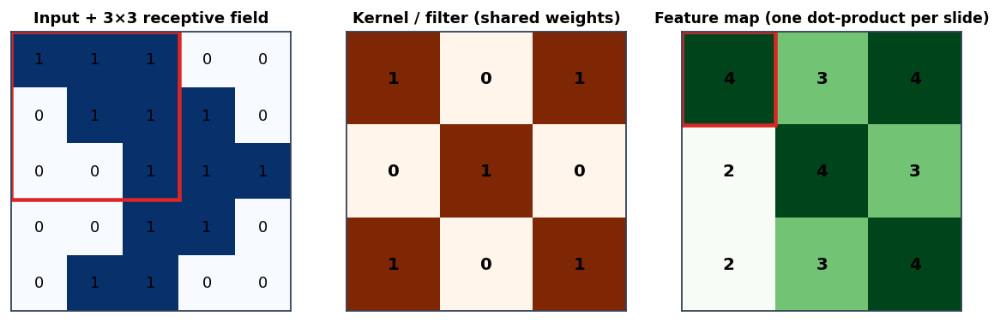

#### 🗣️ Layman Explanation

A filter is a tiny pattern-detector (say, "vertical edge"). Drag it across the whole image; wherever a local patch matches the pattern, the output lights up. The *same* small detector is reused everywhere — so it finds that edge anywhere.

#### 🧠 Conceptual Deep Dive — how convolution kills all three MLP problems

- **Parameter sharing** → solves *parameter explosion*. One kernel ($3\times3=9$ weights) is reused across the entire image instead of a unique weight per pixel. Millions of weights collapse to a handful per filter.
- **Locality (small receptive field)** → solves *ignoring spatial structure*. Each output depends only on a small neighbourhood — exactly how real visual features (edges, corners) are defined.
- **Translation equivariance** → solves *no translation invariance*. Because the same kernel slides everywhere, a feature detected at one location is detected at all locations; the network learns "vertical edge" *once* and applies it globally.

So convolution isn't a random trick — it's the *minimal* architecture that encodes the two true facts about images. Each design choice maps to one MLP failure it repairs.

**Convolution vs cross-correlation — the definition nuance.** True mathematical convolution **flips** the kernel before sliding; deep-learning "convolution" **does not flip** — it's really **cross-correlation**. Since the kernel weights are *learned*, the flip is irrelevant (the network just learns the would-be-flipped weights), so the field uses the terms interchangeably. Worth a mark on a definition question.

#### 🧪 Worked Example — a vertical-edge detector

The Sobel-style kernel $\begin{bmatrix}-1&0&1\\-1&0&1\\-1&0&1\end{bmatrix}$ slid over an image gives large responses where brightness jumps left-to-right (a vertical edge) and ~0 over flat regions. One kernel, 9 weights, detects vertical edges *everywhere* — the parameter-sharing payoff in one picture.

#### ❓ Counter Questions

- **What two inductive biases do CNNs encode?** Locality, translation invariance.
- **How does parameter sharing reduce overfitting?** One kernel reused everywhere → far fewer weights → lower variance.
- **Convolution vs cross-correlation?** Convolution flips the kernel; DL "conv" doesn't; learned weights make it moot.

---

## 8.3 Padding, Stride & Output Size

#### 📐 Formal Definition

**Padding ($p$):** add zeros around the border so the output doesn't shrink too fast. **Stride ($s$):** how far the filter jumps each step ($s>1$ downsamples). For an $n\times n$ input, $f\times f$ filter, stride $s$, padding $p$:
$$\boxed{\left\lfloor\frac{n-f+2p}{s}\right\rfloor+1}.$$

#### 🗣️ Layman Explanation

Without padding, each convolution nibbles the edges and the image shrinks; zero-padding adds a border so it doesn't. Stride is the step size — stride 2 skips every other position, halving the output.

#### 🧠 Conceptual Deep Dive — deriving the formula (so you never misremember it)

Place an $f$-wide filter at the far left of an $n$-wide (padded to $n+2p$) row. It can slide until its right edge hits the end — that's $(n+2p-f)$ available shifts, taken in steps of $s$, giving $\frac{n+2p-f}{s}$ moves, **plus 1** for the starting position. The **floor** handles strides that don't divide evenly (you can't take a fractional step). Padding appears as $+2p$ because you add $p$ on *each* side. Understanding the derivation means you can reconstruct the formula under pressure instead of memorising it.

**Why "same" padding uses $p=\frac{f-1}{2}$.** To keep output size = input size with $s=1$: set $\frac{n-f+2p}{1}+1=n$ → $2p=f-1$ → $p=\frac{f-1}{2}$. This is an integer only for **odd** $f$ — a key reason kernels are almost always odd-sized ($3\times3$, $5\times5$): odd kernels have a well-defined centre and admit clean symmetric padding.

> [!warning] **Exam trap**
> A guaranteed calculation question. Watch the integer **floor** for non-divisible strides, and remember "same" padding needs $p=\frac{f-1}{2}$.

#### 🧪 Worked Examples (step by step)

- $n=32,f=5,p=0,s=1$: $\frac{32-5+0}{1}+1=27+1=\mathbf{28}$. ($32\times32\to28\times28$.)
- "Same" padding, $f=3,s=1$: $p=\frac{3-1}{2}=1$ → $\frac{32-3+2}{1}+1=32$. ✓ size preserved.
- $n=7,f=3,p=0,s=2$: $\frac{7-3}{2}+1=2+1=\mathbf{3}$.
- Tricky floor: $n=8,f=3,p=0,s=2$: $\frac{8-3}{2}+1=\lfloor2.5\rfloor+1=2+1=\mathbf{3}$ (the floor matters here).

#### ❓ Counter Questions

- **Compute output for $n=28,f=5,p=2,s=1$.** $\frac{28-5+4}{1}+1=28$.
- **What padding keeps size for a $3\times3$, stride-1 filter?** $p=1$.
- **Why are kernels usually odd-sized?** Clean symmetric "same" padding and a defined centre.

---

## 8.4 Channels, Feature Maps & Stacking Filters

#### 📐 Formal Definition

For a multi-channel input (e.g. RGB = 3 channels), each filter has a **matching number of channels** and sums across them to produce **one** 2-D feature map. To detect **multiple** features, use **multiple filters**: $K$ filters → $K$ feature maps → output depth $K$.

#### 🗣️ Layman Explanation

A colour filter looks at all three colour layers at once and produces a single response map. One filter learns one kind of feature; to also catch other features, add more filters — each its own feature map.

#### 🧠 Conceptual Deep Dive

**A filter's depth always matches its input's depth.** A filter for an RGB input is $f\times f\times3$; it dot-products across *all three* channels and sums to one number per position → one 2-D map. So "RGB → one feature map per filter" — the channel dimension is consumed, not preserved per-filter.

**Why output depth = number of filters (not input channels).** Each filter answers one question ("is there a vertical edge here?"). Stack $K$ filters and you get $K$ answers per location → a depth-$K$ output. As you go deeper, **spatial size shrinks** (pooling/stride) while **depth grows** — the network trades "*where*" for "*what*," building edges → textures → parts → objects (exactly L6.2's compositional hierarchy, now visual).

**What if we used one filter only?** The network could detect a single feature type — useless. Multiple filters per layer give a *rich* feature vocabulary at each level; their composition across layers is where CNN power comes from.

#### 🧪 Worked Example

RGB input ($\cdot\times\cdot\times3$) convolved with **16** filters, each $3\times3\times3$: output depth = **16**; each filter has **3** channels (to match RGB) and $3\times3\times3=27$ weights (+1 bias). Total layer weights $=16\times28=448$ — versus an MLP's millions.

#### ❓ Counter Questions

- **RGB input, 16 filters → output depth? Filter channels?** Depth 16; each filter has 3 channels.
- **Why does depth grow while spatial size shrinks?** The network abstracts "where" into richer "what" — more feature types over smaller maps.

---

## 8.5 Pooling Layers

#### 📐 Formal Definition

**Pooling** reduces spatial dimensions by summarising small regions with one value: **Max** (the maximum) or **Average** (the mean). Typical: $2\times2$ window, stride 2 — **halves** both spatial dims, ~**4×** fewer activations.

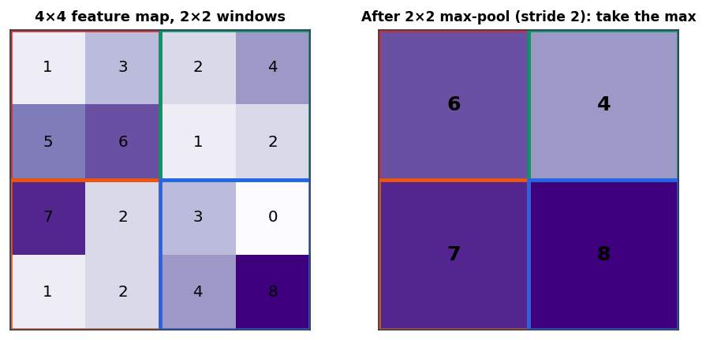

#### 🗣️ Layman Explanation

Pooling zooms out: each little neighbourhood is replaced by its strongest signal (max) or its average. The map gets smaller and cheaper, and small wobbles in feature position stop mattering.

#### 🧠 Conceptual Deep Dive — three benefits (slide), with the "why" for each

1. **Dimensionality reduction** → fewer activations → fewer downstream parameters → cheaper, less overfitting.
2. **Approximate local translation invariance** → if a feature shifts a few pixels *within* a pooling window, max-pooling outputs the *same* value. So the network becomes robust to *small* positional jitter — a sharper version of the translation invariance convolution already provides.
3. **Enlarging the effective receptive field** → after pooling, each deeper neuron "sees" a proportionally larger region of the *original* image, letting later layers reason about bigger structures (a whole face, not just an edge).

**Max vs average — what each preserves.** Max-pooling keeps the *strongest* activation (best for "was this feature present *anywhere* here?"), which suits feature detection. Average-pooling smooths (keeps overall intensity), used e.g. in *global average pooling* at a network's end to collapse a feature map to one number per channel.

> [!info] **Modern note (slide)**
> Many recent architectures replace max-pooling with **strided convolutions**, letting the network *learn* the downsampling instead of fixing it — more flexible, at a small parameter cost.

#### 🧪 Worked Example

A $4\times4$ feature map, $2\times2$ max-pool, stride 2 → $2\times2$ output (size halved, $\frac{16}{4}=4\times$ fewer values). For the top-left $2\times2$ block $\begin{bmatrix}1&3\\2&8\end{bmatrix}$, max-pool outputs **8**; average-pool outputs $\frac{1+3+2+8}{4}=3.5$.

#### ❓ Counter Questions

- **What does $2\times2$ stride-2 max pooling do to a map's size?** Halves each spatial dim; ~4× fewer activations.
- **Two reasons to pool?** Dim reduction; local translation invariance; larger receptive field.
- **Max vs average pooling?** Max keeps the strongest response (feature presence); average keeps overall intensity.

---

## 8.6 Assembling a CNN & Classic Architectures

#### 📐 Formal Definition

$$[\text{Conv}\to\text{Activation}\to\text{Pool}]\times N\to\text{Flatten}\to\text{Fully-Connected}\to\text{Output}.$$
The **convolutional base (backbone)** extracts features (spatial ↓, depth ↑); the **classifier head** flattens and uses FC layers ending in $K$ outputs.

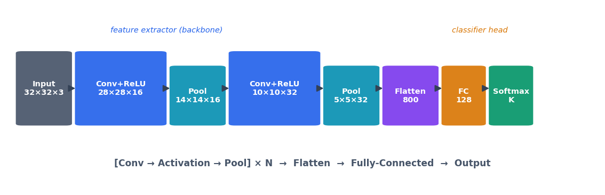

#### 🗣️ Layman Explanation

The first part is a feature factory (convolutions + pooling turning pixels into abstract features); the last part is an ordinary classifier (the MLP from L6) that reads those features and picks a class.

#### 🧠 Conceptual Deep Dive

**Why this two-stage structure.** The **backbone** answers "*what features are in this image, and roughly where?*", progressively abstracting from edges to object-parts. The **head** answers "*given these features, which class?*" — exactly the L6 MLP, now fed *learned* features instead of raw pixels. The flatten step bridges the spatial feature maps to the vector the FC layer expects. This is the culmination of L2's representation idea: the CNN *learns its own representation*, then classifies it.

**The classic lineage (slide) — each solved a problem:**
- **LeNet** (LeCun, 1998) — the original, for handwritten digits; proved the conv→pool→FC template.
- **AlexNet** (2012) — scaled it up with ReLU, dropout, and GPUs; crushed ImageNet and launched the deep-learning era.
- **VGGNet** — deep stacks of small $3\times3$ filters. Insight: two $3\times3$ convs have the same receptive field as one $5\times5$ but with *fewer parameters* and *more nonlinearity* (two activations instead of one) — a concrete instance of L6.2's "depth beats width."

#### 🧪 Worked Example (a feature map's journey)

$32\times32\times3$ → Conv(16 filters, $3\times3$, same pad) → $32\times32\times16$ → MaxPool $2\times2$ → $16\times16\times16$ → Conv(32) → $16\times16\times32$ → Pool → $8\times8\times32$ → Flatten → $2048$-vector → FC → 10 outputs. Spatial size fell $32\to8$ while depth rose $3\to32$: "where" traded for "what," then classified.

#### ❓ Counter Questions

- **Sketch the canonical CNN pattern and label backbone vs head.** [Conv→Act→Pool]×N → Flatten → FC → Output; backbone extracts features, head classifies.
- **Why do two $3\times3$ convs beat one $5\times5$?** Same receptive field, fewer parameters, more nonlinearity.

---

## 8.7 Transfer Learning

#### 📐 Formal Definition

A CNN pretrained on a large dataset (e.g. **ImageNet**: 1.2M images, 1000 classes) learns general visual features (edges, textures, shapes, parts). **Transfer learning** reuses them: **feature extraction** (freeze the backbone, train only a new head) or **fine-tuning** (unfreeze some/all of the backbone, keep training at a small LR).

#### 🗣️ Layman Explanation

Someone already trained a network to "see" on millions of images. Rather than start from scratch, borrow its eyes: bolt a fresh classifier onto the frozen eyes (feature extraction), or also gently adjust the eyes for your task (fine-tuning).

#### 🧠 Conceptual Deep Dive

**Why it works — early features are universal.** Early convolutional layers learn edges, colours, and textures that are useful for *almost any* vision task, not just the original 1000 classes. Only the later, task-specific layers and the head need to change. So you inherit millions of dollars of pretraining for free and adapt cheaply.

**Choosing feature extraction vs fine-tuning — a data-size decision:**
- **Small dataset** → **feature extraction** (freeze backbone): few trainable parameters → little overfitting risk. You trust the pretrained features as-is.
- **Larger dataset** → **fine-tuning** (unfreeze, low LR): enough data to safely adapt the features to your domain. The **small learning rate** is crucial — it nudges the valuable pretrained weights without destroying them (a large LR would wipe out what pretraining learned).

**Connection to the whole course.** Transfer learning is the practical answer to two earlier problems: it sidesteps the **data hunger** that the UAT (L6.2) and overfitting (L4) warn about, by importing knowledge instead of learning from scratch. It's why modern vision rarely trains from zero.

#### 🧪 Worked Example

You have 500 labelled X-rays (tiny by deep-learning standards). Take an ImageNet-pretrained ResNet, **freeze** its convolutional backbone, replace the final 1000-class head with a 2-class (normal/abnormal) head, and train only that head. 500 images is far too few to train millions of weights, but plenty to fit a small head on top of strong pretrained features.

#### ❓ Counter Questions

- **Feature extraction vs fine-tuning?** Freeze backbone + train head vs unfreeze and adapt backbone at low LR.
- **Why does transfer learning work at all?** Early conv features (edges/textures) are general across vision tasks.
- **Why a *small* LR when fine-tuning?** To adapt without destroying the valuable pretrained weights.

---

## 🎯 High-Yield Concepts (Lecture 8)

1. **Image = $[0,255]$ tensor** ($H\times W\times3$); MLPs fail (1.5M params, no locality, no translation invariance).
2. **Convolution** = sliding **shared** kernel → feature map, encoding **locality + translation invariance** (inductive biases).
3. **Output size** $=\lfloor(n-f+2p)/s\rfloor+1$; "same" padding $p=\frac{f-1}{2}$.
4. **DL conv = cross-correlation** (no flip); $K$ filters → depth $K$; filters match input channels.
5. **Pooling** ($2\times2$/s2) halves dims, gives local invariance, grows receptive field.
6. **Architecture:** [Conv→Act→Pool]×N→Flatten→FC→Output (backbone + head); LeNet→AlexNet→VGG.
7. **Transfer learning:** feature extraction (frozen) vs fine-tuning (low LR).

## ⚠️ Common Misconceptions

- *"CNNs need fewer layers than MLPs but more weights."* The opposite — far *fewer* weights via parameter sharing.
- *"Output depth equals input channels."* It equals the **number of filters**.
- *"Padding is optional decoration."* It controls output size and preserves edge information.
- *"DL convolution flips the kernel."* It doesn't (cross-correlation); learned weights make it irrelevant.
- *"Pooling has learnable parameters."* Max/avg pooling has **none** (strided conv is the learnable alternative).
- *"Fine-tune with a normal learning rate."* Use a *small* LR or you erase pretrained knowledge.

## 🎓 Professor Trap Questions

1. *"Output size for $n=10,f=3,p=0,s=2$?"* — $\lfloor(10-3)/2\rfloor+1=\lfloor3.5\rfloor+1=4$. The **floor** is the trap.
2. *"An RGB image convolved with 8 filters gives output depth 3 (one per colour) — true?"* — **False:** depth = **8** (number of filters); the 3 channels are summed inside each filter.
3. *"Max-pooling learns weights to downsample — true?"* — **False:** it has no parameters; *strided convolution* is the learnable downsampler.
4. *"You have 200 images; train a CNN from scratch?"* — **No** — use **transfer learning** (freeze backbone, train head); 200 images can't fit millions of weights.

## 📝 Practice Problems (inspired by Goodfellow Ch. 9, Alpaydın Ch. 12)

1. **(Mathematical)** Output size for $n=64,f=7,p=3,s=2$. *( $\lfloor(64-7+6)/2\rfloor+1=\lfloor31.5\rfloor+1=32$.)*
2. **(Mathematical)** How many weights in a conv layer with 32 filters of size $5\times5$ on an RGB input (with biases)? *( $32\times(5\cdot5\cdot3+1)=32\times76=2432$.)*
3. **(Conceptual)** Explain how parameter sharing encodes translation invariance. *(Same kernel slides everywhere ⇒ a feature is detected regardless of position.)*
4. **(Analytical)** Why do two stacked $3\times3$ convs often beat a single $5\times5$? *(Same receptive field, fewer parameters, extra nonlinearity.)*
5. **("What if?")** What if you removed all pooling/striding from a deep CNN? *(Spatial size never shrinks → huge activation maps, tiny receptive fields, heavy compute, weak global reasoning.)*
6. **(Mixed)** You must classify 300 satellite images. Outline a transfer-learning plan and justify each choice. *(Pretrained backbone frozen (small data → avoid overfit), new head trained; fine-tune top layers at low LR only if results plateau.)*

## ⚡ Quick Revision Summary

> [!abstract]
> **Image = $[0,255]$ tensor** ($H\times W\times3$). MLPs fail on images (≈1.5M params for CIFAR; no locality; no translation invariance). **Convolution** = sliding **shared** kernel → feature map, encoding the inductive biases **locality + translation invariance** via parameter sharing — repairing all three MLP failures. **Output size** $=\lfloor(n-f+2p)/s\rfloor+1$; "same" padding $p=\frac{f-1}{2}$ (odd kernels). DL conv = **cross-correlation** (no flip). $K$ filters → depth $K$; each filter matches input channels. **Pooling** ($2\times2$/s2) halves dims, adds local invariance, grows the receptive field (max = strongest, avg = mean; no parameters). **Architecture:** [Conv→Act→Pool]×N → Flatten → FC → Output (backbone extracts, head classifies); LeNet→AlexNet→VGG. **Transfer learning:** feature extraction (freeze) for small data, fine-tuning (low LR) for larger — because early features are universal.

---
# 🏁 Finale — Summary, Formulae, Glossary, Traps, High-Yield Q&A, Connections

---

## 📋 Master Summary

The whole course is **model → loss → optimisation**, repeated with growing sophistication, *justified* by MLE, *guaranteed* by convexity, *protected* by regularization, *judged* by evaluation metrics, and *specialised* for images by CNNs.

| Lecture | Core idea | The one thing you must not get wrong |
|---|---|---|
| **1 Intro** | Mitchell's E/T/P; S/U/R paradigms | Don't swap which is E, T, P |
| **2 Prob & Data** | splits/leakage; Bayes; MLE | Posterior ≠ likelihood; touch test set once |
| **3.1 Linear Reg** | $\theta^\top x$, MSE, GD, normal eq. | Gradient is *(pred−truth)×input*; keep $\frac{1}{2m}$ |
| **3.2 Convexity** | Hessian PSD ⇒ convex ⇒ local=global | MSE convex; MSE+sigmoid is NOT |
| **4 Regularization** | bias–variance; L1 sparse, L2 decay | Underfit = high bias/**low** var (slide says high/high) |
| **5.1 Logistic Reg** | sigmoid → probability; boundary $\theta^\top x{=}0$ | Threshold 0.5 ⟺ $\theta^\top x\ge0$ |
| **5.2 LogReg+GD** | BCE from Bernoulli MLE; $(\hat y{-}y)x$ | The minus sign is load-bearing |
| **6.1 Neural Nets** | composed neurons; backprop | No nonlinearity ⇒ one affine map |
| **6.2 UAT** | one layer can approximate anything | Existence ≠ trainability/generalization |
| **7 Evaluation** | confusion matrix; ROC/AUC | Accuracy lies on imbalance; FP ≠ FPR |
| **8 CNN** | conv = shared local filters | Output $=\lfloor(n-f+2p)/s\rfloor+1$ |

**The single sentence:** *Choose a curve ($h_\theta$), measure its wrongness ($J$, a negative log-likelihood), roll downhill ($\theta\leftarrow\theta-\alpha\nabla J$) on a surface you've tried to make convex, while penalising complexity — then judge it with the metric that matches the real-world cost of being wrong.*

---

## 🗺️ Suggested revision roadmap

1. **First pass — intuition.** Read each lecture's 🗣️ Layman + 🧠 Conceptual Deep Dive only. Build the mental model.
2. **Second pass — mechanics.** Work every 🧪 Worked Example *with pen and paper*, hiding the answer first. Especially: $J\approx0.583$, the GD step ($2.213,4.4$), Hantavirus ($0.161$), BCE ($1.609$), the 100-patient metrics, and one CNN output-size calculation.
3. **Third pass — defence.** Drill the **Common Misconceptions** and **Professor Trap Questions** until the adjacent-but-wrong distractors feel obvious.
4. **Night before.** Read only the ⚡ Quick Revision Summaries, this Formula Sheet, and the Common Exam Traps.
5. **In the hall.** For every MCQ: name the concept, recall its thread (Concept Connections), then **eliminate before selecting**.

---

## 🧮 Formula Sheet

**Models**
- Linear: $h_\theta(x)=\theta^\top x$
- Logistic: $\hat y=\sigma(\theta^\top x)=\dfrac{1}{1+e^{-\theta^\top x}}$, $\sigma'=\sigma(1-\sigma)\le0.25$
- Neuron: $a=g(Wx+b)$; softmax $p_k=\dfrac{e^{z_k}}{\sum_j e^{z_j}}$

**Losses**
- MSE: $J=\dfrac{1}{2m}\sum_i(h_\theta(x^{(i)})-y^{(i)})^2$
- BCE: $J=-\dfrac1m\sum_i[y^{(i)}\log\hat y^{(i)}+(1-y^{(i)})\log(1-\hat y^{(i)})]$
- Regularized: $J_{\text{reg}}=J+\lambda\Omega(\theta)$; $\Omega_{L2}=\tfrac12\sum\theta_j^2$, $\Omega_{L1}=\sum|\theta_j|$

**Gradients & updates**
- Shared form (linear *and* logistic): $\nabla_\theta J=\dfrac1m X^\top(\hat y-y)$
- GD: $\theta\leftarrow\theta-\alpha\nabla_\theta J$
- Ridge update: $\theta\leftarrow(1-\alpha\lambda)\theta-\dfrac{\alpha}{m}X^\top(\hat y-y)$
- Lasso grad: $\dfrac1m X^\top(\hat y-y)+\lambda\,\mathrm{sign}(\theta)$
- Normal equation: $\theta=(X^\top X)^{-1}X^\top y$; ridge: $(X^\top X+\lambda I)^{-1}X^\top y$
- Momentum: $v_t=\beta v_{t-1}+\nabla J$, $\theta\leftarrow\theta-\alpha v_t$
- Backprop output error: $dZ^{[L]}=A^{[L]}-Y$

**Convexity**
- Convex set: $tx+(1-t)y\in C$
- Convex fn: $f(tx+(1-t)y)\le tf(x)+(1-t)f(y)$; 2nd-order: $\nabla^2 f\succeq0$
- MSE Hessian: $\nabla^2 J=\tfrac1m\sum_i x^{(i)}x^{(i)\top}\succeq0$

**Probability**
- Bayes: $P(H\mid D)=\dfrac{P(D\mid H)P(H)}{P(D)}$; Bernoulli mean $p$, var $p(1-p)$
- MLE: maximise $\prod_i P(x_i\mid\theta)$ ⇔ minimise $-\sum_i\log P(x_i\mid\theta)$

**Evaluation**
- Accuracy $=\dfrac{TP+TN}{N}$; Precision $=\dfrac{TP}{TP+FP}$; Recall $=\dfrac{TP}{TP+FN}$
- Specificity $=\dfrac{TN}{TN+FP}$; F1 $=\dfrac{2PR}{P+R}$; FPR $=\dfrac{FP}{FP+TN}$
- $R^2=1-\dfrac{SS_{res}}{SS_{tot}}$; RMSE $=\sqrt{\text{MSE}}$

**CNN**
- Output size $=\left\lfloor\dfrac{n-f+2p}{s}\right\rfloor+1$; "same" padding $p=\dfrac{f-1}{2}$

**Numbers from your course to memorise**
- $J\approx0.583$ for $\{(1,1),(2,2),(3,3)\}$, $\theta_0{=}0,\theta_1{=}0.5$
- One GD step → $\theta_0=2.213,\ \theta_1=4.4$
- Hantavirus posterior $\approx0.161$
- BCE for $\hat y{=}0.2,y{=}1$: $-\ln0.2\approx1.609$
- $\sigma'_{\max}=0.25$; $0.25^{20}\approx9.1\times10^{-13}$
- 100-patient: TP8/FN2/FP15/TN75 → Acc 83%, P 0.35, R 0.80
- CIFAR MLP first layer: $3072\times512\approx1.5$M params

---

## 📖 Notation & Term Glossary (for quick lookup)

| Symbol / term | Meaning |
|---|---|
| $m$ | number of training examples |
| $n$ | number of features |
| $x^{(i)},\,y^{(i)}$ | the $i$-th example's features and label |
| $x_0=1$ | the bias/intercept "feature" (bias trick) |
| $\theta,\,W,\,b$ | parameters: weights ($\theta$/$W$) and bias ($b$) |
| $h_\theta(x),\,\hat y$ | model prediction |
| $\theta^\top x$ | dot product = weighted sum = the "score" $z$ |
| $\sigma(z)$ | sigmoid, $1/(1+e^{-z})$ |
| $J(\theta)$ | cost / loss function |
| $\nabla J$ | gradient (vector of partial derivatives) |
| $\nabla^2 J$ | Hessian (matrix of 2nd partials) |
| PSD ($\succeq0$) | positive semi-definite: $v^\top Hv\ge0\ \forall v$ |
| $\alpha$ | learning rate (step size) |
| $\lambda$ | regularization strength |
| $X$ | design matrix ($m\times n$, examples as rows) |
| MLE / MAP | maximum likelihood / maximum a posteriori |
| TP/FP/FN/TN | confusion-matrix counts |
| $f,p,s$ | CNN filter size, padding, stride |
| backbone / head | CNN feature extractor / classifier |

---

## ⚠️ Common Exam Traps

Your faculty's signature: **every distractor is a true statement about a slightly different concept.** Discipline: *eliminate the adjacent-but-wrong options by reading the precise qualifier* before selecting.

1. **Underfit bias/variance.** Standard: high bias, **LOW** variance. *(Your L4 slide says "high/high" — answer per the slide only if explicitly cited; otherwise give the standard form.)*
2. **The BCE minus sign.** Forgetting it yields a *negative* loss. $-\ln0.2\approx1.609$, not $-1.609$.
3. **Threshold 0.5 ⟺ $\theta^\top x\ge0$** — not $\theta^\top x\ge0.5$ (0.5 is on the probability, not the logit).
4. **Precision vs recall.** Precision has **FP** in the denominator; recall has **FN**.
5. **FP vs FPR.** ROC's x-axis is **FPR = FP/(FP+TN)**, not raw FP, not precision.
6. **Type I vs II.** FP = Type I (false alarm); FN = Type II (miss).
7. **σ′ ≤ 0.25**, not 0.5 (0.5 is $\sigma$ at the peak, not its derivative).
8. **Affine-only network = one affine map.** Extra layers add nothing without a nonlinearity.
9. **UAT is existence, not learnability.** No promise of training success, neuron count, or generalization.
10. **L1 vs L2.** L1 → exact zeros/sparse (diamond); L2 → smooth shrink/dense (circle). Only L1 selects features.
11. **Don't regularize the bias.** It only shifts the boundary.
12. **Convexity guarantee.** Convex ⇒ local = global. MSE convex; **MSE+sigmoid is not** (use BCE).
13. **Accuracy on imbalance.** A 99%-accurate model can catch zero positives.
14. **Vectorized gradient shape.** $\frac1m X^\top(\hat y-y)$ — the **transpose** makes dims work.
15. **Simultaneous GD updates.** Compute all partials from the *old* $\theta$, then update together.
16. **CNN output-size floor.** Use $\lfloor\cdot\rfloor$ when stride doesn't divide evenly.
17. **Batch norm train vs inference.** Train = mini-batch stats; inference = running estimates.
18. **Large learning rate ⇒ oscillation/divergence** (not "perfect generalization," not "weights → 0").
19. **Bayes ≠ reversing a conditional.** $P(D\mid T)\ne P(T\mid D)$; the base rate matters (Hantavirus ≈ 0.161).
20. **MAPE breaks at true value 0** (division by zero).
21. **Output depth = #filters**, not input channels.
22. **Zero-init = symmetry trap;** even identical *nonzero* weights fail — need distinct random values.

---

## 🎯 High-Yield Questions (with answers)

**Q1.** State Mitchell's definition; identify E/T/P for a spam filter. **A.** Performance on T (by P) improves with E. T: classify emails; P: accuracy; E: labelled emails.

**Q2.** Why does an accurate test give a low posterior for a rare disease? Compute for prevalence 1%, 95% accuracy. **A.** False positives from the large healthy group dominate. $P(T)=0.95(0.01)+0.05(0.99)=0.059$; $P(D\mid T)=0.0095/0.059\approx0.161$.

**Q3.** Prove MSE is convex. **A.** $\nabla^2 J=\frac1m\sum x^{(i)}x^{(i)\top}$; $v^\top\nabla^2Jv=\frac1m\sum(v^\top x^{(i)})^2\ge0$ ⇒ PSD ⇒ convex.

**Q4.** Why is convexity desirable, and why is MSE+sigmoid non-convex? **A.** Convex ⇒ every local min is global ⇒ GD reaches the optimum from any init. A sigmoid inside the square makes the Hessian's sign vary ⇒ non-convex; cross-entropy restores convexity.

**Q5.** Compute $J$ for $\{(1,1),(2,2),(3,3)\}$, $\theta_0{=}0,\theta_1{=}0.5$. **A.** $\frac16(0.25+1+2.25)=0.583$.

**Q6.** One GD step for $\{(1,1.75),(2,3.22),(3,1.67)\}$, $\theta{=}0,\alpha{=}1$. **A.** $\partial_{\theta_0}=-2.213$, $\partial_{\theta_1}=-4.4$ → $\theta_0=2.213,\theta_1=4.4$.

**Q7.** Underfit vs overfit in bias–variance terms. **A.** Underfit: high bias, low variance. Overfit: low bias, high variance. *(Slide labels underfit "high/high.")*

**Q8.** L1 vs L2 effect on weights. **A.** L1 → exact zeros (sparse, feature selection); L2 → smooth shrink (dense).

**Q9.** Why standardize features before ridge? **A.** L2 penalizes weights equally; unscaled small-range features need large weights, which L2 over-punishes. Standardize first.

**Q10.** Threshold-0.5 condition for class 1? **A.** $\theta^\top x\ge0$.

**Q11.** Why BCE over MSE for logistic regression? **A.** It's the Bernoulli negative log-likelihood (principled), convex with the sigmoid, and gives the clean gradient $(\hat y-y)x$.

**Q12.** Derive the logistic gradient; why the cancellation? **A.** $\partial_{\hat y}L=\frac{\hat y-y}{\hat y(1-\hat y)}$, $\partial_z\hat y=\hat y(1-\hat y)$, $\partial_{\theta_j}z=x_j$; product $=(\hat y-y)x_j$. The $\hat y(1-\hat y)$ cancels — a sigmoid+log gift.

**Q13.** Vectorized logistic gradient and its shape. **A.** $\frac1m X^\top(\hat y-y)$; $d\times m$ times $m$-vector → $d$-vector.

**Q14.** Effect of only-affine layers? **A.** The whole network collapses to one affine map; no added power.

**Q15.** Why do sigmoids cause vanishing gradients? **A.** $\sigma'\le0.25$; many factors multiply to ≈0 ($0.25^{20}\approx9.1\text{e-}13$).

**Q16.** Why can't all weights start at zero? **A.** Symmetry: identical outputs/gradients → neurons never differentiate. Use random init.

**Q17.** $dZ^{[L]}$ for sigmoid + BCE, and why useful? **A.** $A^{[L]}-Y$; the derivatives cancel → simple, efficient backprop.

**Q18.** State the UAT and one thing it does *not* guarantee. **A.** One hidden layer + enough neurons + a nonlinear activation approximates any continuous function on a compact domain to any $\varepsilon$. It does NOT guarantee trainability/neuron count/generalization.

**Q19.** For TP=8, FN=2, FP=15, TN=75: accuracy, precision, recall. **A.** 0.83, 8/23≈0.35, 0.80.

**Q20.** CNN output size for $n=32,f=5,p=0,s=1$; "same" padding for $f=3$. **A.** 28; $p=1$.

**Q21.** Multi-label (an instance in several classes at once) — design? **A.** One **sigmoid** output per class + **BCE per output**; assign every class above threshold. *(Real Quiz 2 SET-A/B Q5.)*

**Q22.** Momentum in a narrow valley? **A.** Accumulates velocity where gradients agree, cancels oscillation across the walls → faster, smoother descent.

---

## 🔗 Concept Connections

The course is a web, not a list. The threads worth seeing:

**1. The model→loss→optimisation spine.** Every method picks $h_\theta$, defines $J$, minimises it. Linear → logistic → neural → CNN are the *same recipe* with richer $h_\theta$.

**2. The MLE thread.** Every loss is a negative log-likelihood: Gaussian noise → **MSE**; Bernoulli → **BCE**; categorical → **softmax cross-entropy**. "Minimise loss" = "maximise the probability of the data." This is why the minus sign exists and why losses aren't arbitrary. Add a *prior* on weights and MLE becomes **MAP** = **regularization** (L4) — so even L4 is on this thread.

**3. The "(prediction − truth) × input" gradient.** $\frac1m X^\top(\hat y-y)$ is identical for linear and logistic regression, and reappears as $dZ^{[L]}=A^{[L]}-Y$ in backprop. One template, learned once, reused everywhere — courtesy of the sigmoid+log cancellation.

**4. The convexity thread.** Convexity (3.2) guarantees GD works (3.1), explains why classification uses BCE not MSE (5.1/5.2), and clarifies why neural networks (6.1, non-convex) need momentum, good init, and SGD noise instead of clean guarantees.

**5. The regularization thread.** Overfitting (L2: generalization) → bias–variance (L4) → L1/L2 (L4, 5.2) → dropout/batch norm (L6) → transfer learning's data efficiency (L8). All are "limit effective complexity / inject prior knowledge." Even ridge's $+\lambda I$ that fixes the singular normal equation (3.1) is the same idea wearing a numerical-stability hat.

**6. Single neuron = logistic regression.** A sigmoid neuron *is* logistic regression (5.1 → 6.1); stacking needs nonlinearity (6.1), whose power the UAT formalises (6.2), and whose training fails silently via vanishing gradients (σ′≤0.25, traceable to the sigmoid's derivative in 5.1).

**7. Bayes = precision.** The Bayes posterior $P(D\mid T)$ (L2) is literally **precision** $\frac{TP}{TP+FP}$ (L7). The Hantavirus surprise (≈0.161) and "accuracy lies on imbalance" are the same base-rate truth.

**8. Normalization everywhere.** Feature scaling speeds GD (3.1), makes L2 fair (L4), and matters before ridge (real quiz). Batch norm (L6) is the same instinct applied *inside* the network. Stabilise the scale, ease the optimisation.

**9. Inductive bias & representation.** Representation caps performance (L2). Feature engineering (L4/L5) and hidden layers (L6) both create better representations — by hand vs learned. CNNs (L8) bake the *right* biases (locality, translation invariance) into the architecture, and the UAT (L6.2) explains why *depth* composes representations efficiently. "Match your assumptions to your data" runs from L2 to L8.

**10. Existence vs reality (the meta-thread).** The UAT (L6.2) separates *can-represent* (yes), *can-train* (L6.1: non-convex, no guarantee), and *can-generalize* (L2/L4: splits + regularization). Almost every lecture after L3 exists to address the second and third — a single argument spanning the syllabus.

> [!tip] **Final exam mindset**
> On a tricky MCQ: name the concept, locate it on these threads, then **eliminate the adjacent-but-wrong distractors**. Your faculty rewards *principled reasoning over pattern-matching* — and you now have the principles, the connections, the derivations, and your own course's exact numbers at your fingertips. Go get the marks. 🎓

---

*End of the CSE 4621 Machine Learning Concept Book — Companion Edition. Built from your decoded lecture decks and quiz sets, the Convexity & UAT notes, and the textbooks they cite (Goodfellow · Bishop · Alpaydın), with a self-contained maths primer so the slides are optional. Diagrams live in the `images/` folder — keep them beside this file so they render in Obsidian.*
