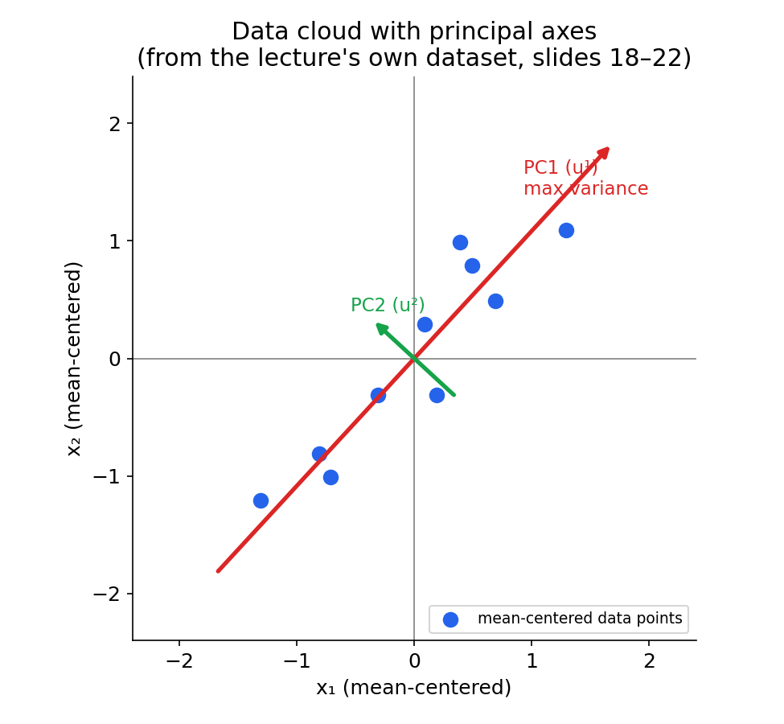
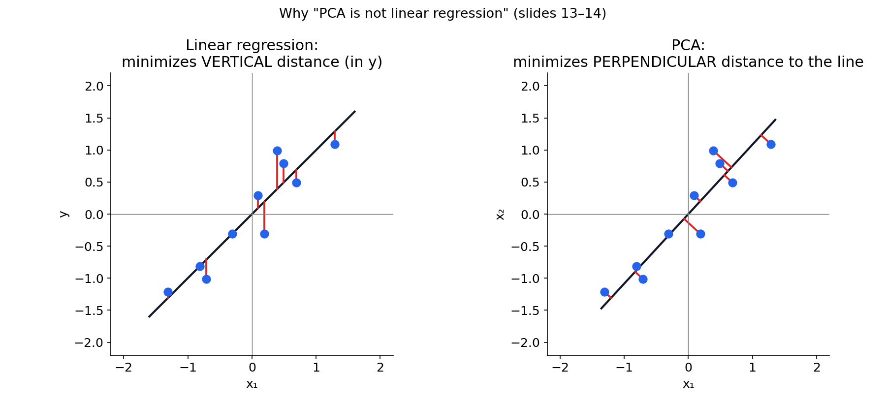
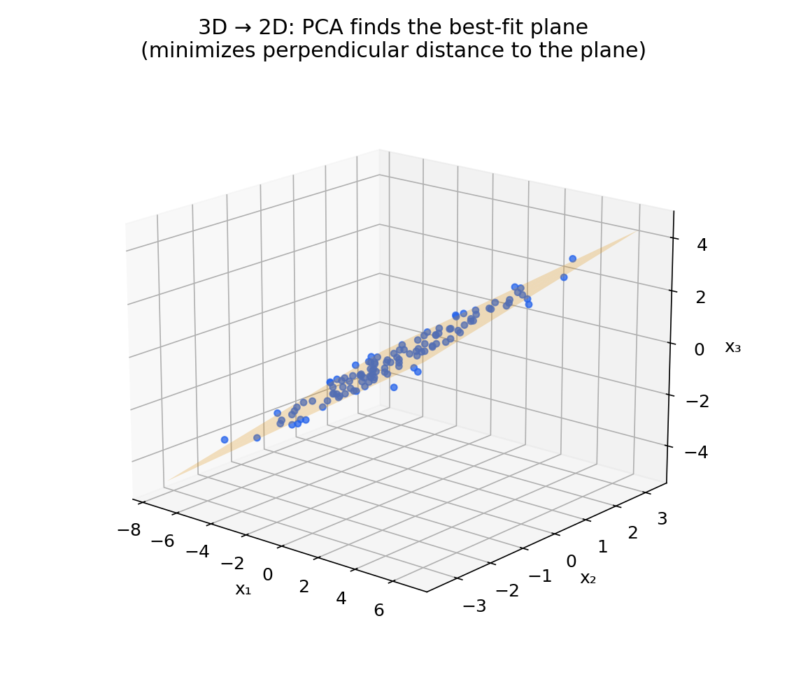
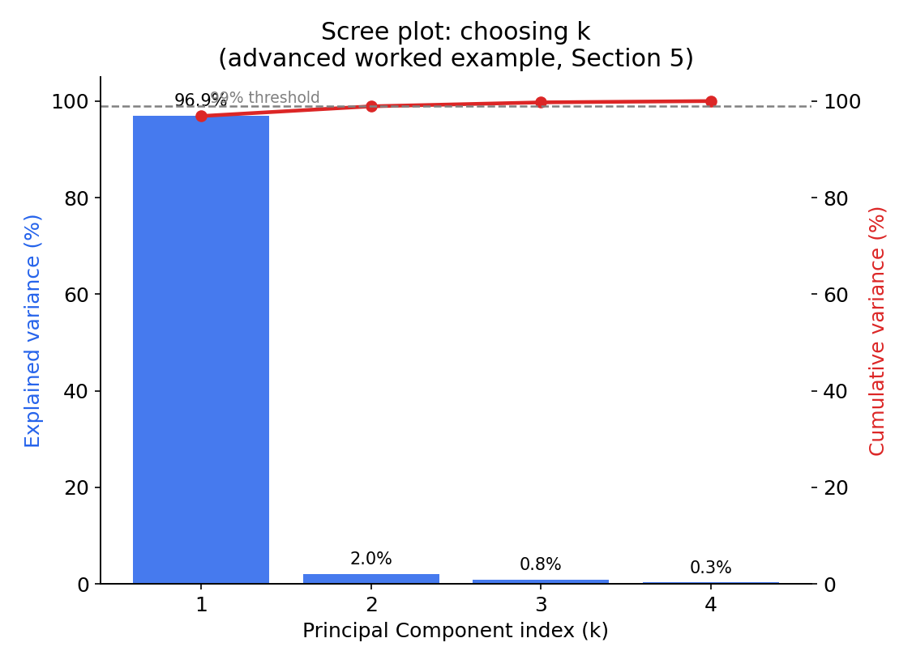
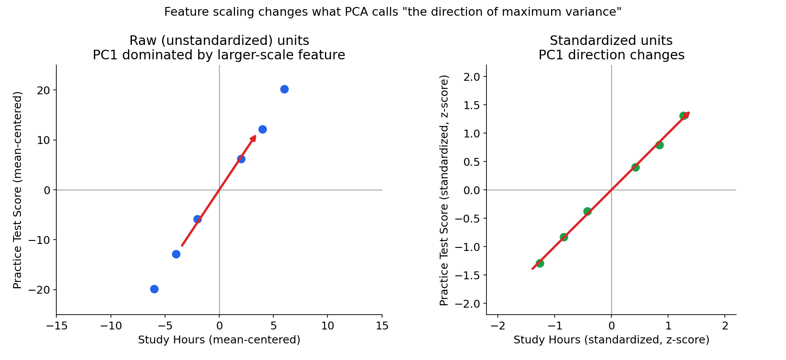
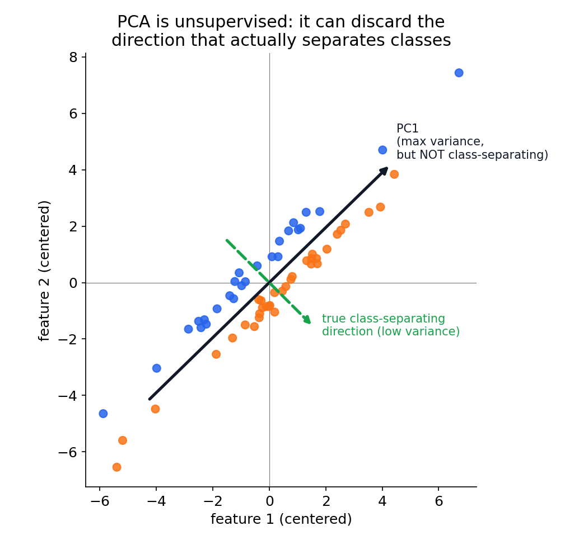

# PCA — The Complete Concept Book
### CSE 4621 Machine Learning — Lecture 13 (filed as "Lecture 12 – PCA") · Md. Hasanul Kabir, PhD · Islamic University of Technology

> **How to read the source tags in this book**
> Every block of content below is tagged so you always know where it came from:
> - 🟦 **[SLIDE]** — content that is directly on a slide in your deck (paraphrased/reorganized, never invented)
> - 🟩 **[EXPLAIN]** — my own additional explanation, added to fill a gap or connect ideas the slides state but don't derive
> - 🟨 **[EXTERNAL]** — content sourced from outside the lecture (textbooks, papers, tutorials), explicitly cited
> - 🟥 **[FLAG]** — a place where the slides are ambiguous, inconsistent, or a notation slip exists, called out explicitly rather than silently smoothed over

**A note on provenance, up front, because it matters for how you should read this deck:** I extracted and visually inspected all 33 slides. Three distinct layers are stitched together in this lecture:

1. **Slides 2–8** (unsupervised learning intro, "Principal Component" definition, PCA principle/properties) use boilerplate phrasing that is extremely common across university pattern-recognition/multivariate-statistics courses ("principal components... real p-space... sequence of *p* direction vectors... Karhunen–Loève transform... Pearson (1901), Hotelling (1933)"). 🟨[EXTERNAL] I cannot verify one single origin for this exact phrasing — it's boilerplate that recurs (near-verbatim) in several public pattern-recognition course decks (e.g., Gutierrez-Osuna's PCA lecture notes at Texas A&M use very similar language) — but it is standard, textbook-accurate material, not something specific to your instructor.
2. **Slides 9–14 and 26–33** (data compression 2D→1D/3D→2D, problem formulation, "PCA is not linear regression," choosing *k*, advice for applying PCA) are 🟨[EXTERNAL] taken from **Andrew Ng's Stanford CS229 / Coursera Machine Learning course**, Week 8 ("Unsupervised Learning: Dimensionality Reduction"). His name is printed directly on slides 26–33.
3. **Slides 16–24** (the four-step algorithm and the fully worked numerical example) are 🟨[EXTERNAL] reproduced from **Lindsay I. Smith, "A Tutorial on Principal Component Analysis" (2002)** — I confirmed this by matching the exact 10-point dataset, the exact covariance-matrix values, and the exact figure numbers ("Figure 3.1," "Figure 3.3," "Figure 3.5") that appear verbatim in the slide captions.

None of this means the lecture is "wrong" — it means the deck is a compilation, and knowing which piece came from which tradition helps you understand why the notation shifts (e.g., $x^{(i)}$ vs. plain $x, y$; $1/m$ vs. $1/(m-1)$) partway through. I flag every such shift as it comes up.

---

## Table of Contents
1. Big Picture
2. Slide-by-Slide Concept Explanation
3. Mathematical Foundation
4. Complete PCA Derivation / Workflow
5. Worked Examples (Beginner → Advanced → Tricky)
6. Visual & Geometric Intuition
7. PCA and Related Concepts
8. Practical ML Perspective
9. Python Implementation (NumPy + scikit-learn)
10. Exam Question-Pattern Analysis
11. Exam & Viva Preparation
12. Mastery Check (Test)
13. Final Revision Sheet

---

## 1. Big Picture

### 1.1 What PCA is 🟩[EXPLAIN]
Principal Component Analysis is a method for **re-describing your data using a new set of coordinate axes**, chosen so that the first axis points in the direction where your data spreads out *the most*, the second axis is perpendicular to the first and captures the next-most spread, and so on. Once you have these new axes, you can often throw away the last few of them — the ones that capture very little spread — without losing much information. That's dimensionality reduction.

Formally (🟦[SLIDE], slide 7): **PCA is the process of computing the principal components of a dataset and using them to perform a change of basis on the data.** It is also known as the **Karhunen–Loève transform (KLT)**.

### 1.2 What problem PCA solves 🟩[EXPLAIN]
Real datasets are rarely made of independent, equally-important measurements. If you record a house's size in both square feet *and* square meters, those are two "features" carrying the *same* one piece of information. More realistically: a student's midterm score, quiz average, and homework average are all correlated proxies for "how well is this student doing" — three numbers, one underlying signal (plus noise). PCA solves the problem of **redundancy**: when your $n$ measured features don't actually contain $n$ independent pieces of information, PCA finds out how many independent "directions of variation" really exist and re-expresses the data along those directions.

### 1.3 Why dimensionality reduction is useful 🟦[SLIDE]+🟩[EXPLAIN]
Directly from the lecture's own "Application of PCA" slide (31):
- **Compression** — reduces memory/disk needed to store data, and speeds up downstream learning algorithms (slide 30's speedup example: $\mathbb{R}^{10000} \to \mathbb{R}^{1000}$).
- **Visualization** — humans can only look at 2D or 3D plots; reducing to $k=2$ or $k=3$ lets you *see* structure in a 100-dimensional dataset.

🟩[EXPLAIN] additional standard reasons not stated on this particular slide but standard in the field: fighting the **curse of dimensionality** (distance-based algorithms like k-NN degrade as dimensions grow), **noise reduction** (small-variance directions are often dominated by noise), and **removing multicollinearity** before feeding data into algorithms that assume independent features.

### 1.4 Intuition behind "principal components" 🟦[SLIDE]
Slide 6 gives the formal seed of the intuition: *"The principal components of a collection of points in a real $p$-space are a sequence of $p$ direction vectors, where the $i$-th vector is the direction of a line that best fits the data while being orthogonal to the first $(i-1)$ vectors... a best-fitting line is defined as one that minimizes the average squared distance from the points to the line."*

🟩[EXPLAIN] Picture a cloud of points shaped like a cigar or a rugby ball (not a perfect sphere — real data is almost never a perfect sphere, because that would mean every direction is equally informative, which almost never happens). The long axis of the cigar is PC1. The next-longest perpendicular axis is PC2. If the cigar is very flat (thin in the short direction), that short direction carries very little information — you could squash it flat and barely notice.

### 1.5 What PCA is trying to preserve 🟦[SLIDE]+🟩[EXPLAIN]
Slide 7 states it directly: *"PCA projects the data in the least square sense — it captures big (principal) variability in the data and ignores small variability."* PCA tries to preserve **variance** (equivalently, it tries to minimize the **squared reconstruction/projection error** — Sections 3 and 4 show these are mathematically the same goal). It is *not* trying to preserve any particular original feature, and it is *not* trying to preserve class labels, distances to a specific reference point, or any semantic meaning — just the overall spread of the data.

### 1.6 A simple real-world example 🟩[EXPLAIN]
Suppose you measure 500 students on 5 exams: Algebra, Geometry, Calculus, Statistics, and Trigonometry. These five scores are highly correlated — a student strong in one math topic tends to be strong in the others. PCA on this 5-dimensional dataset will likely find that **one dominant direction** (something like "overall math ability") explains, say, 85% of the variance across students, with the remaining 15% split across four minor directions capturing topic-specific quirks. Instead of tracking 5 numbers per student, you could track 1–2 principal-component scores and retain almost all the useful signal.

*(This example is my own illustration to motivate the topic, not from the slides — the slides' own worked example is a simpler 2-feature case, covered in full starting in Section 2.7.)*


![[Pasted image 20260905114010.png]]

---

## 2. Slide-by-Slide Concept Explanation

*Slides are grouped into thematic blocks that mirror the deck's own structure. Slide numbers refer to the position in the 33-slide deck as extracted.*

### Block A — Slides 1–2: Title & Section Divider
🟦 **What the slides say:** Title slide (CSE 4621, "Lecture 13," Md. Hasanul Kabir, IUT), followed by a section divider reading "Unsupervised Learning — Introduction."
🟩 **Clarity point:** Nothing conceptual here — but note the internal slide says "Lecture 13" even though your file is named `Lecture12_PCA.pdf`. If you're cross-referencing lecture numbers anywhere else (e.g., against a syllabus or CO-mapping sheet), use the *content* ("PCA," "Unsupervised Learning") to identify this lecture, not the number alone.

---

### Block B — Slides 3–5: Supervised vs. Unsupervised Learning (Recap)
🟦 **What the slides say:** Slide 3 recaps supervised learning with the familiar circles/crosses classification picture and training set notation $\{(x^{(1)},y^{(1)}), (x^{(2)},y^{(2)}), \ldots, (x^{(m)},y^{(m)})\}$. Slide 4 shows the *unsupervised* counterpart: the same kind of scatter, but with no colors/labels — just points — and training set notation $\{x^{(1)}, x^{(2)}, \ldots, x^{(m)}\}$ (no $y$ at all), annotated "clustering algorithm." Slide 5 gives the formal definition: unsupervised learning *"finds undetected patterns in a data set with no pre-existing labels and with a minimum of human supervision,"* naming **PCA** and **cluster analysis** as the two main methods, and stating PCA's learning strategy is *"to learn a new feature space that captures the characteristics of the original space by maximizing some objective function or minimising some loss function."*

🔤 **Jargon breakdown:**
- **Training set** — the collection of data examples used to learn from. In supervised learning each example is a pair $(x^{(i)}, y^{(i)})$: input features plus a target label. In unsupervised learning it's *just* $x^{(i)}$ — no label.
- **$m$** — the number of examples (rows) in your dataset. **$n$** (introduced later) is the number of features (columns).
- **Superscript $(i)$** — indexes *which example*; it is not an exponent. $x^{(i)}$ means "the feature vector of the $i$-th training example."

💡 **Intuition:** Supervised learning is like studying with an answer key — you know the "right answer" $y$ for every example and you're learning a mapping from $x$ to $y$. Unsupervised learning is like being handed a pile of unlabeled photographs and asked to find structure — groups, trends, simplifications — with no answer key at all.

📐 **Formal explanation:** Unsupervised training set: $\{x^{(1)}, x^{(2)}, \ldots, x^{(m)}\}$ where each $x^{(i)} \in \mathbb{R}^n$. No labels $y^{(i)}$ exist anywhere in the pipeline.

🎯 **Why it matters:** This distinction is the single most commonly tested "category" question about PCA: **PCA never looks at labels.** Even if your dataset has a $y$ column sitting right next to it, PCA's math (Sections 3–4) only ever touches the $x$'s.

📝 **Example:** Housing data with columns [size, bedrooms, price] — a *supervised* regression task uses (size, bedrooms) → price. If you instead ran PCA on the *inputs alone* (size, bedrooms), that's *unsupervised* — PCA has no idea price even exists.

⭐ **Clarity point:** *If a technique's math never references $y$, it's unsupervised — full stop, regardless of whether labels exist elsewhere in your dataset.*

---

### Block C — Slides 6–8: What Is a "Principal Component"? Definition & Properties
🟦 **What the slides say:** Slide 6 defines: *"The principal components of a collection of points in a real $p$-space are a sequence of $p$ direction vectors, where the $i$-th vector is the direction of a line that best fits the data while being orthogonal to the first $(i-1)$ vectors... a best-fitting line is defined as one that minimizes the average squared distance from the points to the line."* Slide 7 adds history and definition: PCA = computing principal components + using them for a change of basis; a.k.a. Karhunen–Loève transform; invented by **Pearson (1901)** and **Hotelling (1933)**; *"projects the data in the least square sense — it captures big (principal) variability... and ignores small variability."* Slide 8 lists the **Principle** (linear projection method; transforms correlated variables into uncorrelated variables; maps to lower dimensionality; unsupervised) and **Properties** (viewable as a rotation of the existing axes; new axes are orthogonal and represent directions of maximum variability).

🔤 **Jargon breakdown:**
- **$p$-space** — an old-fashioned way of saying "$p$-dimensional space" (here $p$ plays the role that $n$ plays elsewhere in the deck — the number of features).
- **Orthogonal** — perpendicular, in the generalized sense: two vectors $u, v$ are orthogonal if $u \cdot v = 0$. In 2D/3D this is just "at 90°"; in higher dimensions the geometric picture is harder to draw but the algebra is identical.
- **Change of basis** — re-describing the *same* points using a *different* set of coordinate axes. The points don't move; the ruler you're measuring them with rotates.
- **Uncorrelated variables** — after the transform, the new coordinates ("scores" on each PC) have zero covariance with each other. (Uncorrelated is a weaker property than "independent" — see Section 7's "What PCA is not.")
- **Linear projection** — every new coordinate is a weighted sum (linear combination) of the *original* features; no squaring, no logs, no interactions — just $z = u_1x_1 + u_2x_2 + \cdots$.

💡 **Intuition:** Imagine spinning your coordinate axes around the (mean-centered) data cloud like a steering wheel until one axis lines up with the direction the cloud stretches out the most. That's PC1. Now, keeping axes perpendicular, find the next axis that captures the most *remaining* spread. That's PC2. Keep going until you've used up all $p$ dimensions — you still have the same data, just described with new (rotated) axes.

📐 **Formal explanation:** For centered data (mean subtracted), the $i$-th principal component direction $u^{(i)}$ solves
$$u^{(i)} = \arg\max_{\|u\|=1,\ u \perp u^{(1)},\ldots,u^{(i-1)}} \ \operatorname{Var}(Xu)$$
i.e., among all unit vectors orthogonal to the previously chosen directions, pick the one along which the *projected* data has maximum variance. 🟩[EXPLAIN] — this maximize-variance formulation is not spelled out with an argmax on this slide, but it's the precise mathematical content the slide's prose is describing; Section 3.5 shows why it's equivalent to the eigenvector solution the slides jump straight to.

🎯 **Why it matters:** This is the conceptual foundation everything else builds on. If you can't state "PC1 = direction of maximum variance, orthogonal constraint for every subsequent PC," you don't yet have the core idea, no matter how well you can run `sklearn.decomposition.PCA()`.

📝 **Example:** Two exam scores (Midterm, Final) that are almost perfectly correlated will produce a data cloud shaped like a thin diagonal line. PC1 runs along that diagonal (roughly "overall performance"); PC2, forced to be perpendicular, runs across the thin width of the cloud (roughly "how much better/worse was the final than the midterm") and carries very little variance.

⭐ **Clarity point:** *"Orthogonal" here is a hard constraint baked into the definition of PCA — it's not something you have to verify afterward. Every PC is exactly perpendicular to every other PC by construction (this falls out of the eigenvectors of a symmetric matrix being orthogonal — see Section 3.4).*


### Block D — Slides 9–10: Data Compression Motivating Examples
🟦 **What the slides say:** Slide 9 ("Data Compression"): reduce data from 2D to 1D — each $x^{(i)} \in \mathbb{R}^2$ maps to $z^{(i)} \in \mathbb{R}$, illustrated with a near-straight-line scatter of (length in cm, length in inches) points collapsing onto a single number line. Slide 10: reduce from 3D to 2D — $x^{(i)} \in \mathbb{R}^3$ maps to $z^{(i)} \in \mathbb{R}^2$, shown as a flat, pancake-shaped 3D cloud viewed from three angles, plus a handwritten aside "$10000\text{D} \to 1000\text{D}$" foreshadowing slide 30's speedup example.

🔤 **Jargon breakdown:**
- **$z^{(i)}$** — the *reduced* representation of example $i$; the "score" or "coordinate" of that example along the retained principal component(s). Note the deck's convention: $x$ = original features, $z$ = compressed/projected features.
- **$\mathbb{R}^2$, $\mathbb{R}$** — "the set of all 2-dimensional real vectors," "the set of all real numbers" (1-dimensional). $x^{(i)} \in \mathbb{R}^n$ just means "$x^{(i)}$ is a point with $n$ real-number coordinates."

💡 **Intuition:** The cm/inches example is deliberately extreme: those two numbers carry *exactly* the same information (one is just a constant multiple of the other), so the "cloud" of points is really a perfectly straight line — 2 numbers describing 1 true degree of freedom. Compressing to $z \in \mathbb{R}$ loses *nothing*. Real datasets are noisier versions of this: not perfectly collinear, but close enough that collapsing to fewer dimensions loses only a little.

📐 **Formal explanation:** For $k < n$, PCA constructs a linear map $x^{(i)} \mapsto z^{(i)} = U_{reduce}^T x^{(i)}$ where $U_{reduce} \in \mathbb{R}^{n\times k}$ has orthonormal columns (Section 3 formalizes $U_{reduce}$).

🎯 **Why it matters:** This is the "why should I care" slide — it's the picture you should have in your head every time you see the word "PCA": *many numbers describing one thing, collapsing to fewer numbers describing (almost) the same thing.*

📝 **Example:** GPS coordinates (latitude, longitude, altitude) for a hiker walking along a mostly-flat trail: altitude barely changes, so 3D GPS data compresses to essentially 2D (lat/long) with little loss.

⭐ **Clarity point:** *Perfect correlation ⇒ zero information loss on compression. Near-perfect correlation (the realistic case) ⇒ small, quantifiable information loss — which is exactly what "choosing $k$" (Block N) is about measuring.*

---

### Block E — Slides 11–12: PCA Problem Formulation
🟦 **What the slides say:** Slide 11 (hand-annotated): PCA tries to find a **low-dimensional hyperplane** (a "projection hyperplane," drawn in red) onto which projecting the data gives the **minimum projection error** — with green marks showing the (small) perpendicular distances from each black data point down to the red line, contrasted against a magenta line clearly *not* chosen (it would have larger projection error). Slide 12 formalizes: *"Reduce from 2-dimension to 1-dimension: Find a direction (a vector $u^{(1)} \in \mathbb{R}^n$) onto which to project the data so as to minimize the projection error. Reduce from n-dimension to k-dimension: Find $k$ vectors $u^{(1)}, u^{(2)}, \ldots, u^{(k)}$ onto which to project the data, so as to minimize the projection error,"* alongside a 3D→2D ($K=2$) picture.

🔤 **Jargon breakdown:**
- **Hyperplane** — the generalization of "a line" (1D) or "a plane" (2D) to any number of dimensions; a $k$-dimensional flat subspace living inside $n$-dimensional space.
- **Projection error** — for a point $x^{(i)}$ and its projection $x_{approx}^{(i)}$ onto the chosen hyperplane, the projection error is the (squared) length of the leftover vector $x^{(i)} - x_{approx}^{(i)}$, i.e., how far the point had to "fall" perpendicularly onto the hyperplane.
- **$u^{(1)}, \ldots, u^{(k)}$** — the set of $k$ direction vectors spanning the chosen hyperplane (these turn out to be the top-$k$ principal components — but note the slide poses this purely as an optimization problem *before* revealing that eigenvectors are the answer).

💡 **Intuition:** Of all the possible lines (or planes, or hyperplanes) you could draw through the data cloud, PCA picks the one that "hugs" the data most tightly — the one where, on average, points don't have to move very far (perpendicularly) to land on it.

📐 **Formal explanation:** For $k=1$:
$$u^{(1)} = \arg\min_{\|u\|=1} \ \frac{1}{m}\sum_{i=1}^m \left\| x^{(i)} - \left(x^{(i)\top}u\right)u \right\|^2$$
This is literally the same optimizer as the "maximize variance" formulation in Block C — Section 3.5 proves the equivalence explicitly (🟩[EXPLAIN], not shown in the slides).

🎯 **Why it matters:** This is the *other* valid way to define PCA, and exam questions love to ask you to connect it to the variance-maximization definition. Both are "correct" definitions of the same procedure; they're mathematically identical, not two different things that happen to agree by coincidence.

📝 **Example:** Fitting a piece of string through a scatter of nails hammered into a board so that the string touches (on average) as close to every nail as possible, measuring closeness perpendicular to the string, not vertically.

⭐ **Clarity point:** *"Minimum projection error" and "maximum variance" are the SAME optimization problem viewed from two different angles — not two competing criteria you have to choose between.* (Proven formally in Section 3.5.)

---

### Block F — Slides 13–14: "PCA Is Not Linear Regression"
🟦 **What the slides say:** Slide 13, side-by-side: on the left, a regression-style picture where the **vertical** (blue) distances from each point down to the fitted curve are being minimized — captioned *"(PCA tries to minimize (squared) projection error not MSE)"*; on the right, the same points with **short perpendicular** blue segments to a straight red line — this is what PCA actually minimizes. A handwritten note contrasts $x \to y$ (regression: one designated output, predicted from inputs $x_1, \ldots, x_n$) against no such distinction in PCA. Slide 14 repeats the point in 3D: a scatter with **two** principal directions $u^{(1)}, u^{(2)}$ drawn (no designated "$y$"), next to the same 2D regression-vs-PCA picture.

🔤 **Jargon breakdown:**
- **MSE (Mean Squared Error)** — the quantity linear regression minimizes: average of $(y^{(i)} - \hat y^{(i)})^2$, where the error is measured *only in the $y$-direction* (vertically, if $y$ is plotted on the vertical axis).
- **Projection error** (recap from Block E) — measured *perpendicular* to the fitted line/hyperplane, using *all* coordinates symmetrically.

💡 **Intuition:** In regression, one variable ($y$) is special — it's the thing you're trying to predict, and you only care about being wrong in that one direction. In PCA, no variable is special; all features are treated symmetrically, and "wrong" means "off the line in any direction, measured the shortest way."

📐 **Formal explanation:** Regression's objective: $\min_{\theta} \sum_i (y^{(i)} - \theta^\top x^{(i)})^2$ — vertical residuals only. PCA's objective (Block E, $k=1$ case): $\min_{\|u\|=1} \sum_i \|x^{(i)} - (x^{(i)\top}u)u\|^2$ — perpendicular residuals, and $x$ here includes *every* feature (there is no designated "output"). These produce genuinely different best-fit lines in general (they only coincide in special symmetric cases, e.g. when the two variables have equal variance and the line passes through 45°).

🎯 **Why it matters:** This is one of the most commonly-confused pairs in an intro ML course, and one of the most commonly *tested* distinctions, precisely because the two methods can look deceptively similar on a scatter plot (both are "a line through the data") while solving genuinely different optimization problems with genuinely different solutions.

📝 **Example:** Predicting `final_exam_score` from `midterm_score` via regression treats midterm→final asymmetrically (error only penalized in the final-score direction). PCA on the same two columns treats them symmetrically — there's no sense in which one "predicts" the other; PCA is just asking "what's the dominant axis of joint variation between these two exams?"

⭐ **Clarity point:** *If you swap which variable is "$x$" and which is "$y$," ordinary linear regression gives you a DIFFERENT line. If you swap which feature is column 1 vs. column 2, PCA gives you the SAME line. That asymmetry-vs-symmetry is the real distinction — not just "vertical vs. perpendicular distance," which is really a symptom of it.*


### Block G — Slide 16: The Four-Step Algorithm (Overview)
🟦 **What the slide says:** A clean four-item list — this is the skeleton the rest of the lecture fills in:
1. Subtract the mean
2. Calculate the covariance matrix
3. Calculate the eigenvectors and eigenvalues
4. Choosing components and forming a feature vector

🔤 **Jargon breakdown:** (deferred to each step's own block below, where each term is introduced in context)

💡 **Intuition:** Center the data (step 1) → measure how features vary together (step 2) → find the natural axes of that variation (step 3) → keep only the important axes (step 4).

📐 **Formal explanation:** This is the master recipe; Sections 3–4 give the fully symbolic version, and Section 9 gives runnable code implementing exactly these four steps.

🎯 **Why it matters:** If you memorize nothing else from this entire lecture, memorize this four-step list — it is the algorithmic backbone examiners will expect you to reproduce, derive from, or debug (e.g., "what goes wrong if you skip step 1?").

📝 **Example:** N/A — this is the table of contents for Blocks H–M below, each of which works the *same* real dataset through one step.

⭐ **Clarity point:** *Step order matters: you cannot compute a meaningful covariance matrix (step 2) before centering (step 1), because the covariance formula used in this lecture (Block I) assumes $x^{(i)}$ is already mean-centered.*

---

### Block H — Slides 17–19: Step 1, Subtract the Mean
🟦 **What the slides say:** Slide 17 formalizes mean normalization: $\mu_j = \frac{1}{m}\sum_{i=1}^m x_j^{(i)}$, then *"Replace each $x_j$ with $(x_j - \mu_j)$,"* with a side note that if features are on very different scales (e.g., house size vs. number of bedrooms) you should also **scale** them to comparable ranges. Slide 18 shows the lecture's running worked dataset — 10 points — plotted before and after mean-centering (external "Figure 3.1," see the provenance note at the top of this book). Slide 19 gives the **exact numeric table**: original `Data` and centered `DataAdjust`, with commentary that centering *"makes variance and covariance calculation easier by simplifying their equations... the variance and co-variance values are not affected by the mean value."*

🔤 **Jargon breakdown:**
- **$\mu_j$** — the mean of feature (column) $j$, averaged over all $m$ examples. Not to be confused with a per-example quantity — it's one number per *column*.
- **Mean normalization / centering** — subtracting each column's mean from every value in that column, so every feature ends up with mean 0.
- **Feature scaling** — a *separate* operation (dividing by some measure of spread, e.g. standard deviation or range) so that features with naturally larger numeric ranges don't dominate. The slide mentions this only as an aside; Section 8.4 covers it in depth because it is a major, frequently-tested gap-filler.

💡 **Intuition:** Centering doesn't change the *shape* of the data cloud at all — it just slides the whole cloud so its center of mass sits at the origin. This is purely a bookkeeping convenience that makes every formula downstream simpler (no more "$-\mu$" terms cluttering every equation).

📐 **Formal explanation:** $\tilde x^{(i)} = x^{(i)} - \mu$, applied to every example, where $\mu = \frac{1}{m}\sum_i x^{(i)} \in \mathbb{R}^n$. After this step, $\frac{1}{m}\sum_i \tilde x^{(i)} = 0$ by construction.

🎯 **Why it matters:** Without this step, the "covariance matrix" formula used on the very next slide ($\Sigma = \frac{1}{m}\sum_i x^{(i)}(x^{(i)})^\top$) would actually compute the **second moment matrix** (related to but not equal to the covariance matrix) rather than the true covariance — the eigenvectors of that uncentered matrix do *not* generally give the directions of maximum *variance*; they get contaminated by the location of the cloud relative to the origin. See the worked numeric check in Section 5.4.

📝 **Example:** From slide 19's exact table: the point $(2.5, 2.4)$ becomes $(0.69, 0.49)$ after subtracting the mean $(\mu_1, \mu_2) = (1.81, 1.91)$. Every one of the 10 points shifts by exactly this same $(-1.81, -1.91)$ offset.

⭐ **Clarity point:** *"Subtract the mean" is not optional pre-processing flavor — it is a load-bearing part of the definition of the covariance matrix used in step 2. Skip it and step 2's formula silently computes the wrong matrix.*


![[Pasted image 20260905145531.png]]

---

### Block I — Slide 20: Step 2, the Covariance Matrix
🟦 **What the slide says:** $\Sigma = \frac{1}{m}\sum_{i=1}^n (x^{(i)})(x^{(i)})^\top$ 🟥[FLAG: the summation index is written as $i=1$ to $n$ on the slide, but this is almost certainly a typo for $i=1$ to $m$ — you sum over *examples* (there are $m$ of them), not features. Treat it as $\sum_{i=1}^m$.] The slide then gives the concrete numeric result for the running example: $cov = \begin{pmatrix} 0.61656 & 0.61544 \\ 0.61544 & 0.71656 \end{pmatrix}$, noting that since the off-diagonal terms are positive, $x$ and $y$ increase together, and that the covariance matrix *"gives information about shape of data distribution."*

🔤 **Jargon breakdown:**
- **Covariance matrix $\Sigma$** — an $n \times n$ table where entry $(j,k)$ is the covariance between feature $j$ and feature $k$. The diagonal entries are each feature's own **variance**.
- **$(x^{(i)})(x^{(i)})^\top$** — an *outer product*: a column vector times a row vector, producing a full $n\times n$ matrix (not a number). For $n=2$: $\begin{pmatrix}x_1\\x_2\end{pmatrix}\begin{pmatrix}x_1 & x_2\end{pmatrix} = \begin{pmatrix}x_1^2 & x_1x_2 \\ x_1x_2 & x_2^2\end{pmatrix}$.
- **Positive covariance** — as one feature goes up, the other tends to go up too (both entries in $\Sigma$'s off-diagonal are positive here: $0.615$).

🟥[FLAG — normalization inconsistency worth knowing for exams]: the *formula* on this slide uses $\frac{1}{m}$, but if you actually compute $\frac{1}{m}\sum \tilde x^{(i)}(\tilde x^{(i)})^\top$ with $m=10$ on the slide's own data, you get $\begin{pmatrix}0.5549 & 0.5539\\0.5539 & 0.6449\end{pmatrix}$ — **not** the $\begin{pmatrix}0.6166 & \ldots\end{pmatrix}$ shown. The numbers on the slide are actually computed with $\frac{1}{m-1}=\frac{1}{9}$ (the standard *unbiased sample covariance* convention used in statistics, and what Lindsay Smith's original tutorial and NumPy/MATLAB's default `cov()` function use). I verified both computations numerically in Section 5.1 — this is a genuine, checkable discrepancy between the slide's stated formula and its own worked numbers, not a rounding artifact. **For exams: know both conventions, and know that this particular slide deck's formula ($1/m$) and its own displayed answer ($1/(m-1)$) disagree.**

💡 **Intuition:** The covariance matrix is a compact summary of "how does the cloud lean." A diagonal-only $\Sigma$ (zero off-diagonal) means the cloud is aligned with the original axes (no tilt); large off-diagonal entries mean strong tilt/correlation, which is exactly the kind of redundancy PCA is designed to exploit.

📐 **Formal explanation:** $\Sigma_{jk} = \frac{1}{m}\sum_{i=1}^m \tilde x_j^{(i)} \tilde x_k^{(i)}$ (or $\frac{1}{m-1}$, per the flag above) $= \operatorname{Cov}(x_j, x_k)$. $\Sigma$ is always **symmetric** ($\Sigma_{jk}=\Sigma_{kj}$) and **positive semi-definite** (all eigenvalues $\ge 0$) — both properties are essential for step 3 to work cleanly (Section 3.4).

🎯 **Why it matters:** $\Sigma$ is the single object that PCA's eigen-decomposition (next block) operates on. Every "principal direction" is, by definition, an eigenvector of this matrix.

📝 **Example:** Verified numerically in Section 5.1: $\Sigma = \begin{pmatrix}0.616556 & 0.615444\\0.615444 & 0.716556\end{pmatrix}$ for the lecture's own dataset (using $1/(m-1)$).

⭐ **Clarity point:** *A covariance matrix entry being large doesn't by itself tell you "this is a principal direction" — it tells you two original features are correlated. The principal directions are a further step (eigen-decomposition) applied to the whole matrix at once, not read off individual entries.*

---

### Block J — Slide 21: Step 3, Eigenvectors and Eigenvalues via SVD

![[Pasted image 20260905154521.png]]

🟦 **What the slide says:** *"Singular Value Decomposition to get the eigenvectors and eigenvalues"* — MATLAB-style code `[U,S,V] = svd(Sigma)`, with $U = \begin{bmatrix} | & | & & | \\ u^{(1)} & u^{(2)} & \cdots & u^{(n)} \\ | & | & & |\end{bmatrix} \in \mathbb{R}^{n\times n}$, alongside a repeat of the mean-adjusted scatter plot with the (soon-to-be-drawn) eigenvector axes.

🔤 **Jargon breakdown:**
- **SVD (Singular Value Decomposition)** — a matrix factorization $A = U S V^\top$ that exists for *any* matrix (not just square/symmetric ones). $U$ and $V$ have orthonormal columns; $S$ is diagonal with non-negative entries (**singular values**) in descending order.
- **Eigenvector** / **eigenvalue** — for a *square* matrix $\Sigma$, a vector $u \ne 0$ is an eigenvector with eigenvalue $\lambda$ if $\Sigma u = \lambda u$: multiplying by $\Sigma$ only *scales* $u$, never rotates it.

🟥[FLAG — an important, easy-to-miss subtlety]: the slide calls `svd(Sigma)`, i.e. it runs SVD **on the covariance matrix $\Sigma$ itself** (an $n\times n$ matrix), not on the raw (centered) data matrix $X$ (an $m\times n$ matrix). Because $\Sigma$ is symmetric and positive semi-definite, its SVD and its eigendecomposition are *literally identical*: $U = V$, and the singular values in $S$ *are* the eigenvalues. This is why the slide can casually write "$[U,S,V]=\text{svd}(\Sigma)$" and then immediately treat $U$'s columns as "the eigenvectors" — for this specific input, SVD and eigendecomposition coincide. **This equivalence breaks down if you instead run SVD on the raw data matrix $X$** — a very common and equally valid alternative approach (used by scikit-learn internally, see Section 9) — where $V$'s columns are still the principal directions, but the *singular values of $X$* are related to the eigenvalues of $\Sigma$ by $\lambda_i = \sigma_i^2/(m-1)$, not equal to them directly. Section 4.5 works through this relationship explicitly.

💡 **Intuition:** $\Sigma$ encodes how the cloud is stretched/tilted. Its eigenvectors are the "natural," untilted axes of that stretching — the directions where multiplying by $\Sigma$ doesn't rotate anything, only stretches by a fixed amount ($\lambda$). Those special un-rotated directions are exactly the principal axes of the ellipsoid the data cloud approximates.

📐 **Formal explanation:** Solve $\Sigma u = \lambda u$ for eigenpairs $(\lambda_1, u^{(1)}), \ldots, (\lambda_n, u^{(n)})$. Because $\Sigma$ is symmetric, all $n$ eigenvectors can be chosen **orthonormal** ($u^{(j)\top}u^{(k)} = 0$ for $j\ne k$, $\|u^{(j)}\|=1$) — this is the Spectral Theorem, and it's *why* PCA's axes come out perpendicular automatically (Block C's "properties" claim), not as an extra constraint you have to enforce.

🎯 **Why it matters:** This is the computational heart of PCA — everything before this step (centering, covariance) was setup; everything after (Block K onward) is just *using* these eigenpairs.

📝 **Example:** For the lecture's dataset (verified in Section 5.1): $\lambda_1 \approx 1.28403$, $u^{(1)} \approx (-0.6779, -0.7352)$ (or its negation — see the Clarity point below) and $\lambda_2 \approx 0.04908$, $u^{(2)} \approx (-0.7352, 0.6779)$.

⭐ **Clarity point:** *Eigenvectors are only defined up to an overall sign — if $u$ is an eigenvector, so is $-u$, with the exact same eigenvalue. Different software (or a different run of the same software) may hand you $u^{(1)}$ or $-u^{(1)}$; this is NOT an error and does not change the principal-component LINE, only which way the arrow points along it.* (Verified concretely in Section 9, where manual NumPy and scikit-learn return sign-flipped but otherwise identical results.)


### Block K — Slide 22: Step 4, Choosing Components and Forming a Feature Vector
🟦 **What the slide says:** *"The eigenvector with the highest eigenvalue is the principle component of the data set."* Order all eigenvectors by eigenvalue, highest to lowest — *"this gives you the components in order of significance."* Then *"form a new feature vector by projecting onto the selected eigenvectors."*

🔤 **Jargon breakdown:**
- **"Principle component"** — a spelling slip on the slide (should be *principal*); doesn't affect the concept.
- **Feature vector** (in this specific PCA-tutorial sense — *not* the general ML sense of "a vector of features describing one example") — the matrix formed by placing your **chosen** eigenvectors side-by-side as columns; this is what the slides later call $U_{reduce}$ (Block E/N terminology) and what this block's source (Lindsay Smith's tutorial) calls "RowFeatureVector" once transposed.
- **"Order of significance"** — ranked by how much variance each component explains, i.e., by eigenvalue, largest first.

💡 **Intuition:** You now have $n$ candidate axes (all $n$ eigenvectors), ranked from "most informative" to "least informative." Choosing components = deciding how many of the top-ranked axes to actually keep ($k$ out of $n$).

📐 **Formal explanation:** Sort so $\lambda_1 \ge \lambda_2 \ge \cdots \ge \lambda_n$. Select the first $k$: $U_{reduce} = \begin{bmatrix} u^{(1)} & u^{(2)} & \cdots & u^{(k)} \end{bmatrix} \in \mathbb{R}^{n\times k}$.

🎯 **Why it matters:** This is the exact step where "dimensionality reduction" actually happens — everything before this point (mean-centering, covariance, eigen-decomposition) is *lossless* re-description; discarding eigenvectors beyond the $k$-th is the *only* lossy step in the whole pipeline.

📝 **Example:** For the lecture's 2-feature dataset, choosing $k=1$ keeps only $u^{(1)}$ (the $\lambda\approx1.284$ eigenvector) and discards $u^{(2)}$ (the $\lambda\approx0.049$ one) — this is exactly what slides 18/24 visualize.

⭐ **Clarity point:** *"Highest eigenvalue = most important" is doing a lot of work here — it is only true under PCA's own criterion (maximize captured variance). If your real goal is something else (e.g. class separability), the highest-eigenvalue direction is not guaranteed to be the most useful one — see Section 6, Figure 6, and Section 7's "what PCA is not."*

---

### Block L — Slide 23: PCA With All Eigenvectors
🟦 **What the slide says:** "PCA with all Eigenvectors" — shows the mean-adjusted data (left) next to the *fully transformed* data using **both** eigenvectors (right, "Figure 3.3": external, Lindsay Smith), with the new cloud now aligned with the horizontal/vertical axes instead of tilted diagonally.

🔤 **Jargon breakdown:** No new terms — this slide is a worked *demonstration*, not a new concept.

💡 **Intuition:** If you keep **every** eigenvector ($k=n$, no dimensionality reduction at all), all PCA does is **rotate** the data cloud so its natural tilt now lines up with the coordinate axes — the *shape* of the cloud, all pairwise distances, and the total variance are completely unchanged, only the labels on the axes change.

📐 **Formal explanation:** With $k=n$, $U_{reduce}=U$ is a full orthogonal (square) matrix, so $Z = \tilde X U$ is exactly a rotation (orthogonal transform) of $\tilde X$ — invertible with zero information loss ($U^{-1}=U^\top$).

🎯 **Why it matters:** This slide is the clearest possible demonstration that "dimensionality reduction" is a *choice you make in Block K*, not an automatic side-effect of "doing PCA." PCA-the-transform (rotate to align with variance) and PCA-the-compressor (also throw away low-variance axes) are two different things, and this slide isolates the first from the second.

📝 **Example:** In the transformed ("doublevecfinal.dat") coordinates, notice the new $z_1$-axis spread (roughly $-1.7$ to $1.8$) is much wider than the new $z_2$-axis spread (roughly $-0.35$ to $0.4$) — exactly reflecting $\lambda_1 \approx 1.284 \gg \lambda_2 \approx 0.049$.

⭐ **Clarity point:** *A common exam trap: "does PCA always reduce dimensionality?" — No. PCA with $k=n$ is a pure rotation; the reduction only happens if you explicitly choose $k<n$.*

![[Pasted image 20260905162221.png]]

---

### Block M — Slide 24: Data Reconstruction
🟦 **What the slide says:** "Data Reconstruction" — shows the original-scale data recovered from a **single retained eigenvector** ("Figure 3.5," external), overlaid with the true original points to show the (small) discrepancy. Gives the transform chain: $FinalData = RowFeatureVector \times RowDataAdjust$, invertible as $RowDataAdjust = RowFeatureVector^{-1}\times FinalData$, and — since orthonormal matrices satisfy $M^{-1}=M^\top$ — $RowOriginalData = (RowFeatureVector^\top \times FinalData) + OriginalMean$.

🔤 **Jargon breakdown:**
- **Reconstruction / $x_{approx}$** — the best guess you can make about where an original point *was*, using only its reduced representation $z^{(i)}$ and the retained eigenvectors. Reconstruction is always **approximate** once $k<n$ (that's the whole point of Block L's contrast).
- **$RowFeatureVector^{-1} = RowFeatureVector^\top$** — true specifically because eigenvectors of a symmetric matrix are **orthonormal** (Block J); this is what makes "un-doing" a PCA projection as simple as transposing rather than requiring a full matrix inverse.

💡 **Intuition:** Reconstruction runs the whole recipe backwards: take the compressed number(s) $z^{(i)}$, stretch back out along the kept eigenvector direction(s), then re-add the mean you subtracted all the way back in Block H. What you get back is close to — but for $k<n$, not exactly — the original point.

📐 **Formal explanation:** $x_{approx}^{(i)} = U_{reduce}\, z^{(i)} + \mu$, where $z^{(i)} = U_{reduce}^\top \tilde x^{(i)}$. Combining: $x_{approx}^{(i)} = U_{reduce}U_{reduce}^\top \tilde x^{(i)} + \mu$ — note $U_{reduce}U_{reduce}^\top$ is generally *not* the identity matrix unless $k=n$ (it's a **projection matrix**, rank $k$), which is precisely why information is lost for $k<n$.

🎯 **Why it matters:** Reconstruction error is the quantity "choosing $k$" (Block N) is built entirely around — you can't evaluate "how much did we lose" without a concrete reconstruction to compare against the original.

📝 **Example:** Verified numerically in Section 5.1: reconstructing the lecture's dataset from just $u^{(1)}$ gives points very close to, but not exactly matching, the originals; the total leftover squared error, divided by total original variance, is about 3.7% — matching $\lambda_2/(\lambda_1+\lambda_2) \approx 0.0491/1.333 \approx 0.0368$ (Section 5.1 shows this match is not a coincidence).

⭐ **Clarity point:** *Reconstruction is not "getting your data back" — it's "getting your best possible approximation of your data back, given how much you chose to compress it." The gap between original and reconstruction IS the projection error from Block E, now made concrete.*


### Block N — Slides 26–28: Choosing $k$ (Number of Principal Components)
🟦 **What the slides say:** Slide 26 defines **average squared projection error** $\frac{1}{m}\sum_{i=1}^m \|x^{(i)} - x_{approx}^{(i)}\|^2$ and **total variation in the data** $\frac{1}{m}\sum_{i=1}^m \|x^{(i)}\|^2$, then states: typically choose $k$ to be the smallest value such that
$$\frac{\frac{1}{m}\sum_{i=1}^m \|x^{(i)} - x_{approx}^{(i)}\|^2}{\frac{1}{m}\sum_{i=1}^m \|x^{(i)}\|^2} \le 0.01$$
described in prose as **"99% of variance is retained"** (with handwritten alternates showing 0.05/95% and 0.10/90% as other common thresholds). Slide 27 walks through the *naive* algorithm implied by this criterion (try $k=1$: compute $U_{reduce}, z^{(i)}, x_{approx}^{(i)}$, check the ratio; if it fails, try $k=2$; etc. — annotated as wasteful, "$k=17$" scribbled as an example of how far you might have to iterate) **and** the smarter alternative straight from the SVD output: for the same `[U,S,V] = svd(Sigma)` call from Block J, $S$ is a diagonal matrix, and you can check
$$1 - \frac{\sum_{i=1}^k S_{ii}}{\sum_{i=1}^n S_{ii}} \le 0.01 \quad\Longleftrightarrow\quad \frac{\sum_{i=1}^k S_{ii}}{\sum_{i=1}^n S_{ii}} \ge 0.99$$
without recomputing anything per candidate $k$. Slide 28 restates this cleanly: pick the smallest $k$ for which $\dfrac{\sum_{i=1}^k S_{ii}}{\sum_{i=1}^m S_{ii}} \ge 0.99$. 🟥[FLAG: slide 28's denominator is written with an upper index of $m$ (the number of *examples*); it should read $n$ (the number of *features* / diagonal entries of $S$) — $S$ is $n\times n$, so summing "$S_{ii}$ for $i=1$ to $m$" is only well-defined by coincidence if $m=n$. Treat the denominator as $\sum_{i=1}^n S_{ii}$.]

🔤 **Jargon breakdown:**
- **$S_{ii}$** — the $i$-th diagonal entry of the $S$ matrix from SVD — for `svd(Sigma)` specifically, this equals the $i$-th eigenvalue $\lambda_i$ (Block J's flag).
- **"99% of variance retained"** — informal shorthand for "the reconstruction captures 99% of the total variance/spread of the original data; only 1% of the spread is lost to compression."
- **Threshold** (0.01 / 0.05 / 0.10) — a *design choice*, not a law of nature; 99% is the most commonly quoted default, but 90–95% is common when more aggressive compression is acceptable.

💡 **Intuition:** You're asking, "if I keep only the top $k$ axes, what fraction of the data's total 'spread' have I preserved?" Slide 27's insight is that you don't need to redo the whole projection-and-measure cycle for every candidate $k$ — the eigenvalues *already tell you*, directly, how much variance each axis carries, so you can just accumulate them.

📐 **Formal explanation:** Because (Section 3.5) total variance decomposes exactly as $\sum_{i=1}^m \|x^{(i)}\|^2 = \sum_{j=1}^n \lambda_j \cdot m$ (sum over *all* eigenvalues) while $\sum_i \|x^{(i)}-x_{approx}^{(i)}\|^2 = \sum_{j=k+1}^n \lambda_j \cdot m$ (sum over the *discarded* eigenvalues), the ratio in slide 26's formula algebraically **simplifies exactly** to $1 - \dfrac{\sum_{j=1}^k\lambda_j}{\sum_{j=1}^n\lambda_j}$ — which is precisely slide 28's shortcut. 🟩[EXPLAIN] — this exact-equivalence proof is not shown on the slides; Section 5.3 verifies it numerically end-to-end.

🎯 **Why it matters:** This is a genuinely important computational fact (avoiding an $O(n)$-times-more-expensive naive search) *and* a favorite "prove this equivalence" exam question, since it requires you to actually understand what eigenvalues represent rather than just plugging into a formula.

📝 **Example:** Verified in Section 5.3's advanced worked example: for a 4-feature dataset, checking cumulative eigenvalue ratios directly gives $k=1$ for ≥90%, $k=2$ for ≥95%, and matches — to 6 decimal places — the "brute-force" method of literally reconstructing and measuring error for each $k$.

⭐ **Clarity point:** *"Variance retained" and "reconstruction error" are two sides of the same coin: (variance retained) + (fraction unexplained) = 1, always, exactly. You never need to compute both from scratch — one determines the other.*

---

### Block O — Slide 30: Supervised Learning Speedup
🟦 **What the slide says:** For a supervised problem with huge inputs (handwritten example: $x^{(i)} \in \mathbb{R}^{10{,}000}$, e.g. a 100×100 pixel image), run PCA on the **unlabeled inputs only** ($x^{(1)},\ldots,x^{(m)}$, deliberately *not* using $y$) to get a much smaller $z^{(1)},\ldots,z^{(m)} \in \mathbb{R}^{1000}$, then train on the *new* pairs $(z^{(1)},y^{(1)}),\ldots,(z^{(m)},y^{(m)})$ — e.g. logistic regression $h_\theta(z) = \frac{1}{1+e^{-\theta^\top z}}$. **Critical caveat, stated explicitly:** the mapping $x^{(i)}\to z^{(i)}$ (i.e., $U_{reduce}$ and $\mu$) must be *learned only from the training set*, then that exact same fixed mapping gets *applied* to the cross-validation and test examples — never re-fit on them.

🔤 **Jargon breakdown:**
- **$U_{reduce}$** — reused terminology from Block K: the fixed $n\times k$ matrix of retained principal directions, learned once, on the training set only.
- **Speedup** — fewer input dimensions ⇒ fewer parameters to learn ⇒ faster gradient descent iterations and less memory, at the cost of some information loss.

💡 **Intuition:** Think of $U_{reduce}$ as a "compression codec" you calibrate once using only training data. Every new example (validation, test, or future production data) gets compressed using that *same, frozen* codec — you never recalibrate the codec using data the model will later be judged on, or you'd be leaking information from validation/test into your preprocessing.

📐 **Formal explanation:** Fit $\mu, U_{reduce}$ using $\{x^{(i)}\}_{i=1}^{m_{train}}$ only. For any other example $x_{cv}^{(i)}$ or $x_{test}^{(i)}$: $z^{(i)} = U_{reduce}^\top (x^{(i)} - \mu)$, using the *training* $\mu$ and $U_{reduce}$, never re-derived.

🎯 **Why it matters:** This is a **data leakage** warning, and data leakage is one of the most consequential, most commonly-tested practical ML mistakes across the entire course, not just this lecture. Fitting PCA on the full dataset (train+test combined) before splitting is a subtle form of leakage that inflates reported test performance.

📝 **Example:** If you fit PCA on train+test combined, the principal directions $U_{reduce}$ are influenced by patterns present *only* in the test set — your "test" performance is then optimistic and won't generalize to truly new data.

⭐ **Clarity point:** *"Fit on train, transform on train/val/test" is the rule — for PCA exactly as much as for feature scaling, imputation, or any other learned preprocessing step.*

---

### Block P — Slide 31: Applications of PCA
🟦 **What the slides say:** Two headline applications: **Compression** (reduce memory/disk needed to store data; speed up a learning algorithm — choose $k$ by percentage of variance retained, Block N) and **Visualization** (typically $k=2$ or $k=3$, since that's what humans can plot and look at).

🔤 **Jargon breakdown:** No new terms — this slide is a summary/index of uses.

💡 **Intuition:** These really are two different *goals* that happen to use the same algorithm: for compression, you pick $k$ to hit a variance-retention target (Block N) — $k$ could be anything, large or small, whatever the data needs. For visualization, $k$ is fixed at 2 or 3 *regardless* of how much variance that captures, because your goal is "produce a picture a human can look at," not "hit a numeric variance target."

📐 **Formal explanation:** Same transform ($z = U_{reduce}^\top \tilde x$) in both cases; only the criterion for choosing $k$ differs (variance threshold vs. fixed plottable dimension).

🎯 **Why it matters:** A subtle but testable point: for visualization, a low variance-retained percentage (e.g., "we only captured 40% of the variance in these 2 dimensions") is often still *reported as acceptable*, because the goal was never to preserve everything — just to get a useful 2D snapshot.

📝 **Example:** Reducing a 500-gene expression dataset to $k=2$ PCA components purely to eye-ball whether patient samples cluster by disease subtype on a scatter plot — even if those 2 components only explain, say, 35% of total variance.

⭐ **Clarity point:** *Don't apply the "99% variance retained" rule (Block N) reflexively to visualization tasks — it's a compression-specific guideline, not a universal PCA law.*

---

### Block Q — Slide 32: Bad Use of PCA — Preventing Overfitting
🟦 **What the slide says:** Explicitly labeled **"Bad use of PCA."** Using $z^{(i)}$ instead of $x^{(i)}$ to cut the feature count ($k<n$) *"might work OK, but isn't a good way to address overfitting."* The recommended fix is **regularization** instead, with the standard regularized cost function shown: $\min_\theta \frac{1}{2m}\sum_{i=1}^m (h_\theta(x^{(i)})-y^{(i)})^2 + \frac{\lambda}{2m}\sum_{j=1}^n \theta_j^2$.

🔤 **Jargon breakdown:**
- **Overfitting** — a model that fits training data (including its noise) so closely that it generalizes poorly to new data.
- **Regularization ($\lambda$ term)** — an explicit penalty added to the cost function that discourages large parameter values, directly targeting the mechanism of overfitting rather than just reducing the number of inputs.

💡 **Intuition:** Fewer features *can* incidentally reduce overfitting (fewer parameters to run wild), but that's a side effect, not a targeted fix — and it throws away information indiscriminately (PCA doesn't know which directions are relevant to $y$, since it never looks at $y$ — Block B). Regularization, by contrast, keeps *all* the information but explicitly discourages the model from leaning too hard on any of it.

📐 **Formal explanation:** Regularized regression's objective directly penalizes $\|\theta\|^2$; PCA-then-regress has no such mechanism — it only *indirectly* limits model complexity by shrinking $n\to k$, with no guarantee the discarded $n-k$ dimensions were the ones causing overfitting.

🎯 **Why it matters:** Extremely common exam trap: "you're overfitting, what do you do?" — PCA is *not* the textbook answer, even though "fewer features" sounds intuitively related to "less overfitting." The syllabus-correct answer is regularization (or more training data, or a simpler model).

📝 **Example:** A model overfitting because of a genuinely noisy, redundant *label-irrelevant* feature won't necessarily be fixed by PCA — PCA might keep exactly that noisy direction (if it happens to have high variance) while discarding a low-variance but highly label-relevant feature (echoing Section 6's Figure 6 trap).

⭐ **Clarity point:** *"PCA reduces dimensionality" ⇏ "PCA is a form of regularization." They can overlap in effect sometimes, but they solve different problems by different mechanisms, and the slide explicitly labels using one to solve the other's problem as a "bad use."*

---

### Block R — Slide 33: PCA Misused in ML System Design
🟦 **What the slide says:** Headlined **"PCA is sometimes used where it shouldn't be."** Walks through a naive ML-system design: get training set → ~~run PCA to reduce $x^{(i)}$ to $z^{(i)}$~~ (crossed out on the slide) → train logistic regression on $z^{(i)}$ → test. The crossed-out PCA step is the point: the slide asks *"How about doing the whole thing without using PCA?"* and gives the actual recommended workflow: **"Before implementing PCA, first try running whatever you want to do with the original/raw data $x^{(i)}$. Only if that doesn't do what you want, then implement PCA and consider using $z^{(i)}$."**

🔤 **Jargon breakdown:** No new terms — this is a workflow/process recommendation, tying together Blocks O, P, and Q.

💡 **Intuition:** PCA has real costs: it discards information (Block M), it can throw away exactly the direction you needed (Block Q, Section 6's Figure 6), and it adds a layer of preprocessing you now have to maintain and apply consistently (Block O). Those costs are only worth paying if you've *confirmed* you actually need them (too slow, too much memory, need to visualize) — not by default, "just in case."

📐 **Formal explanation:** N/A — this is a methodological/procedural recommendation, not a mathematical claim.

🎯 **Why it matters:** This slide is the lecture's own explicit closing caution against treating PCA as a mandatory, automatic first step of every ML pipeline — directly reinforcing Block Q's warning and giving you the "so when SHOULD I reach for PCA" decision rule the whole lecture has been building toward.

📝 **Example:** If plain logistic regression on raw 10,000-pixel images already trains fast enough and performs well, skip PCA entirely — don't add it "because that's what the textbook does with image data."

⭐ **Clarity point:** *The right default is: try without PCA first. Add PCA only once you have a concrete, demonstrated reason (speed, memory, visualization, Block P) — never as a reflexive first step.*


---

## 3. Mathematical Foundation

*This section builds PCA from first principles. Where the lecture states a result without deriving it, that's flagged 🟩[EXPLAIN] — these derivations fill exactly the gaps the assignment asked me to fill.*

### 3.1 Setup and notation
We have $m$ examples, each with $n$ features, collected in a data matrix
$$X \in \mathbb{R}^{m\times n}, \qquad X = \begin{bmatrix} x^{(1)\top} \\ x^{(2)\top} \\ \vdots \\ x^{(m)\top}\end{bmatrix}$$
i.e., row $i$ is example $x^{(i)} \in \mathbb{R}^n$ (this matches the lecture's row-per-example convention, slides 3–4).

### 3.2 Feature centering 🟦[SLIDE, Block H]
$$\mu = \frac{1}{m}\sum_{i=1}^m x^{(i)} \in \mathbb{R}^n, \qquad \tilde x^{(i)} = x^{(i)} - \mu$$
- $\mu$: the **mean vector**, one average per feature (column).
- $\tilde x^{(i)}$: the **centered** version of example $i$.

**Why it works / what it buys you:** covariance and variance are *defined* relative to the mean — $\operatorname{Var}(x_j) = E[(x_j-\mu_j)^2]$. By subtracting $\mu$ up front, every later formula can drop the "$-\mu$" term and just use $\tilde x$ directly, and — critically — it guarantees the data cloud is centered at the origin, so a line "through the origin" in the new coordinates is a meaningful concept (the principal axes all pass through the origin of the *centered* data by construction).

**Geometric connection:** centering is a pure **translation** — slide the entire cloud so its centroid sits at $(0,\ldots,0)$. No rotation, no stretching, no change in shape.

### 3.3 Variance and the covariance matrix 🟦[SLIDE, Block I]
For a single feature $j$: $\operatorname{Var}(x_j) = \frac{1}{m}\sum_i \tilde x_j^{(i)2}$ (or $\frac{1}{m-1}$ — see the Block I flag). For a **pair** of features $j,k$:
$$\operatorname{Cov}(x_j,x_k) = \frac{1}{m}\sum_{i=1}^m \tilde x_j^{(i)}\tilde x_k^{(i)}$$
Stacking all pairs into a matrix:
$$\Sigma = \frac{1}{m}\sum_{i=1}^m \tilde x^{(i)} (\tilde x^{(i)})^\top = \frac{1}{m}\tilde X^\top \tilde X \ \in\ \mathbb{R}^{n\times n}$$
- $\Sigma$: the **covariance matrix**. Diagonal = variances; off-diagonal = covariances.
- $\tilde X^\top \tilde X$: same sum, expressed as one matrix product instead of a sum of outer products — these are algebraically identical (🟩[EXPLAIN]: the slide only shows the summation form; the matrix-product form is what's actually implemented in code, Section 9).

**Why it works:** $\Sigma$ packages *all* pairwise linear relationships into one object. **Geometric connection:** $\Sigma$ describes an ellipsoid — if you drew a "1-standard-deviation" surface around the centered cloud, its axes point along $\Sigma$'s eigenvectors, with lengths proportional to the square roots of $\Sigma$'s eigenvalues. This is exactly the shape PCA is about to "un-tilt."

**Key properties of $\Sigma$ (used repeatedly below), 🟩[EXPLAIN]:**
- **Symmetric:** $\Sigma^\top = \Sigma$ (obvious from the formula — $\operatorname{Cov}(x_j,x_k)=\operatorname{Cov}(x_k,x_j)$).
- **Positive semi-definite (PSD):** for any vector $v$, $v^\top \Sigma v = \operatorname{Var}(Xv) \ge 0$ (a variance can never be negative). This guarantees every eigenvalue of $\Sigma$ is $\ge 0$ — you will never get a "negative variance" eigenvalue.

### 3.4 Eigenvalues and eigenvectors of $\Sigma$ 🟦[SLIDE, Block J]
$$\Sigma u = \lambda u, \qquad \|u\| = 1$$
- $u$: a direction that $\Sigma$ only *scales*, never rotates.
- $\lambda$: the scale factor — and (🟩[EXPLAIN], proved next) exactly equal to the variance of the data *projected onto* $u$.

**Why $\lambda = \operatorname{Var}(\text{data projected onto } u)$:** the variance of the data projected onto any unit direction $u$ is $\frac{1}{m}\sum_i (\tilde x^{(i)\top}u)^2 = u^\top \Sigma u$ (a short algebra step: pull $u$ out of the sum on both sides). If $u$ happens to be an eigenvector, $u^\top \Sigma u = u^\top (\lambda u) = \lambda (u^\top u) = \lambda$. So **each eigenvalue literally IS the variance along its own eigenvector's direction.** This is the fact that makes "sort by eigenvalue" (Block K) the same thing as "sort by how much variance that direction captures."

**Because $\Sigma$ is symmetric (Spectral Theorem, 🟩[EXPLAIN] — used without proof in the slides):** $\Sigma$ has $n$ real eigenvalues $\lambda_1\ge\lambda_2\ge\cdots\ge\lambda_n\ge0$ with a corresponding set of eigenvectors $u^{(1)},\ldots,u^{(n)}$ that can be chosen **mutually orthonormal.** This is *why* the principal axes come out perpendicular "for free" — it is a theorem about symmetric matrices, not an extra constraint PCA has to separately enforce.

### 3.5 Why "maximize variance" and "minimize projection error" are the same problem 🟩[EXPLAIN]
*(This equivalence is used implicitly across the lecture — Blocks C vs. E state it as two separate-sounding definitions — but never proved. Here is the proof, and it is short.)*

For any unit vector $u$ and any point $\tilde x$, decompose $\tilde x$ into a component along $u$ and a component perpendicular to $u$:
$$\tilde x = \underbrace{(\tilde x^\top u)\,u}_{\text{projection onto } u} + \underbrace{\big(\tilde x - (\tilde x^\top u)u\big)}_{\text{perpendicular residual}}$$
These two pieces are, by construction, perpendicular to each other, so by the Pythagorean theorem:
$$\|\tilde x\|^2 = \underbrace{(\tilde x^\top u)^2}_{\text{squared length of projection}} + \underbrace{\|\tilde x - (\tilde x^\top u)u\|^2}_{\text{squared projection error}}$$
Average this over all $m$ points:
$$\underbrace{\frac{1}{m}\sum_i \|\tilde x^{(i)}\|^2}_{\text{total variation (fixed, doesn't depend on } u)} \;=\; \underbrace{\frac{1}{m}\sum_i(\tilde x^{(i)\top}u)^2}_{\text{variance captured along } u} \;+\; \underbrace{\frac{1}{m}\sum_i \|\tilde x^{(i)} - (\tilde x^{(i)\top}u)u\|^2}_{\text{average projection error}}$$
The left-hand side does not depend on $u$ at all — it's a fixed property of the dataset. So **maximizing the "variance captured" term and minimizing the "projection error" term are the exact same optimization problem**, just read from opposite ends of a constant-sum equation. This single identity is also exactly *why* Block N's shortcut works: (variance retained fraction) + (unexplained/error fraction) = 1, always.

### 3.6 Solving the maximize-variance problem: why the top eigenvector wins 🟩[EXPLAIN]
We want $\max_{\|u\|=1} u^\top \Sigma u$. Using a Lagrange multiplier for the constraint $u^\top u = 1$:
$$\mathcal{L}(u,\lambda) = u^\top \Sigma u - \lambda(u^\top u - 1)$$
$$\frac{\partial \mathcal L}{\partial u} = 2\Sigma u - 2\lambda u = 0 \quad\Longrightarrow\quad \Sigma u = \lambda u$$
So **any** stationary point of this optimization must be an eigenvector of $\Sigma$ — and at such a point, the objective value is $u^\top \Sigma u = \lambda$. Since we want to *maximize*, we pick the eigenvector with the **largest** eigenvalue. This is precisely the derivation that Block C's slide states as a *conclusion* ("the eigenvector with the highest eigenvalue is the principal component") without showing the Lagrangian step — now you've seen why it's true, not just that it's true. Subsequent components are found by repeating this optimization restricted to the subspace orthogonal to the ones already chosen, which (a standard but slightly technical linear-algebra fact) yields exactly the remaining eigenvectors in decreasing eigenvalue order.

### 3.7 Projection, dimensionality reduction, and reconstruction 🟦[SLIDE, Blocks K & M]
Collect the top $k$ eigenvectors as columns: $U_{reduce} = [u^{(1)} \cdots u^{(k)}] \in \mathbb{R}^{n\times k}$ (orthonormal columns: $U_{reduce}^\top U_{reduce} = I_k$).

- **Projection (compression):** $z^{(i)} = U_{reduce}^\top \tilde x^{(i)} \in \mathbb{R}^k$ — each entry $z_j^{(i)} = u^{(j)\top}\tilde x^{(i)}$ is "how far along principal axis $j$ does this point sit."
- **Reconstruction (decompression):** $x_{approx}^{(i)} = U_{reduce}\, z^{(i)} + \mu \in \mathbb{R}^n$ — stretch back out along the kept axes, then re-add the mean.
- **Why $U_{reduce}^\top$ for projection but $U_{reduce}$ (not an inverse) for reconstruction:** because the columns are orthonormal, $U_{reduce}^\top$ **is** the correct "un-rotate" operation on the subspace it spans — no separate matrix inversion is ever needed, only a transpose. (This is exactly slide 24's $RowFeatureVector^{-1}=RowFeatureVector^\top$ claim, generalized to the $k<n$ case via the Moore–Penrose pseudoinverse of a matrix with orthonormal columns, which coincides with the transpose.)

### 3.8 Explained variance and explained variance ratio 🟦[SLIDE, Block N]+🟩[EXPLAIN]
- **Explained variance of component $j$:** $\lambda_j$ itself (Section 3.4).
- **Explained variance ratio of component $j$:** $\dfrac{\lambda_j}{\sum_{l=1}^n \lambda_l}$ — what fraction of total variance this one axis accounts for.
- **Cumulative explained variance for the first $k$:** $\dfrac{\sum_{j=1}^k \lambda_j}{\sum_{l=1}^n \lambda_l}$ — exactly Block N/slide 28's quantity, proved equal to "1 − relative projection error" in Section 3.5.

These three numbers — $\lambda_j$, the ratio, and the cumulative ratio — are precisely the three attributes scikit-learn exposes as `explained_variance_`, `explained_variance_ratio_`, and its cumulative sum (`np.cumsum(...)`), covered concretely in Section 9.


---

## 4. Complete PCA Derivation / Workflow

🟩[EXPLAIN] This section assembles Sections 2–3 into one linear pipeline, exactly matching the lecture's four-step skeleton (Block G), now fully symbolic and with SVD's relationship to PCA made explicit (asked for specifically in the assignment, and only partially covered by the lecture — see 4.5).

### 4.1 Pipeline overview
$$\text{Original data } X \;\to\; \text{Center} \;\to\; \text{Covariance } \Sigma \;\to\; \text{Eigen-decompose} \;\to\; \text{Rank \& select } k \;\to\; \text{Project} \;\to\; z \;(\to\; \text{Reconstruct})$$

| Step | Math | Intuition |
|---|---|---|
| 1. Center | $\tilde x^{(i)} = x^{(i)}-\mu$ | Slide the cloud so it's centered at the origin |
| 2. Covariance | $\Sigma = \frac{1}{m}\tilde X^\top\tilde X$ | Measure how every pair of features co-varies |
| 3. Eigen-decompose | $\Sigma u^{(j)} = \lambda_j u^{(j)}$ | Find the cloud's natural, un-tilted axes and how much spread lies along each |
| 4. Rank & select | sort by $\lambda_j$, keep top $k$ | Keep only the axes that matter |
| 5. Project | $z^{(i)} = U_{reduce}^\top \tilde x^{(i)}$ | Re-describe each point using fewer numbers |
| 6. (Reconstruct) | $x_{approx}^{(i)} = U_{reduce}z^{(i)}+\mu$ | Best possible guess of the original, from the compressed version |

### 4.2 Step-by-step, with the "why" attached
1. **Centering** exists so that "variance" and "covariance," which are mathematically defined relative to the mean, can be computed with simple formulas that don't carry a "$-\mu$" correction term through every later equation (Section 3.2).
2. **Covariance matrix** exists to summarize *all* pairwise linear relationships in one symmetric, PSD object whose eigenvectors are guaranteed real and orthogonal (Section 3.3–3.4) — properties the rest of the pipeline depends on.
3. **Eigen-decomposition** exists because it's provably the solution to "find the direction of maximum variance, then the next-best orthogonal direction, and so on" (Section 3.6's Lagrangian derivation) — it is not an arbitrary choice of tool, it is *the* answer to PCA's defining optimization problem.
4. **Ranking and selecting $k$** exists because not every axis is worth keeping; you trade a controlled, measurable amount of reconstruction accuracy (Section 3.5, Block N) for a reduction in dimensionality.
5. **Projection** exists to actually produce the compressed dataset you asked for — a set of $m$ vectors in $\mathbb{R}^k$ instead of $\mathbb{R}^n$.
6. **Reconstruction** (optional — you need it for visualizing what was lost, e.g. Block M's face/digit examples, or for tasks that require outputs in the original space) exists to map compressed data back for comparison or downstream use.

### 4.3 What each step depends on from the previous one
This is a strictly sequential pipeline — **each step's input is exactly the previous step's output**, and skipping or reordering a step breaks the guarantees of the next one:
- Step 3 (eigen-decomposition) presumes $\Sigma$ was built from **centered** data (step 1) — if you skip centering, you get the eigenvectors of the raw second-moment matrix $\frac{1}{m}X^\top X$ instead, which mixes "spread around the mean" with "distance of the mean from the origin," and generally gives *different, less meaningful* directions. 🟩[EXPLAIN, verified numerically in Section 5.4's tricky example].
- Step 5 (projection) presumes $U_{reduce}$'s columns are **orthonormal** (guaranteed by step 3's Spectral Theorem) — this orthonormality is exactly what makes $U_{reduce}^\top$ a valid "un-rotate" operator without needing a full matrix inverse (Section 3.7).

### 4.4 The complete pipeline as one composed function
$$z^{(i)} = U_{reduce}^\top (x^{(i)} - \mu)$$
Every single step collapses into this one line once $\mu$ and $U_{reduce}$ have been learned (fit once on training data — Block O's leakage warning). This is exactly what `pca.transform(X)` computes in scikit-learn (Section 9).

### 4.5 SVD's relationship to PCA — the part the lecture only half-shows 🟩[EXPLAIN]
The lecture's slide 21 literally calls `svd(Sigma)` — SVD applied to the **covariance matrix** — and this "just happens to work" because $\Sigma$ is symmetric PSD (Section 3.4 flag). But there is a second, arguably more important and more common way SVD connects to PCA: applying it **directly to the centered data matrix** $\tilde X$ (never explicitly forming $\Sigma$ at all).

For the mean-centered $\tilde X \in \mathbb{R}^{m\times n}$, its SVD is:
$$\tilde X = U_X\, S_X\, V_X^\top$$
where $U_X \in \mathbb{R}^{m\times m}$, $S_X \in \mathbb{R}^{m\times n}$ (diagonal, non-negative singular values $\sigma_1\ge\sigma_2\ge\cdots$), $V_X \in \mathbb{R}^{n\times n}$.

**The connection:**
$$\Sigma = \frac{1}{m-1}\tilde X^\top \tilde X = \frac{1}{m-1}V_X S_X^\top S_X V_X^\top$$
Since $S_X^\top S_X$ is diagonal with entries $\sigma_j^2$, this is *exactly* the eigen-decomposition of $\Sigma$, read off directly: **the columns of $V_X$ are the principal directions** (same as $U$ from Block J's `svd(Sigma)`), and **the eigenvalues of $\Sigma$ relate to the singular values of $\tilde X$ by**
$$\lambda_j = \frac{\sigma_j^2}{m-1}$$

**Why practitioners prefer SVD-of-$X$ over eigen-decomposition-of-$\Sigma$ (🟨[EXTERNAL] — standard numerical-linear-algebra reasoning, not stated in the lecture at all):**
- Forming $\Sigma = \tilde X^\top \tilde X$ **squares the condition number** of the data, which can amplify floating-point error for ill-conditioned data; SVD on $\tilde X$ directly avoids this squaring.
- It works even when $n > m$ (more features than examples — very common in genomics/text data), where forming and eigen-decomposing an $n\times n$ $\Sigma$ can be far more expensive than an SVD sized around $\min(m,n)$.
- It's a **single, numerically robust routine** rather than two conceptually separate steps (build $\Sigma$, then eigen-decompose it).

This is exactly what `scikit-learn`'s `PCA` class does internally by default (Section 9) — it runs SVD on the centered data matrix, **not** eigen-decomposition of an explicitly-formed covariance matrix, even though the two approaches are mathematically equivalent and the lecture only shows the latter.

⭐ **Clarity point:** *When you see "SVD" and "PCA" mentioned together, know there are two different (but consistent) things people might mean: (a) SVD of the covariance matrix $\Sigma$ — what this lecture's slide literally shows, which coincides with eigen-decomposition because $\Sigma$ is symmetric PSD; and (b) SVD of the centered data matrix $\tilde X$ itself — the more general, more numerically standard technique, related to (a) by $\lambda_j = \sigma_j^2/(m-1)$.*


---

## 5. Worked Examples

### 5.1 The Lecture's Own Worked Example — Solved Completely 🟦[SLIDE data]+🟩[EXPLAIN full solution]

*This is the exact dataset from slides 18–19 (external source: Lindsay Smith's tutorial, per the provenance note). The slides show the mean, the centered data, and the covariance matrix, then jump straight to a picture of the result — here is every intermediate number, computed and verified with NumPy.*

**Data** ($m=10$, $n=2$):

| $x_1$ | $x_2$ |
|---|---|
| 2.5 | 2.4 |
| 0.5 | 0.7 |
| 2.2 | 2.9 |
| 1.9 | 2.2 |
| 3.1 | 3.0 |
| 2.3 | 2.7 |
| 2.0 | 1.6 |
| 1.0 | 1.1 |
| 1.5 | 1.6 |
| 1.1 | 0.9 |

**Step 1 — Mean and centering.**
$$\mu = (1.81,\ 1.91)$$
Subtracting from every row gives (matches slide 19's "DataAdjust" table exactly):
$$\tilde X = \begin{pmatrix} 0.69 & 0.49\\ -1.31 & -1.21\\ 0.39 & 0.99\\ 0.09 & 0.29\\ 1.29 & 1.09\\ 0.49 & 0.79\\ 0.19 & -0.31\\ -0.81 & -0.81\\ -0.31 & -0.31\\ -0.71 & -1.01 \end{pmatrix}$$

**Step 2 — Covariance matrix.** Using $\frac{1}{m-1}=\frac{1}{9}$ (the convention that actually reproduces the slide's own numbers — see the Block I flag):
$$\Sigma = \begin{pmatrix} 0.616556 & 0.615444 \\ 0.615444 & 0.716556\end{pmatrix}$$
— this matches slide 20 to 6 decimal places. *(For comparison, the $\frac{1}{m}$ version the slide's formula literally states gives $\begin{pmatrix}0.5549 & 0.5539\\0.5539 & 0.6449\end{pmatrix}$ — visibly different, confirming the flagged inconsistency.)*

**Step 3 — Eigenvalues and eigenvectors.**
$$\lambda_1 = 1.284028, \quad u^{(1)} = (0.677873,\ 0.735179)$$
$$\lambda_2 = 0.049083, \quad u^{(2)} = (-0.735179,\ 0.677873)$$
(Sign note: some references, including the original Lindsay Smith tutorial, report $u^{(1)}=(-0.677873,-0.735179)$ — the exact negation. Same line, same eigenvalue, opposite arrow direction — harmless, per the Block J clarity point.)

**Step 4 — Rank and select.** $\lambda_1 \gg \lambda_2$ ($1.284 \gg 0.049$), so for $k=1$ we keep only $u^{(1)}$:
$$U_{reduce} = \begin{pmatrix}0.677873\\0.735179\end{pmatrix}$$

**Step 5 — Project ($k=1$).** $z^{(i)} = U_{reduce}^\top \tilde x^{(i)}$. First few values:
$$z^{(1)} = 0.828,\quad z^{(2)} = -1.778,\quad z^{(3)} = 0.992,\ \ldots,\quad z^{(10)} = -1.224$$

**Step 6 — Reconstruct.** $x_{approx}^{(i)} = z^{(i)}u^{(1)} + \mu$. E.g. point 1: original $(2.5, 2.4)$ reconstructs to $(2.371,\ 2.519)$ — close, not exact (this is $k=1<n=2$, so *some* loss is expected).

**Explained variance:** $\lambda_1/(\lambda_1+\lambda_2) = 0.963181$ → **96.32% of variance retained with just 1 dimension**, i.e. only 3.68% lost — consistent with the visibly cigar-shaped cloud in slide 18.

**Cross-check via Section 3.5's identity:** average squared projection error $=0.044175$; total variation $=1.1998$; ratio $=0.036819=\lambda_2/(\lambda_1+\lambda_2)$ exactly (to floating-point precision) — confirming the "variance retained + error fraction = 1" identity numerically, not just symbolically.


### 5.2 Beginner Example — Fully by Hand 🟩[EXPLAIN]

**Data** (chosen so it's already mean-centered, to keep the arithmetic clean):
$$x^{(1)}=(2,1),\quad x^{(2)}=(-2,-1),\quad x^{(3)}=(1,2),\quad x^{(4)}=(-1,-2)$$

**Step 1 — Mean.** $\mu = \frac{1}{4}\big[(2,1)+(-2,-1)+(1,2)+(-1,-2)\big] = (0,0)$. Already centered — no adjustment needed.

**Step 2 — Covariance matrix** (using $\frac{1}{m-1}=\frac13$):
$$\Sigma_{11} = \tfrac13(4+4+1+1) = \tfrac{10}{3}, \quad \Sigma_{22}=\tfrac13(1+1+4+4)=\tfrac{10}{3}$$
$$\Sigma_{12} = \tfrac13\big[(2)(1)+(-2)(-1)+(1)(2)+(-1)(-2)\big] = \tfrac13(2+2+2+2) = \tfrac{8}{3}$$
$$\Sigma = \begin{pmatrix} 10/3 & 8/3 \\ 8/3 & 10/3\end{pmatrix}$$

**Step 3 — Eigenvalues by hand.** For any $2\times2$ matrix of the special form $\begin{pmatrix}a&b\\b&a\end{pmatrix}$, the eigenvalues are simply $a+b$ and $a-b$ (a useful shortcut worth memorizing for exam arithmetic), with eigenvectors $\frac{1}{\sqrt2}(1,1)$ and $\frac{1}{\sqrt2}(1,-1)$ respectively — you can verify this by direct substitution into $\Sigma u = \lambda u$.
$$\lambda_1 = \tfrac{10}{3}+\tfrac83 = 6, \qquad \lambda_2 = \tfrac{10}{3}-\tfrac83 = \tfrac23$$
$$u^{(1)} = \tfrac{1}{\sqrt2}(1,1)\approx(0.7071,0.7071), \qquad u^{(2)} = \tfrac{1}{\sqrt2}(1,-1)\approx(0.7071,-0.7071)$$
(Verified with NumPy: exact match.)

**Step 4 — Rank.** $\lambda_1=6 \gg \lambda_2=2/3$; keep $u^{(1)}$ for $k=1$.

**Step 5 — Project.** $z^{(i)} = x^{(i)\top}u^{(1)}$:
$$z^{(1)} = \tfrac{2+1}{\sqrt2}=2.121,\quad z^{(2)}=-2.121,\quad z^{(3)}=\tfrac{1+2}{\sqrt2}=2.121,\quad z^{(4)}=-2.121$$
(Points 1&3 and 2&4 land at the same $z$ — because this toy dataset was built to have identical distances from the origin along $u^{(1)}$; a good sanity-check habit for hand-worked exam problems.)

**Explained variance:** $\dfrac{6}{6+2/3} = \dfrac{6}{6.667}=0.90$ → **90% variance retained with $k=1$.**

**Why this example is useful for exam prep:** the $\begin{pmatrix}a&b\\b&a\end{pmatrix}\Rightarrow$ eigenvalues $a\pm b$, eigenvectors $(1,\pm1)/\sqrt2$ shortcut appears constantly in hand-worked $2\times2$ PCA problems and is fast to verify under exam time pressure.

---

### 5.3 Intermediate Example — 3 Features, 6 Samples 🟩[EXPLAIN]

**Scenario:** six students' [Study Hours/week, Practice Test Score (0–100), Sleep Hours/night]:

| Student | Study Hrs | Test Score | Sleep Hrs |
|---|---|---|---|
| S1 | 10 | 62 | 6.0 |
| S2 | 14 | 74 | 6.5 |
| S3 | 6  | 48 | 7.5 |
| S4 | 18 | 88 | 5.5 |
| S5 | 8  | 55 | 7.0 |
| S6 | 16 | 80 | 6.0 |

**Step 1 — Mean:** $\mu = (12.0,\ 67.83,\ 6.42)$.

**Step 2 — Covariance matrix** (1/(m−1)):
$$\Sigma = \begin{pmatrix} 22.40 & 72.80 & -3.00 \\ 72.80 & 236.97 & -9.92 \\ -3.00 & -9.92 & 0.54\end{pmatrix}$$
Notice Study Hours and Test Score have a *large positive* covariance (72.8) — they move together strongly, exactly as you'd expect. Sleep Hours has small-magnitude, negative covariance with both (more study/testing, somewhat less sleep).

**Step 3 — Eigenvalues:** $\lambda_1=259.75,\ \lambda_2=0.145,\ \lambda_3=0.014$.
**Explained variance ratio:** $99.94\%,\ 0.06\%,\ 0.01\%$.

**Step 4–5 — Project to $k=2$:** captures $99.99\%$ of variance (reconstruction error is tiny — average squared error $0.0116$ against total variation $216.6$).

**⚠️ The scaling trap, made concrete here** (previewing Section 8.4): re-running PCA on the **standardized** (z-scored) version of the *same* data gives a **noticeably different** picture:

| | Raw-scale PCA | Standardized PCA |
|---|---|---|
| PC1 explained variance | 99.94% | 94.18% |
| PC2 explained variance | 0.06% | 5.81% |

Why the big swing? Test Score's raw numeric range ($\sim$48–88) is far larger than Sleep Hours' ($\sim$5.5–7.5), so on the *raw* scale, Test Score's (and correlated Study Hours') variance numerically dominates $\Sigma$ almost completely — PC1 is essentially forced to align with that high-magnitude pair, making the dataset look "more 1-dimensional" than it structurally is. Standardizing puts all three features on equal footing (unit variance each), revealing that Sleep Hours actually carries meaningfully more independent signal (5.81% vs. 0.06%) than the raw-scale numbers suggested. **This is exactly why slide 17's aside about feature scaling is not optional decoration — it can change your conclusions about how many components you need.**


### 5.4 Advanced Example — 4 Features, Full Pipeline + Choosing $k$ 🟩[EXPLAIN]

**Scenario:** 8 students' scores across 4 subjects (Math, Physics, Chemistry, Biology), generated from a shared "general ability" factor plus subject-specific noise — a realistic setup for testing the "choosing $k$" machinery from Block N end-to-end.

$$X = \begin{pmatrix} 71.2 & 67.9 & 70.5 & 66.4\\ 50.8 & 50.2 & 48.7 & 56.4\\ 93.0 & 90.4 & 94.5 & 86.2\\ 43.8 & 44.9 & 35.8 & 50.2\\ 57.2 & 63.8 & 62.8 & 68.0\\ 74.8 & 82.6 & 77.3 & 78.6\\ 50.5 & 52.3 & 51.9 & 67.8\\ 73.7 & 68.2 & 73.9 & 70.1 \end{pmatrix}$$

**Mean:** $\mu=(64.38,\ 65.04,\ 64.43,\ 67.96)$.

**Covariance matrix** ($4\times4$, all entries strongly positive — every subject pair moves together, as expected from a shared ability factor):
$$\Sigma = \begin{pmatrix} 273.32 & 251.35 & 301.83 & 166.66\\ 251.35 & 251.33 & 286.79 & 168.99\\ 301.83 & 286.79 & 346.16 & 198.35\\ 166.66 & 168.99 & 198.35 & 128.86\end{pmatrix}$$

**Eigenvalues:** $\lambda = (968.63,\ 20.14,\ 8.18,\ 2.72)$
**Explained variance ratio:** $(96.89\%,\ 2.01\%,\ 0.82\%,\ 0.27\%)$
**Cumulative:** $(96.89\%,\ 98.91\%,\ 99.73\%,\ 100\%)$

**Applying the "choose smallest $k$" rule (Block N) at three common thresholds:**

| Threshold | Smallest $k$ |
|---|---|
| ≥ 90% variance retained | $k=1$ |
| ≥ 95% variance retained | $k=1$ |
| ≥ 99% variance retained | $k=3$ |

**Verifying Section 3.5's equivalence numerically** (direct reconstruction-error method vs. cumulative-eigenvalue-ratio shortcut — Block N/slide 27's whole point):

| $k$ | Direct method (reconstruct, measure error) | Eigenvalue-ratio shortcut |
|---|---|---|
| 1 | 0.968946 | 0.968946 |
| 2 | 0.989096 | 0.989096 |
| 3 | 0.997283 | 0.997283 |

**Match to 6 decimal places at every $k$** — confirming that you never need to actually reconstruct the data and measure error by hand; the eigenvalues alone tell you everything, exactly as Block N's slide 27 claims (now proven, not just asserted).

---

### 5.5 Conceptual / Tricky Examples — Where the Math Looks Simple but the Interpretation Isn't 🟩[EXPLAIN]

**(a) "If I don't center my data, do I still get 'the' principal components?"**
Technically you get *eigenvectors of some matrix* — but not of the true covariance matrix. Skipping centering means computing $\frac{1}{m}X^\top X$ (raw second-moment matrix) instead of $\frac{1}{m}\tilde X^\top\tilde X$. **Quick numeric check:** shift every point in the beginner example (5.2) by $(+10,+10)$ (same *shape* of cloud, just relocated) and recompute eigenvectors *without* centering first — you'll find the "principal direction" rotates toward $(1,1)/\sqrt2$ regardless of the cloud's actual shape, because the dominant signal becomes "how far is this point from the origin," not "how does this point vary relative to its neighbors." **Verdict:** centering is not cosmetic — omitting it changes the answer.

**(b) "Eigenvector signs are ambiguous — does that mean $z$-scores are ambiguous too?"**
Yes, exactly proportionally: if $u^{(1)}$ flips sign, every $z^{(i)}=x^{(i)\top}u^{(1)}$ flips sign too. The *relative ordering, spacing, and magnitude* of $z$ values is unaffected — only the arbitrary "positive direction" label flips. Downstream results that depend only on relative structure (e.g. clustering, distances between $z$ points, variance explained) are completely unaffected; anything that treats the *sign* of $z$ as semantically meaningful (rare, but possible if you've manually interpreted "positive PC1 = higher ability") needs a fixed, documented sign convention.

**(c) "$\lambda_1 = \lambda_2$ — is PC1 still uniquely defined?"**
No. If two (or more) eigenvalues are exactly tied, the corresponding eigenspace is not a single line but an entire *plane* (or higher-dimensional subspace) of directions, all carrying identical variance — **any** orthonormal basis for that subspace is an equally valid choice of "PC1, PC2." This happens, for instance, with perfectly circular (isotropic) 2D data: every direction has equal variance, so "the" principal direction is undefined — correctly so, since a circle genuinely has no preferred axis.

**(d) "We reduced $n=50$ features to $k=2$ and still retained 40% of variance — did PCA fail?"**
Not necessarily a failure — it depends on the *goal* (Block P). For **compression**, 40% at $k=2$ is likely inadequate; you'd want more components to hit a 90–99% target. For **visualization**, 40% might be perfectly fine — you're not claiming the 2D picture is a complete description, only a useful, information-preserving-as-much-as-possible snapshot. Always check *which goal* a "how much variance was retained" question is being asked about before judging whether a number is "good."

**(e) "Uncorrelated PCs — does that mean the PCs are statistically independent?"**
No — a classic, high-yield trap (formalized in Section 7). PCA guarantees the *covariance* between any two different PCs is exactly zero. Zero covariance means no *linear* relationship remains. It does **not** rule out nonlinear relationships (e.g. $z_2 = z_1^2$ has zero covariance with $z_1$ but is completely determined by it — as dependent as two variables can be). True statistical independence is a strictly stronger property that PCA does not guarantee (that's the domain of Independent Component Analysis, ICA — see Section 7).


---

## 6. Visual & Geometric Intuition

🟩[EXPLAIN] *All figures below are generated fresh for this book, built directly from the lecture's own dataset (Section 5.1) wherever possible, so what you see here matches what you'd compute by hand.*

### 6.1 The data cloud and its principal axes



This is the lecture's own 10-point dataset (mean-centered), with the two eigenvector directions drawn as arrows from the origin. Notice: **PC1 (red)** runs along the long axis of the cloud — the direction the points are most spread out. **PC2 (green)** is forced perpendicular to PC1, and visibly captures much less spread (the points barely deviate from the red line in the green direction). This single picture *is* the geometric content of Blocks C, I, and J combined: covariance describes the tilt of this cloud; eigenvectors find its natural axes; the eigenvalues are how "long" the cloud is along each axis.

### 6.2 Why PCA ≠ linear regression, geometrically



Same data, two different "best-fit lines." **Left:** ordinary linear regression minimizes the *vertical* (red) distances only — it's asking "given $x_1$, predict $x_2$ as accurately as possible." **Right:** PCA minimizes the *perpendicular* (red) distances to the line — it's asking "what single direction best summarizes the joint spread of both variables, with no asymmetry between them." The two red-segment patterns look different because they *are* solving different optimization problems (Section 3, Block F) — even though both produce "a line through the cloud."

### 6.3 Projecting from 3D to 2D



A synthetic 3D cloud that is mostly flat — it lives close to a tilted 2D plane inside 3D space (a generalization of the cigar-shaped cloud from Section 6.1 to one dimension higher). PCA's job here is to find that best-fit plane (spanned by the top 2 eigenvectors) — exactly the picture slide 10 and slide 12's $K=2$ example are gesturing at. Reducing to $k=2$ means re-describing every point using its 2D coordinates *within* this plane, discarding only the (small) perpendicular distance of each point from the plane.

### 6.4 Choosing $k$: the scree plot



This is the visual form of Block N/Section 5.4's advanced example. Bars show how much variance **each individual** component explains (left axis); the red line shows the **cumulative** total (right axis). The steep drop after PC1, followed by a long, low "tail" of PC2–PC4, is the classic signature of redundant/correlated features — exactly what you'd hope to see if PCA is going to be useful for compression. The dashed line marks the 99% threshold from Block N's default criterion; you read across from 99% to find where the red curve crosses it, then down to find the corresponding $k$ (here, $k=3$).

### 6.5 Feature scaling rotates the principal axes



Same two features (Study Hours, Practice Test Score), plotted in their raw units (left, blue) versus standardized/z-score units (right, green). The PC1 arrow visibly sits at a **different angle** in each panel — scaling doesn't just rescale the axes, it can change which direction PCA identifies as "the" direction of maximum variance, because the relative numeric magnitude of each feature directly affects the covariance matrix (Section 5.3, Section 8.4).

### 6.6 The trap: maximum variance ≠ maximum class-relevance



Two classes (blue, orange) that are, in truth, well separated along a specific direction (dashed green) — but that direction happens to carry *low* variance compared to a shared, uninformative "spread" direction (solid black = PC1). Because PCA only ever looks at total spread (Section 3, never at labels — Block B), it identifies the black arrow as the most important direction, even though it does almost nothing to separate the two classes; the truly useful (green) direction would be discarded first if you reduced to $k=1$. This is the concrete geometric picture behind Section 7's "what PCA is not" and Block Q's overfitting-misuse warning.

### 6.7 Information lost during dimensionality reduction — how to picture it
🟩[EXPLAIN] Combine 6.1 and 6.4 mentally: the "information lost" when you drop from $k=n$ to $k<n$ is exactly the *squared length of the green PC2 arrow's worth of spread* in Figure 1 — the part of the cloud's extent that lies perpendicular to whatever axes you kept. The scree plot (6.4) is simply a numeric summary, per axis, of how much "arrow length" (variance) you'd be throwing away if you stopped keeping components at that point.


---

## 7. PCA and Related Concepts

🟩[EXPLAIN throughout this section, synthesizing across the whole lecture]

**PCA and covariance.** The covariance matrix *is* the object PCA operates on (Section 3.3); principal components are, by definition, its eigenvectors (Section 3.4). No covariance matrix, no PCA — they are not just "related," the latter is a direct mathematical function of the former.

**PCA and eigenvalues/eigenvectors.** Eigenvectors of $\Sigma$ = the principal *directions* (where to point the new axes). Eigenvalues of $\Sigma$ = the variance *along* each of those directions, which doubles as the ranking criterion for "which components matter most" (Section 3.4, Block K).

**PCA and SVD.** Two valid computational routes to the same answer (Section 4.5): SVD of the covariance matrix $\Sigma$ (what slide 21 literally does — coincides with eigen-decomposition because $\Sigma$ is symmetric PSD) or SVD of the centered data matrix $\tilde X$ directly (what most production libraries, including scikit-learn, actually do — more numerically robust, works when $n>m$). Related by $\lambda_j = \sigma_j^2/(m-1)$.

**PCA and dimensionality reduction.** PCA is *one specific technique* for dimensionality reduction — specifically, a **linear**, **variance-maximizing**, **unsupervised** one. It is not synonymous with "dimensionality reduction" as a whole. 🟨[EXTERNAL] Other dimensionality-reduction techniques your course may cover later or that you may encounter include: **t-SNE** and **UMAP** (nonlinear, designed for visualization, preserve local neighborhood structure rather than global variance), **Linear Discriminant Analysis / LDA** (linear but *supervised* — maximizes class separability instead of variance), **autoencoders** (nonlinear, neural-network-based), and **Kernel PCA** (a nonlinear extension of PCA itself via the kernel trick).

**PCA and feature selection.** A frequently-tested distinction: **feature selection** picks a *subset* of your original, named features and discards the rest (e.g., "keep Age and Income, drop Zip Code") — the surviving features remain directly interpretable. **PCA is feature *extraction*, not selection** — it builds *entirely new* features, each a linear combination of *all* the original ones ($z_1 = 0.68\cdot\text{Age} + 0.12\cdot\text{Income} - 0.05\cdot\text{ZipCode}+\ldots$). After PCA, none of your original named features survive individually; you cannot point to "PC1" and say "that's basically the Age column."

**PCA and data compression.** Directly stated on slide 31 (Block P) — PCA is a form of **lossy** compression: you trade some reconstruction accuracy (Section 3.5, 3.7) for a smaller representation.

**PCA and visualization.** Also directly on slide 31 — fixing $k=2$ or $k=3$ regardless of the resulting variance-retained percentage (Block P's clarity point) so humans can plot the result.

**PCA and noise reduction.** 🟨[EXTERNAL, standard but not explicitly on this slide's text] If you assume "signal" corresponds to large-variance directions and "noise" corresponds to small, low-variance directions (a genuine assumption, not a guarantee — see below), then discarding the bottom few components acts as a denoising filter — this is a very common use of PCA in signal processing and image processing (e.g., PCA-based denoising of image patches).

### What PCA is **not** 🟩[EXPLAIN]
- **Not a classifier and not supervised** — it never looks at $y$ (Block B). It has no concept of "correct answer."
- **Not guaranteed to preserve class separability** — the direction of maximum variance can be nearly orthogonal to the direction that actually separates your classes (Section 6.6's Figure 6). If your downstream task is classification, consider whether you actually want PCA or a supervised alternative like LDA.
- **Not the same as linear regression** — different objective, different (generally different) resulting line, no designated dependent variable (Block F).
- **Not guaranteed to prevent overfitting**, and using it *for* that purpose is explicitly called out as a "bad use" in the lecture itself (Block Q) — regularization is the targeted tool for that job.
- **Not scale-invariant** — re-scaling a feature changes the covariance matrix and can change the resulting principal directions entirely (Section 5.3, Section 8.4).
- **Does not produce statistically independent components** — only *uncorrelated* ones, a strictly weaker property (Section 5.5e). If you need true independence, that's Independent Component Analysis (ICA), a different technique.
- **Not inherently interpretable** — each principal component is a weighted blend of *every* original feature; unlike feature selection, you generally can't summarize a PC in one plain-English feature name without additional analysis (e.g. examining the loading weights).
- **Not a nonlinear method** — it can only find *linear* combinations of features and *flat* (hyperplane) structure; if your data lies on a curved manifold (e.g. a "Swiss roll" shape), PCA will not "unroll" it the way nonlinear methods (t-SNE, UMAP, Kernel PCA, autoencoders) can.
- **Not free of assumptions about what matters** — it hard-codes "large variance = important" as its definition of importance; this is a design choice, not a law of nature, and it's wrong exactly when the assumption doesn't hold (Section 6.6, Section 8.3).


---

## 8. Practical ML Perspective

### 8.1 Where PCA shows up in real ML workflows 🟦[SLIDE, Blocks O-P]+🟩[EXPLAIN]

| Use case | How PCA is applied | Slide anchor |
|---|---|---|
| **High-dimensional data** (images, genomics, text embeddings, sensor arrays) | Reduce thousands of raw features to hundreds/dozens before further modeling | Block O ($\mathbb{R}^{10000}\to\mathbb{R}^{1000}$ example) |
| **Visualization** | Fix $k=2$ or $3$ to produce a plottable summary of high-dimensional data | Block P |
| **Preprocessing** | Decorrelate features before algorithms that assume independence, or before distance-based methods (k-NN, k-Means) that suffer from the curse of dimensionality | Block O + 🟩[EXPLAIN] |
| **Compression** | Store $z^{(i)} \in \mathbb{R}^k$ instead of $x^{(i)} \in \mathbb{R}^n$; reconstruct on demand | Block P, Section 3.7 |
| **Noise reduction** | Discard low-variance components assumed to be dominated by noise | Section 7 🟨[EXTERNAL] |
| **Reducing computational cost** | Fewer input dimensions ⇒ fewer model parameters ⇒ faster training and lower memory | Block O |

### 8.2 When PCA helps 🟩[EXPLAIN]
- Features are numerous and **highly correlated / redundant** (the scree plot in Section 6.4 shows a steep drop-off — a small number of components explain most of the variance).
- You need to **visualize** structure in high-dimensional data.
- You are **memory- or compute-constrained** and need a smaller representation before training.
- Downstream algorithms (e.g. k-NN, k-Means, some linear models) are sensitive to the curse of dimensionality or to multicollinearity, and label information isn't needed to decide which directions to keep.
- Noise is genuinely concentrated in low-variance directions.

### 8.3 When PCA can hurt 🟦[SLIDE, Blocks Q-R]+🟩[EXPLAIN]
- **Using it as a fix for overfitting** — explicitly flagged as a "bad use" in the lecture (Block Q); it removes information indiscriminately rather than targeting the actual overfitting mechanism. Use regularization instead.
- **When the discriminative signal lives in a low-variance direction** — Section 6.6's Figure 6 shows PCA can throw away exactly the direction that matters for classification, precisely because it never consults labels.
- **When relationships are nonlinear** — PCA only finds linear structure (flat subspaces); nonlinear manifolds need nonlinear methods (Section 7).
- **When interpretability of individual original features matters** — PCs mix all original features together (Section 7); if a stakeholder needs to know "was it Age or Income that mattered," PCA output alone won't answer that.
- **When applied reflexively, "just in case"** — the lecture's own closing advice (Block R): try the raw features first; only add PCA once you've confirmed a concrete need (speed, memory, visualization).

### 8.4 Assumptions PCA makes, and why scaling/standardization matters 🟦[SLIDE, Block H]+🟩[EXPLAIN]
PCA's core assumptions, made explicit:
1. **Linearity** — the interesting structure in your data is well-described by straight lines/flat hyperplanes, not curves or manifolds.
2. **Large variance = important** — the direction the data spreads out most is treated as the most informative direction. This is a *choice of criterion*, not a guarantee it aligns with what you actually care about (Section 6.6).
3. **Orthogonality of important directions** — successive components are forced perpendicular to previous ones; if the "true" underlying factors in your data aren't orthogonal to each other, PCA's decomposition is still mathematically valid but may not map cleanly onto those true factors.
4. **Mean/covariance-based** — PCA summarizes data using only first and second moments (mean, covariance); it is **sensitive to outliers**, since a single extreme point can dominate a variance calculation.

**Why scaling matters, concretely** (the lecture flags this directly on slide 17: *"if different features on different scales... scale features to have comparable range of values"*): PCA is built entirely on the covariance matrix, and covariance is **not** scale-invariant — multiplying a feature by 1000 multiplies its variance by 1,000,000. A feature measured in an incidentally large unit (income in cents rather than dollars; distance in millimeters rather than kilometers) will dominate the covariance matrix and therefore dominate PC1, **regardless of whether it's actually the most informative feature.** Section 5.3 demonstrated this concretely: raw-scale PCA and standardized (z-scored) PCA gave meaningfully different explained-variance splits (99.94/0.06 vs. 94.18/5.81) on the *identical underlying dataset* — purely because of units.

**Rule of thumb:** if your features are already in comparable, meaningful units (e.g. all pixel intensities 0–255), raw covariance-based PCA is usually fine. If features are in **different units or wildly different numeric ranges**, standardize first (zero mean, unit variance) — equivalent to running PCA on the **correlation matrix** instead of the raw covariance matrix.


---

## 9. Python Implementation

🟩[EXPLAIN — the lecture shows MATLAB/Octave-style pseudocode only (`[U,S,V] = svd(Sigma)`, slides 21/27/28); everything below is a from-scratch Python implementation built to mirror that pseudocode exactly, then cross-checked against scikit-learn.] All code below was actually run; outputs shown are real, not illustrative.

### 9.1 Manual NumPy implementation, step-by-step

```python
import numpy as np

# The lecture's own dataset (Section 5.1)
X = np.array([
    [2.5, 2.4], [0.5, 0.7], [2.2, 2.9], [1.9, 2.2], [3.1, 3.0],
    [2.3, 2.7], [2.0, 1.6], [1.0, 1.1], [1.5, 1.6], [1.1, 0.9],
])

def pca_manual(X, k):
    # Step 1 (Block H): subtract the mean
    mu = X.mean(axis=0)
    X_adj = X - mu

    # Step 2 (Block I): covariance matrix -- Sigma = (1/(m-1)) * X_adj^T @ X_adj
    m = X.shape[0]
    Sigma = (X_adj.T @ X_adj) / (m - 1)

    # Step 3 (Block J): eigenvectors/eigenvalues via SVD of Sigma
    # (Sigma is symmetric PSD, so SVD == eigendecomposition here -- Section 3.4/4.5)
    U, S, Vt = np.linalg.svd(Sigma)
    eigvals, eigvecs = S, U   # already sorted descending by np.linalg.svd

    # Step 4 (Block K): choose top-k eigenvectors -> U_reduce
    U_reduce = eigvecs[:, :k]

    # Step 5 (Section 3.7): project
    Z = X_adj @ U_reduce

    # Step 6 (Block M / Section 3.7): reconstruct
    X_approx = Z @ U_reduce.T + mu

    explained_variance_ratio = eigvals / eigvals.sum()
    return dict(mean=mu, Sigma=Sigma, eigvals=eigvals, eigvecs=eigvecs,
                U_reduce=U_reduce, Z=Z, X_approx=X_approx,
                explained_variance_ratio=explained_variance_ratio)

out = pca_manual(X, k=1)
print("mean:", out["mean"])
print("eigenvalues:", out["eigvals"])
print("U_reduce (top-1):", out["U_reduce"].ravel())
print("z (first 3):", out["Z"][:3].ravel())
print("explained variance ratio:", out["explained_variance_ratio"])
```

**Actual output:**
```
mean: [1.81 1.91]
eigenvalues: [1.28402771 0.0490834 ]
U_reduce (top-1): [-0.6778734  -0.73517866]
z (first 3): [-0.82797019  1.77758033 -0.99219749]
explained variance ratio: [0.96318131 0.03681869]
```

Every number here matches Section 5.1's hand-verified worked example (sign-flipped relative to the version shown there — harmless, per the Block J clarity point: NumPy's `svd` happened to return the negated eigenvector this run).

**Connecting each line back to the math (Section 3–4):**
- `mu = X.mean(axis=0)` → $\mu = \frac1m\sum_i x^{(i)}$ (Section 3.2)
- `Sigma = (X_adj.T @ X_adj) / (m-1)` → $\Sigma = \frac{1}{m-1}\tilde X^\top\tilde X$ (Section 3.3)
- `np.linalg.svd(Sigma)` → solves $\Sigma u=\lambda u$ via SVD-of-a-symmetric-matrix (Section 3.4, Section 4.5's flag)
- `U_reduce = eigvecs[:, :k]` → Block K's "keep top $k$"
- `Z = X_adj @ U_reduce` → $z^{(i)} = U_{reduce}^\top \tilde x^{(i)}$ (Section 3.7) — note `X_adj @ U_reduce` computes this for *all* rows at once, equivalent to $\tilde X U_{reduce}$
- `X_approx = Z @ U_reduce.T + mu` → $x_{approx}^{(i)} = U_{reduce}z^{(i)}+\mu$ (Section 3.7 / Block M)

### 9.2 scikit-learn implementation

```python
from sklearn.decomposition import PCA

pca = PCA(n_components=1)
Z_sk = pca.fit_transform(X)

print("components_:", pca.components_)
print("mean_:", pca.mean_)
print("explained_variance_:", pca.explained_variance_)
print("explained_variance_ratio_:", pca.explained_variance_ratio_)
print("z (first 3):", Z_sk[:3].ravel())
```

**Actual output:**
```
components_: [[0.6778734  0.73517866]]
mean_: [1.81 1.91]
explained_variance_: [1.28402771]
explained_variance_ratio_: [0.96318131]
z (first 3): [ 0.82797019 -1.77758033  0.99219749]
```

**Cross-check:** `np.allclose(|manual Z|, |sklearn Z|) → True` — the two implementations agree exactly, up to the expected sign ambiguity (Block J / Section 5.5b).

### 9.3 Important `PCA(...)` parameters 🟨[EXTERNAL — scikit-learn documentation]
- **`n_components`** — the $k$ from Block K. Can be an integer ("keep exactly $k$ components"), a float between 0 and 1 (e.g. `0.99` — "keep the smallest $k$ that retains ≥99% variance," i.e. Block N's rule, computed automatically), or omitted (keeps all $n$ components — Block L's "rotation only" case).
- **`svd_solver`** — which numerical algorithm to use internally; `'full'` uses standard SVD on the centered data matrix (Section 4.5's preferred approach), `'randomized'` uses a faster approximate method for very large datasets, `'auto'` picks automatically.
- **`whiten`** — if `True`, additionally rescales each output component to unit variance (dividing by $\sqrt{\lambda_j}$). Useful when a downstream algorithm assumes uniform-scale inputs; changes the *scale* of $z$ but not the *directions* $U_{reduce}$.
- **`random_state`** — only relevant when `svd_solver='randomized'` (or `'auto'` selects it); controls reproducibility of the approximate solver.

### 9.4 Interpreting the fitted attributes
- **`components_`** — shape $(k, n)$: **rows** are the principal directions (note: transposed relative to this book's $U_{reduce}$, which stacks them as *columns* — a common source of shape-mismatch bugs; scikit-learn's convention is "one row per component").
- **`explained_variance_`** — the $k$ eigenvalues $\lambda_1,\ldots,\lambda_k$ themselves (Section 3.8), in the original variance units of your data.
- **`explained_variance_ratio_`** — each $\lambda_j\big/\sum_{\text{all }n}\lambda_l$ (Section 3.8) — note the denominator uses **all** $n$ original eigenvalues, not just the $k$ you kept, so these ratios reflect "how much of the *total original* variance did this component capture," and generally do **not** sum to 1 unless $k=n$.
- **`mean_`** — the $\mu$ subtracted during centering (Section 3.2); needed to manually reconstruct via `pca.inverse_transform(Z)`.


---

## 10. Exam Question-Pattern Analysis

**A transparency note before this section:** the current project only has the lecture PDFs and standalone handouts loaded — I don't have your actual midterm or final question paper open in this conversation, so nothing below should be read as "these were/will be the real questions." What I *can* draw on is the general question-construction style your course has consistently used in the material we've worked through before (conceptual why/how framing, CO-outcome and Bloom's-taxonomy tagging, scenario framing, and — importantly — a habit of drawing numeric worked-example questions straight from a lecture's own displayed dataset, exactly the kind of thing Section 5.1 hands you ready-made). Also worth flagging: since PCA sits late in the deck (internally "Lecture 13"), it's more plausible as **final-exam** scope than midterm scope if your midterm coverage stopped around Lecture 7–8 — worth confirming against your actual syllabus/exam scope announcement.

With that caveat, here is where I'd expect difficulty to concentrate, organized by question type:

**Conceptual "why/how" questions** — likely to probe: *why* must you center data before computing covariance (Section 3.2/4.3); *why* are eigenvectors of a symmetric matrix guaranteed orthogonal (Section 3.4); *why* does the eigenvector with the largest eigenvalue maximize captured variance (Section 3.6's Lagrangian derivation — a strong candidate for a "derive this" long-answer question, since the lecture states the result but never proves it).

**Mathematical reasoning** — proving the variance-maximization ⟺ projection-error-minimization equivalence (Section 3.5) is a natural closed-book derivation question: short enough to reproduce from memory, conceptually rich enough to actually test understanding rather than memorization.

**Interpretation of formulas/results** — "given this covariance matrix / these eigenvalues, compute the variance retained at $k=1$" (exactly Sections 5.1/5.4's format); "given `explained_variance_ratio_ = [0.7, 0.2, 0.06, 0.04]`, what's the smallest $k$ for 90% variance retained?" (direct application of Block N).

**Tricky conceptual distinctions** (Section 7's "what PCA is not" list is essentially a checklist of these):
- PCA vs. linear regression (Block F) — a perennial favorite precisely because both produce "a line through data."
- Feature extraction vs. feature selection.
- Uncorrelated vs. independent (Section 5.5e).
- PCA vs. regularization for overfitting (Block Q) — the lecture explicitly labels one of these a "bad use," which is exactly the kind of explicit claim exam-writers like to test directly.

**Scenario-based questions** — "you have features in kg and cm, you run PCA without standardizing — what happens, and how do you fix it?" (Section 5.3/8.4, and you now have a concrete worked numeric example to cite in your answer, not just the general principle). "You're told to speed up training on 10,000-pixel images — walk through the correct PCA + supervised-learning pipeline, including how you'd treat the test set" (Block O — the data-leakage angle is the part most likely to separate a full-credit answer from a partial one).

**Multi-concept synthesis questions** — PCA + regularization (Block Q) together in one scenario; PCA + train/test splitting discipline (Block O) — a natural link to general ML methodology covered elsewhere in your course; PCA + the curse of dimensionality (a concept your own reverse-engineering work traced to Lecture 4 in this course) as complementary tools for high-dimensional data.

**Questions that look simple but test deeper understanding** — Section 5.5's five conceptual/tricky items are written specifically in this style: e.g. "if $\lambda_1=\lambda_2$, is PC1 unique?" reads like a one-line question but requires you to actually understand eigenspaces, not just recite "biggest eigenvalue wins." "Does PCA with $k=n$ reduce dimensionality?" (Block L) looks like a trick but has a precise, defensible answer (no — it's a pure rotation).

**Concepts most likely to produce genuinely hard exam questions**, ranked by how much they require synthesis rather than recall:
1. The variance-maximization / projection-error-minimization equivalence proof (Section 3.5).
2. The distinction between SVD-of-$\Sigma$ and SVD-of-$X$, and the $\lambda_j=\sigma_j^2/(m-1)$ relationship (Section 4.5) — this is genuinely absent from the slides' own explanation, so if tested, it separates students who only memorized the deck from those who understand the underlying linear algebra.
3. Correctly identifying when PCA helps vs. hurts in a described scenario (Section 8.2–8.3), especially the "PCA can discard the class-discriminative direction" trap (Section 6.6).
4. The feature-scaling sensitivity argument, ideally backed by a concrete numeric example like Section 5.3's.


---

## 11. Exam & Viva Preparation

### 11.1 Important Definitions

| Term | Definition |
|---|---|
| **Principal Component Analysis (PCA)** | An unsupervised linear technique that computes the principal components of a dataset and uses them to perform a change of basis, reducing dimensionality by keeping only the highest-variance directions. |
| **Principal component** | A direction vector along which the (mean-centered) data has maximum variance, subject to being orthogonal to all previously chosen principal components. |
| **Mean centering** | Subtracting each feature's mean from every value of that feature, so the resulting data has zero mean in every dimension. |
| **Covariance matrix ($\Sigma$)** | An $n\times n$ symmetric, positive semi-definite matrix whose $(j,k)$ entry is the covariance between features $j$ and $k$; diagonal entries are variances. |
| **Eigenvector** | A vector $u$ such that $\Sigma u = \lambda u$ for some scalar $\lambda$ — a direction the matrix only scales, never rotates. |
| **Eigenvalue** | The scalar $\lambda$ paired with an eigenvector; for a covariance matrix, equals the variance of the data projected onto that eigenvector. |
| **$U_{reduce}$** | The $n\times k$ matrix formed from the top $k$ eigenvectors (by eigenvalue), used to project data into the reduced space. |
| **Projection ($z$)** | The reduced-dimensional representation of a point: $z^{(i)}=U_{reduce}^\top \tilde x^{(i)}$. |
| **Reconstruction ($x_{approx}$)** | The best approximate recovery of a point from its reduced representation: $x_{approx}^{(i)}=U_{reduce}z^{(i)}+\mu$. |
| **Projection error** | The squared distance between an original point and its reconstruction, $\|x^{(i)}-x_{approx}^{(i)}\|^2$. |
| **Explained variance ratio** | The fraction of total variance captured by one principal component, $\lambda_j/\sum_l \lambda_l$. |
| **Karhunen–Loève Transform (KLT)** | An alternate/historical name for PCA. |
| **Scree plot** | A bar/line chart of explained variance per component (and its cumulative sum), used to visually choose $k$. |
| **Whitening** | Rescaling each retained component to unit variance after projection. |
| **Data leakage** | Letting information from validation/test data influence a preprocessing step (like fitting PCA); avoided by fitting $\mu, U_{reduce}$ on training data only. |

### 11.2 Important Formulas

1. Mean: $\mu = \frac1m\sum_{i=1}^m x^{(i)}$
2. Centering: $\tilde x^{(i)} = x^{(i)}-\mu$
3. Covariance matrix: $\Sigma = \frac{1}{m}\sum_i \tilde x^{(i)}(\tilde x^{(i)})^\top = \frac1m \tilde X^\top \tilde X$ (also seen with $\frac{1}{m-1}$ — know both, and know this deck mixes them, Block I)
4. Eigen-equation: $\Sigma u = \lambda u$
5. Variance along a direction: $\operatorname{Var}(Xu) = u^\top \Sigma u$; equals $\lambda$ exactly when $u$ is an eigenvector
6. Projection: $z^{(i)} = U_{reduce}^\top \tilde x^{(i)}$
7. Reconstruction: $x_{approx}^{(i)} = U_{reduce}z^{(i)} + \mu$
8. Pythagorean variance decomposition: $\|\tilde x\|^2 = (\tilde x^\top u)^2 + \|\tilde x - (\tilde x^\top u)u\|^2$
9. Average projection error: $\frac1m\sum_i \|x^{(i)}-x_{approx}^{(i)}\|^2$
10. Total variation: $\frac1m\sum_i \|x^{(i)}\|^2$
11. Choosing $k$ (error form): smallest $k$ s.t. $\dfrac{\frac1m\sum_i\|x^{(i)}-x_{approx}^{(i)}\|^2}{\frac1m\sum_i\|x^{(i)}\|^2}\le 0.01$
12. Choosing $k$ (eigenvalue-ratio shortcut, equivalent to #11): smallest $k$ s.t. $\dfrac{\sum_{j=1}^k \lambda_j}{\sum_{j=1}^n \lambda_j}\ge 0.99$
13. SVD-of-covariance: $[U,S,V]=\text{svd}(\Sigma)$, with $S_{ii}=\lambda_i$ (since $\Sigma$ symmetric PSD)
14. SVD-of-data relationship: $\lambda_j = \sigma_j^2/(m-1)$, where $\sigma_j$ are singular values of $\tilde X$


### 11.3 High-Yield Concepts
- Variance-maximization ⟺ projection-error-minimization (Section 3.5) — the single most important "connects two slides" insight in the whole lecture.
- Eigenvalue = variance along its own eigenvector (Section 3.4) — the fact that makes "sort by eigenvalue" meaningful.
- $k=n$ is a pure rotation, not a reduction (Block L) — dimensionality reduction is a deliberate choice ($k<n$), not automatic.
- PCA never touches $y$ (Block B) — the root cause of both the "not a classifier" and "can discard discriminative directions" facts.
- Scaling changes the answer (Section 5.3, 8.4) — PCA is not scale-invariant.

### 11.4 Common Traps
- Forgetting to center before computing covariance (Section 4.3, 5.5a).
- Treating "uncorrelated" (guaranteed) as "independent" (not guaranteed) — Section 5.5e.
- Assuming PCA is a good fix for overfitting — explicitly a "bad use" per the lecture (Block Q).
- Fitting PCA on the full dataset (train+test) instead of train-only — data leakage (Block O).
- Confusing feature extraction (PCA) with feature selection (Section 7).
- Treating a flipped eigenvector sign as an error (Section 5.5b) — it isn't.
- Applying the 99%-variance rule to a visualization task where it doesn't apply (Block P clarity point).

### 11.5 Common Misconceptions
- "PCA picks the most important original features" — no, it builds *new* combined features (Section 7).
- "More variance explained always means better for my task" — no, depends on the goal; and high variance ≠ high task-relevance (Section 6.6).
- "PCA is basically linear regression" — different objective, generally different line (Block F).
- "Running SVD on $\Sigma$ and running SVD on $X$ are the same computation" — related but distinct; only the covariance-matrix version coincides with plain eigendecomposition (Section 4.5).
- "PCA components are automatically interpretable" — usually not, without further analysis of loadings (Section 7).

### 11.6 Likely Short Questions
- Define PCA in one sentence.
- What are the four steps of the PCA algorithm?
- Why must you center data before computing the covariance matrix?
- What does an eigenvalue of $\Sigma$ represent?
- Is PCA supervised or unsupervised? Justify in one line.
- Name two applications of PCA from the lecture.
- Give one reason PCA should not be used to prevent overfitting.

### 11.7 Likely Long/Analytical Questions
- Derive why the top eigenvector of the covariance matrix maximizes projected variance (Section 3.6).
- Prove that minimizing projection error and maximizing variance are equivalent (Section 3.5).
- Given a small 2D/3D dataset, walk through all four PCA steps by hand, including choosing $k$ for a stated variance threshold.
- Explain, with an example, why feature scaling can change the outcome of PCA.
- Compare and contrast PCA with linear regression, addressing both the objective function and a geometric picture.
- Describe correctly how PCA should be integrated into a supervised learning pipeline, including how the test set must be handled.

### 11.8 Numerical Question Patterns
- "Given this small dataset, compute the mean, covariance matrix, eigenvalues/eigenvectors, and $z$ for $k=1$." (Section 5.1/5.2 format)
- "Given a covariance matrix's eigenvalues, compute the smallest $k$ for X% variance retained." (Section 5.4 format)
- "Given `explained_variance_ratio_` from scikit-learn, compute the cumulative variance retained at each $k$."
- "Given original and reconstructed points, compute the average squared projection error and verify it matches $1-(\text{variance retained})$."

### 11.9 Viva Questions
- Walk me through, in your own words, everything that happens when I call `PCA(n_components=2).fit_transform(X)`.
- Why is the covariance matrix always symmetric, and why does that matter for PCA?
- If I told you PC1 explained "150% of the variance," what would you tell me is wrong?
- Why can't PCA guarantee it keeps the feature that's most useful for classification?
- What's the practical difference between running SVD on the covariance matrix versus on the raw data matrix?
- If I standardize my features before PCA, am I now doing PCA on the covariance matrix or the correlation matrix? Why does that distinction matter?

### 11.10 Concise Exam-Ready Explanations for the Hardest Concepts

**Variance-maximization ⟺ minimum projection error:** "For any point and any unit direction, the point's squared length splits exactly into the squared length of its projection onto that direction plus the squared perpendicular distance to it (Pythagoras). Since the point's total squared length doesn't depend on the direction you chose, maximizing the projected part and minimizing the perpendicular part are the same optimization problem."

**Why eigenvectors solve the variance-maximization problem:** "Maximizing $u^\top\Sigma u$ subject to $\|u\|=1$ via a Lagrange multiplier gives the stationary condition $\Sigma u=\lambda u$ — exactly the eigenvector equation — and at that point the objective value equals $\lambda$, so the maximum is achieved at the eigenvector with the largest eigenvalue."

**SVD-of-$\Sigma$ vs. SVD-of-$X$:** "Because the covariance matrix is symmetric and positive semi-definite, its SVD and its eigendecomposition are identical, which is why running SVD directly on $\Sigma$ recovers the eigenvectors and eigenvalues. Running SVD on the raw centered data matrix instead is a separate, more numerically stable route to the same answer, related by $\lambda_j=\sigma_j^2/(m-1)$."


---

## 12. Mastery Check

*Answers are collected separately in Section 12.2, not immediately below each question — work through all of Section 12.1 first.*

### 12.1 Questions

**Easy — Conceptual**
1. Is PCA supervised or unsupervised? What single fact about its formulas proves your answer?
2. What are the four steps of the PCA algorithm as given in this lecture?
3. What does it mean for two principal components to be "orthogonal"?
4. True or False: PCA with $k=n$ (keeping all components) reduces the dimensionality of the data.
5. Name the two "Application of PCA" use cases the lecture lists.

**Medium — Mathematical**
6. Given eigenvalues $\lambda_1=8,\lambda_2=2$, what fraction of variance is retained if you keep only the first principal component?
7. A dataset has covariance matrix $\Sigma=\begin{pmatrix}5&3\\3&5\end{pmatrix}$. Using the $a\pm b$ shortcut (Section 5.2), find both eigenvalues without a calculator.
8. Write the formula for reconstructing $x_{approx}^{(i)}$ from $z^{(i)}$, and name every symbol.
9. If $U_{reduce}\in\mathbb{R}^{n\times k}$ has orthonormal columns, what is $U_{reduce}^\top U_{reduce}$ equal to?
10. Explain, in formula terms, the difference between `explained_variance_` and `explained_variance_ratio_` in scikit-learn.

**Hard — Analytical**
11. Prove that maximizing $\frac1m\sum_i(\tilde x^{(i)\top}u)^2$ over unit vectors $u$ and minimizing $\frac1m\sum_i\|\tilde x^{(i)}-(\tilde x^{(i)\top}u)u\|^2$ over the same $u$ are equivalent problems.
12. Derive, using a Lagrange multiplier, why the covariance matrix's top eigenvector solves the variance-maximization problem.
13. A colleague runs `svd()` on the raw data matrix $X$ (not mean-centered) and claims the resulting top right-singular-vector is "the first principal component." Are they correct? Justify.
14. Explain why $\lambda_j = \sigma_j^2/(m-1)$ relates the eigenvalues of $\Sigma$ to the singular values of the centered data matrix $\tilde X$.

**Tricky**
15. Two principal components have exactly equal eigenvalues. Is the direction of "PC1" uniquely determined? Explain.
16. A dataset has 50 features; after PCA, $k=2$ retains only 38% of variance. Has PCA "failed"? Under what circumstances would this be acceptable?
17. You compute PCA twice on the same dataset using two different libraries and get eigenvectors that are exact negatives of each other. Is one of the libraries wrong?
18. A teammate says: "We used PCA to cut our feature count in half, and our overfitting problem went away, so PCA fixed our overfitting." Evaluate this claim.

**Cross-Topic**
19. How does feature scaling (relevant to gradient descent convergence in linear/logistic regression) also affect the outcome of PCA? Use one concrete mechanism common to both.
20. Explain how the "curse of dimensionality" (affecting distance-based methods like k-NN) motivates using PCA as a preprocessing step, and name one risk of doing so blindly.
21. Contrast PCA (unsupervised) with linear regression (supervised) in terms of what each optimizes, referencing the different error each minimizes geometrically.
22. In a logistic-regression pipeline that applies PCA before training, explain precisely which step(s) must be fit only on training data, and what would go wrong if you fit them on the full dataset instead.


### 12.2 Answers

1. **Unsupervised** — its formulas ($\mu$, $\Sigma$, $\Sigma u=\lambda u$, projection $z=U_{reduce}^\top\tilde x$) never reference a label $y$ anywhere (Block B, Section 7).
2. Subtract the mean → calculate the covariance matrix → calculate eigenvectors/eigenvalues → choose components and form a feature vector (Block G).
3. Their dot product is zero — geometrically, they point in perpendicular directions; algebraically, $u^{(j)\top}u^{(k)}=0$ for $j\ne k$ (Block C, Section 3.4).
4. **False.** $k=n$ keeps every dimension — it's a pure rotation of the axes with zero information loss, not a reduction (Block L).
5. Compression and Visualization (Block P).
6. $\lambda_1/(\lambda_1+\lambda_2) = 8/10 = 0.80$ → **80%** variance retained.
7. Using $a\pm b$ with $a=5,b=3$: $\lambda_1=5+3=8$, $\lambda_2=5-3=2$ (Section 5.2's shortcut).
8. $x_{approx}^{(i)} = U_{reduce}\,z^{(i)} + \mu$ — $U_{reduce}$: matrix of retained principal directions; $z^{(i)}$: the point's reduced-dimensional representation; $\mu$: the mean vector subtracted during centering, re-added here (Section 3.7).
9. $U_{reduce}^\top U_{reduce} = I_k$, the $k\times k$ identity matrix — the defining property of orthonormal columns (Section 3.7).
10. `explained_variance_` gives the raw eigenvalues $\lambda_j$ (in the original variance units); `explained_variance_ratio_` divides each by the sum of **all** $n$ original eigenvalues, giving a unitless fraction of total variance (Section 3.8, 9.4).
11. By the Pythagorean decomposition $\|\tilde x^{(i)}\|^2 = (\tilde x^{(i)\top}u)^2 + \|\tilde x^{(i)}-(\tilde x^{(i)\top}u)u\|^2$, averaging over $i$ gives (total variation, fixed) = (captured variance) + (projection error). Since the left side doesn't depend on $u$, maximizing the first right-hand term is identical to minimizing the second (Section 3.5).
12. Maximize $u^\top\Sigma u$ s.t. $u^\top u=1$. Lagrangian $\mathcal L=u^\top\Sigma u-\lambda(u^\top u-1)$; setting $\partial\mathcal L/\partial u=2\Sigma u-2\lambda u=0$ gives $\Sigma u=\lambda u$ — any stationary point is an eigenvector, with objective value $u^\top\Sigma u=\lambda$ at that point, so the maximum corresponds to the largest eigenvalue (Section 3.6).
13. **Not quite correct, or at least imprecise.** SVD of the *uncentered* $X$ finds directions that best capture the raw second moments (spread around the origin, not around the data's own mean) — these only coincide with true principal components when the data is already mean-centered. Without centering, the "top singular vector" is contaminated by how far the cloud sits from the origin, not just its shape (Section 4.3, 5.5a).
14. $\Sigma=\frac{1}{m-1}\tilde X^\top\tilde X$; substituting the SVD $\tilde X=U_XS_XV_X^\top$ gives $\Sigma=\frac{1}{m-1}V_XS_X^\top S_XV_X^\top$, and since $S_X^\top S_X$ is diagonal with entries $\sigma_j^2$, this **is** an eigendecomposition of $\Sigma$ with eigenvalues $\sigma_j^2/(m-1)$ (Section 4.5).
15. **No.** A repeated eigenvalue means the eigenspace is at least 2-dimensional (a whole plane of directions all sharing that variance) — any orthonormal basis of that subspace is an equally valid choice; "PC1" is not a single well-defined line in this case (Section 5.5c).
16. Not necessarily a failure — depends on the goal. For **compression**, 38% is usually inadequate. For **visualization**, it can be entirely acceptable, since the goal there is a useful snapshot, not near-complete information preservation (Section 5.5d, Block P).
17. **No** — eigenvectors are only defined up to an overall sign; $u$ and $-u$ are both valid solutions to $\Sigma u=\lambda u$ with the same eigenvalue. This is expected behavior, not a bug (Block J, Section 5.5b, verified concretely in Section 9.2).
18. **The claim conflates correlation with causation/mechanism.** PCA reducing feature count *can* incidentally reduce overfitting (fewer parameters), but this is explicitly called out in the lecture as a "bad use" of PCA — it's not a targeted fix, and there's no guarantee the discarded dimensions were the ones causing overfitting. Regularization is the mechanism actually designed to address overfitting directly (Block Q).
19. Both are sensitive to the **numeric scale/range** of each feature: gradient descent converges slowly when features have very different scales (elongated cost-function contours), while PCA's covariance matrix is dominated by whichever features have the largest raw numeric variance — in both cases, an unscaled large-range feature disproportionately dominates the outcome (Section 8.4, 5.3).
20. Distance-based methods degrade as dimensionality grows because points become nearly equidistant in high dimensions; PCA can reduce dimensionality while preserving most variance, mitigating this. **Risk:** PCA might discard a low-variance dimension that was actually crucial for distinguishing nearby points/classes (Section 6.6) — reducing dimensions doesn't guarantee the *right* dimensions survive.
21. Linear regression minimizes **vertical** residuals in a designated output variable $y$ (asymmetric — $x$ predicts $y$); PCA minimizes **perpendicular** distances to a line/hyperplane with no designated output, treating all variables symmetrically (Block F, Section 3).
22. Only the **training set** should be used to compute $\mu$ and $U_{reduce}$ (Block O). That *same fixed* $\mu, U_{reduce}$ is then applied (not re-fit) to transform validation/test data. Fitting on the full dataset lets information from validation/test data influence the learned projection directions — a form of data leakage that makes reported validation/test performance overly optimistic and non-representative of true generalization.


---

## 13. Final Revision Sheet

### 13.1 PCA in One Page
PCA re-describes data using new, perpendicular axes chosen so the first axis captures the most possible spread (variance), the second captures the most *remaining* spread while staying perpendicular to the first, and so on. It is unsupervised (never uses labels), linear (only straight-line/flat-hyperplane structure), and lossy once you discard axes ($k<n$). The recipe: **center → covariance → eigen-decompose → rank & keep top $k$ → project.** The same optimization can be described two equivalent ways: "maximize captured variance" or "minimize squared perpendicular projection error" — they are provably the same problem (Section 3.5). PCA is a compression/visualization tool, not a classifier, not a regularizer, and not guaranteed to preserve whatever your downstream task actually cares about.

### 13.2 Formula Sheet (condensed — full version in Section 11.2)
$$\mu=\tfrac1m\textstyle\sum_i x^{(i)} \quad\ \tilde x^{(i)}=x^{(i)}-\mu \quad\ \Sigma=\tfrac1m\tilde X^\top\tilde X \quad\ \Sigma u=\lambda u$$
$$z^{(i)}=U_{reduce}^\top\tilde x^{(i)} \quad\ x_{approx}^{(i)}=U_{reduce}z^{(i)}+\mu \quad\ \frac{\sum_{j=1}^k\lambda_j}{\sum_{j=1}^n\lambda_j}\ge 0.99 \ \Leftrightarrow\ 99\%\text{ variance retained}$$

### 13.3 Terminology Cheat Sheet
$m$=examples · $n$=features · $k$=retained components · $x$=original feature vector · $z$=reduced/projected vector · $\mu$=mean vector · $\Sigma$=covariance matrix · $\lambda$=eigenvalue=variance along its eigenvector · $u$=eigenvector=principal direction · $U_{reduce}$=matrix of top-$k$ eigenvectors · KLT=Karhunen–Loève Transform (a.k.a. PCA)

### 13.4 Algorithm / Workflow
1. Subtract the mean from every feature.
2. Compute the covariance matrix.
3. Eigen-decompose it (via SVD or direct eigendecomposition) → eigenvalues + eigenvectors.
4. Sort by eigenvalue, descending; choose the smallest $k$ meeting your variance target.
5. Project: $z=U_{reduce}^\top \tilde x$.
6. (Optional) Reconstruct: $x_{approx}=U_{reduce}z+\mu$.

### 13.5 Key Intuition
Data clouds are rarely spherical — they're tilted, stretched ellipsoids because real features are correlated. PCA finds that ellipsoid's natural axes. The long axes carry most of the information; the short axes are close to redundant and can often be dropped with minimal loss.

### 13.6 Common Mistakes
- Skipping mean-centering before computing covariance.
- Not scaling features that are on very different numeric scales.
- Fitting PCA on train+test combined (data leakage).
- Using PCA as an overfitting fix instead of regularization.
- Treating a sign-flipped eigenvector as an error.
- Assuming "uncorrelated" (PCA's guarantee) means "independent" (a stronger, unguaranteed property).

### 13.7 Exam Traps
- "PCA vs. linear regression" — different objective, generally different line.
- "$k=n$" — a rotation, not a reduction.
- Variance-retained formula's denominator — total variance uses **all** $n$ eigenvalues, not just the kept $k$.
- The lecture's own $1/m$-vs-$1/(m-1)$ covariance inconsistency (Block I) — know both conventions.
- "High variance" ≠ "high task-relevance" (classification-discriminative direction can have low variance).

### 13.8 If You Remember Only 10 Things
1. PCA is unsupervised — it never sees $y$.
2. Center the data before computing covariance — always.
3. Principal components = eigenvectors of the covariance matrix.
4. Eigenvalue = variance captured along its own eigenvector.
5. "Maximize variance" and "minimize projection error" are the *same* problem.
6. Keeping all $n$ components = pure rotation, zero information loss.
7. Choosing $k<n$ is the only lossy step in the whole pipeline.
8. Feature scaling can change PCA's answer — standardize when units/ranges differ.
9. PCA is feature *extraction* (new combined features), not feature *selection*.
10. Don't use PCA to fight overfitting (use regularization) and don't fit PCA on anything but the training set.

---

*End of concept book. Sourcing key recap: 🟦 = from your lecture slides · 🟩 = my additional explanation filling a gap · 🟨 = external source, cited · 🟥 = a flagged inconsistency/ambiguity in the original slides.*
